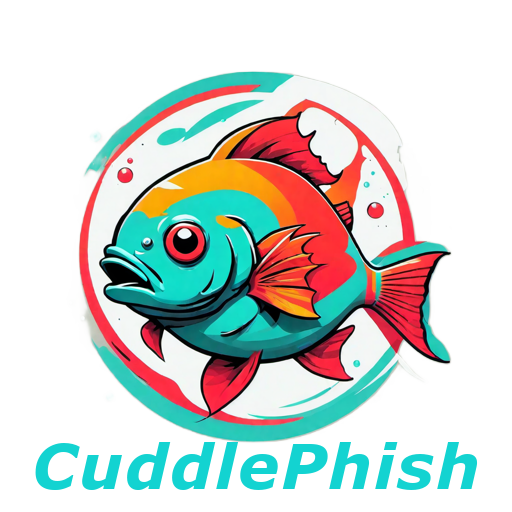

  

CuddlePhish is a weaponized multi-user Browser-in-the-Middle (BitM) attack tool designed for penetration testers and red team operations. This tool enables bypassing multi-factor authentication on high-value web applications through real-time session proxying, even for applications that do not use session tokens.

<Warning>
  **For Authorized Use Only**: This is a social engineering tool intended exclusively for authorized security testing and red team exercises. Always obtain proper authorization before deployment.
</Warning>

## What is CuddlePhish?

CuddlePhish implements a Browser-in-the-Middle attack by pairing phishing victims with attacker-controlled Chrome browser instances running on the phishing server. Victims interact with what appears to be a legitimate login page, but they are actually viewing and controlling a live browser session via WebRTC video stream. All mouse movements, keyboard inputs, and interactions are forwarded in real-time to the automated browser, allowing attackers to capture credentials and session data as victims authenticate.

## How It Works

CuddlePhish operates through a sophisticated multi-component architecture:

1. **Automated Browser Instances**: The server spawns headless Chrome browsers using Puppeteer with Xvfb (virtual display), each navigating to the target login page
2. **WebRTC Video Streaming**: Each browser instance broadcasts its display to victims via WebRTC peer-to-peer connections
3. **Input Forwarding**: Victim mouse movements and keyboard inputs are forwarded through WebSockets to control the automated browser
4. **Session Capture**: Chrome DevTools Protocol (CDP) APIs extract cookies, localStorage, and session data after successful authentication
5. **Admin Interface**: Operators monitor all active sessions, view keylogs, take control of browsers, and extract credentials

## Key Features

<CardGroup cols={2}>
  <Card title="Multi-User Support" icon="users">
    Supports multiple simultaneous phishing victims, each paired with their own isolated browser instance
  </Card>

  <Card title="MFA Bypass" icon="shield-halved">
    Bypasses multi-factor authentication including OTP, SMS, push notifications, and phone verification
  </Card>

  <Card title="Real-Time Monitoring" icon="display">
    Live admin interface with browser thumbnails, keylogging, and session control capabilities
  </Card>

  <Card title="Session Replay" icon="rotate">
    Extracted credentials can be replayed in local browsers using included stealer tools
  </Card>

  <Card title="WebRTC Technology" icon="video">
    Leverages WebRTC for low-latency video streaming with peer-to-peer connections
  </Card>

  <Card title="Stealth Features" icon="mask">
    Uses puppeteer-extra with stealth plugins to evade bot detection mechanisms
  </Card>
</CardGroup>

## Architecture Overview

### Core Components

**Server-Side (Node.js)**
- **index.js**: Main Fastify server managing browser instances, WebSocket connections, and WebRTC negotiation
- **Puppeteer Integration**: Spawns and controls Chrome instances via Chrome DevTools Protocol
- **Socket.io**: Handles real-time communication between browsers, victims, and administrators
- **Xvfb**: Provides virtual displays for headless browser instances to enable WebRTC

**Client-Side HTML Pages**
- **cuddlephish.html**: Victim-facing page with WebRTC video player and input forwarding
- **broadcast.html**: Loaded by automated browsers to broadcast video streams via WebRTC
- **admin.html**: Administrative interface for session monitoring and control

**Supporting Scripts**
- **add_target.js**: Utility to configure new phishing targets by extracting favicons and page titles
- **stealer.js**: Credential injection tool for replaying stolen sessions locally
- **smooth_criminal.js**: Remote browser connector for extracting credentials via CDP
- **resize_window.js**: Dynamically resizes browser windows to match victim viewports

**Infrastructure**
- **Caddyfile**: Reverse proxy configuration with automatic TLS and user-agent filtering
- **Dockerfile**: Builds Caddy with DNS provider plugins for wildcard certificates
- **Browser Extension**: Chrome extension for cookie and localStorage manipulation

## Attack Workflow

<Steps>
  <Step title="Server Initialization">
    Launch the CuddlePhish server, which spawns an initial "empty phishbowl" Chrome instance navigating to the target login page
  </Step>

  <Step title="Victim Connection">
    Phishing victim visits the malicious domain and connects via WebSocket. The server pairs them with an available browser instance
  </Step>

  <Step title="WebRTC Negotiation">
    Server brokers WebRTC connection between the automated browser and victim's browser, establishing peer-to-peer video stream
  </Step>

  <Step title="Interactive Session">
    Victim sees the target login page via video stream and interacts with it. All inputs are forwarded to the automated browser
  </Step>

  <Step title="Credential Capture">
    As victim authenticates, the server logs keystrokes and uses CDP to extract cookies and localStorage after successful login
  </Step>

  <Step title="Session Extraction">
    Operator uses admin interface to extract session data, boot the victim, or take direct control of the authenticated browser
  </Step>
</Steps>

## Technology Stack

**Backend**
- **Node.js**: Server runtime environment
- **Fastify**: High-performance web framework
- **Socket.io**: Real-time bidirectional WebSocket communication
- **Puppeteer/Puppeteer-Extra**: Headless Chrome automation with stealth plugins
- **Xvfb**: X Virtual Framebuffer for headless display

**Frontend**
- **WebRTC**: Peer-to-peer video streaming protocol
- **Bootstrap 5**: UI framework for admin interface
- **jQuery**: DOM manipulation and event handling

**Infrastructure**
- **Caddy**: Reverse proxy with automatic HTTPS and DNS challenge support
- **Docker**: Containerization for Caddy deployment

## Requirements

### System Requirements
- **Operating System**: Debian 11 (Bullseye) or compatible Linux distribution
- **Architecture**: x64 (ARM not supported for full functionality due to Chromium limitations)
- **Public IP**: Required for admin IP whitelisting functionality
- **Network**: STUN/TURN server access for WebRTC connectivity

### Software Dependencies
- Docker and Docker Compose
- Node.js and npm
- Xvfb (X Virtual Frame Buffer)
- Chrome/Chromium dependencies: libnss3, libasound2, libgbm-dev, libgtk-3-0

### Network Requirements
- **Ports**: 80 (HTTP), 443 (HTTPS), 58082 (Node.js server)
- **STUN Server**: Access to stun.l.google.com:19302 or alternative
- **NAT Compatibility**: Full-cone NAT, Address-restricted-cone NAT, or Port-restricted cone NAT
- **Domain**: Registered domain with DNS control for wildcard certificates

## Security Considerations

### Defensive Measures Against BitM Attacks

Organizations can protect against Browser-in-the-Middle attacks by implementing:

1. **Client TLS Certificates**: Hardware-bound certificates prevent credential relay
2. **FIDO2/U2F Hardware Keys**: Physical security keys (YubiKey) verify origin domain
3. **Domain Whitelisting**: Strict domain policies prevent access to phishing sites
4. **User Training**: Education on recognizing phishing indicators
5. **Certificate Pinning**: Applications can pin expected TLS certificates

### Operational Security

When conducting authorized testing with CuddlePhish:

- Configure admin IP whitelist in config.json before deployment
- Change default socket_key from "abc123" to a secure random value
- Use Caddy's user-agent filtering to block security scanners
- Monitor server logs for unexpected connections
- Clean up browser user_data directories after testing
- Document all testing activities for compliance

## Limitations

- **ARM Architecture**: Limited functionality on ARM processors due to Chromium constraints
- **NAT Requirements**: Symmetric NAT configurations may prevent WebRTC connectivity
- **Local Testing**: Difficult to test locally without public IP for admin features
- **STUN Dependency**: Requires accessible STUN server or paid TURN server for reliable connections
- **Special Characters**: Tab titles with special characters may cause display capture failures
- **JavaScript Dependency**: Victims must have JavaScript enabled

## Research Attribution

CuddlePhish was developed by [@fkasler](https://github.com/fkasler). While independently developed, similar Browser-in-the-Middle techniques have been researched by:

**Related Research:**
- Franco Tommasi, Christian Catalano & Ivan Taurino - [VNC-based MitM research](https://link.springer.com/article/10.1007/s10207-021-00548-5)
- [@mrd0x](https://mrd0x.com/bypass-2fa-using-novnc/) - noVNC-based 2FA bypass techniques

**Contributors:**
- Daniel Aaron [@majordmg](https://github.com/majordmg) - WebRTC proof-of-concept assistance
- RJ Stallkamp [@Z3rO-C00L](https://github.com/Z3rO-C00L) - Admin interface development and branding

## Project Information

**Repository**: [https://github.com/fkasler/cuddlephish](https://github.com/fkasler/cuddlephish)

**License**: ISC

**Name Origin**: A playful combination of "Cuttlefish" (a sea creature that camouflages), "Phishing" (social engineering), and intentional misspelling for uniqueness ("Cuddle" for friendly, silly branding).
