```
       ______        _
      (_____ \      | |
       _____) )_   _| |__  _____ _   _  ___
      |  __  /| | | |  _ \| ___ | | | |/___)
      | |  \ \| |_| | |_) ) ____| |_| |___ |
      |_|   |_|____/|____/|_____)____/(___/

      v2.3.3 - Kerberos Interaction Toolkit
```

## What is Rubeus?

Rubeus is a **C# toolset for raw Kerberos interaction and abuses**. It provides comprehensive functionality for Kerberos ticket manipulation, credential extraction, and advanced attack techniques against Active Directory environments.

<Tip>
  Rubeus is heavily adapted from Benjamin Delpy's [Kekeo](https://github.com/gentilkiwi/kekeo/) project and Vincent LE TOUX's [MakeMeEnterpriseAdmin](https://github.com/vletoux/MakeMeEnterpriseAdmin) project, with significant contributions from Charlie Clark, Ceri Coburn, and Elad Shamir.
</Tip>

## Kerberos Authentication Flow & Rubeus Commands

The diagram below illustrates the complete Kerberos authentication process and shows where specific Rubeus commands interact with each step:

```mermaid
sequenceDiagram
    participant Client as 👤 Client<br/>(User/Attacker)
    participant KDC as 🏛️ Key Distribution Center<br/>(Domain Controller)
    participant Service as 🖥️ Target Service<br/>(File Server, SQL, etc.)

    Note over Client,Service: Phase 1: Initial Authentication (AS-REQ/AS-REP)

    Client->>+KDC: 1. AS-REQ: Request TGT<br/>Rubeus: asktgt /user:alice /password:pass
    Note right of Client: Authentication Methods:<br/>• Password: /password:pass<br/>• Hash: /rc4:hash<br/>• Certificate: /certificate:cert.pfx

    KDC-->>Client: 2. AS-REP: TGT + Session Key<br/>Encrypted with user's key
    Note left of KDC: Attack Opportunities:<br/>asreproast (no pre-auth)<br/>brute (password spray)<br/>preauthscan (vuln discovery)

    Note over Client,Service: Phase 2: Service Ticket Request (TGS-REQ/TGS-REP)

    Client->>+KDC: 3. TGS-REQ: Request Service Ticket<br/>Rubeus: asktgs /service:cifs/fileserver
    Note right of Client: Using TGT from Phase 1<br/>+ Target Service SPN

    KDC-->>Client: 4. TGS-REP: Service Ticket<br/>Encrypted with service key
    Note left of KDC: Attack Opportunities:<br/>kerberoast (extract & crack)<br/>s4u (delegation abuse)<br/>tgssub (ticket substitution)

    Note over Client,Service: Phase 3: Service Authentication (AP-REQ/AP-REP)

    Client->>+Service: 5. AP-REQ: Service Ticket<br/>Authenticate to service
    Service-->>Client: 6. AP-REP: Authentication Success<br/>Service access granted

    Note over Client,Service: Attack Techniques & Ticket Management

    rect rgb(255, 240, 240)
        Note over Client: 🎫 Ticket Extraction & Management<br/>• dump (extract from memory)<br/>• triage (enumerate tickets)<br/>• klist (list current tickets)<br/>• ptt (inject tickets)<br/>• describe (analyze tickets)
    end

    rect rgb(240, 255, 240)
        Note over Client: 🥇 Golden Ticket Attacks<br/>• golden (forge domain TGT)<br/>• Requires KRBTGT hash<br/>• Domain-wide persistence
    end

    rect rgb(240, 240, 255)
        Note over Service: 🥈 Silver Ticket Attacks<br/>• silver (forge service ticket)<br/>• Requires service account hash<br/>• Service-specific access
    end

    rect rgb(255, 255, 240)
        Note over Client,Service: 💎 Diamond Ticket Attacks<br/>• diamond (hybrid legitimate/forged)<br/>• Uses real TGT + modifications<br/>• Enhanced stealth capabilities
    end

    Note over Client,Service: Additional Reconnaissance & Utilities

    rect rgb(245, 245, 245)
        Note over Client: Credential Discovery:<br/>• harvest (continuous collection)<br/>• monitor (real-time capture)<br/>• tgtdeleg (delegation extraction)<br/>• changepw (password modification)<br/>• hash (password hash generation)
    end

    rect rgb(250, 250, 250)
        Note over Client: Session Management:<br/>• createnetonly (network-only sessions)<br/>• currentluid (session identification)<br/>• logonsession (enumerate sessions)<br/>• purge (clear ticket cache)
    end
```



### Command Categories Mapped to Kerberos Flow

<Tabs>
  <Tab title="Phase 1: Initial Auth">
    **TGT Acquisition Commands:**
    - `asktgt` - Request TGT with various auth methods
    - `brute` - Password spray attacks
    - `preauthscan` - Find accounts without pre-auth
    - `asreproast` - Extract hashes from AS-REP responses
    - `renew` - Extend TGT validity
  </Tab>

  <Tab title="Phase 2: Service Tickets">
    **Service Ticket Operations:**
    - `asktgs` - Request service tickets with TGT
    - `kerberoast` - Extract service account hashes
    - `s4u` - Abuse delegation for impersonation
    - `tgssub` - Substitute service names in tickets
  </Tab>

  <Tab title="Ticket Management">
    **Ticket Manipulation:**
    - `ptt` - Inject tickets into sessions
    - `dump` - Extract tickets from memory
    - `triage` - Enumerate all accessible tickets
    - `klist` - List current session tickets
    - `describe` - Analyze ticket structure
    - `purge` - Clear ticket cache
  </Tab>

  <Tab title="Advanced Attacks">
    **Persistence & Forgery:**
    - `golden` - Forge domain-wide TGTs
    - `silver` - Forge service-specific tickets
    - `diamond` - Create hybrid legitimate/forged tickets
    - `harvest` - Continuous credential collection
    - `monitor` - Real-time ticket capture
  </Tab>
</Tabs>

## Key Capabilities

<CardGroup cols={2}>
  <Card title="Ticket Operations" icon="ticket-alt">
    Request, renew, and manipulate Kerberos tickets
  </Card>
  <Card title="Credential Extraction" icon="key">
    Extract and harvest Kerberos tickets from memory
  </Card>
  <Card title="Attack Techniques" icon="shield-alt">
    Implement advanced Kerberos attacks and abuses
  </Card>
  <Card title="Ticket Forgery" icon="magic">
    Create golden, silver, and diamond tickets
  </Card>
</CardGroup>

## Command Categories

### Ticket Requests and Renewals
<AccordionGroup>
  <Accordion title="Ticket Acquisition" icon="download">
    - [`asktgt`](/GhostPack/Rubeus-mdx/commands/ticket-requests/asktgt) - Request Ticket Granting Tickets
    - [`asktgs`](/GhostPack/Rubeus-mdx/commands/ticket-requests/asktgs) - Request service tickets
    - [`renew`](/GhostPack/Rubeus-mdx/commands/ticket-requests/renew) - Renew existing tickets
  </Accordion>

  <Accordion title="Attack Operations" icon="crosshairs">
    - [`brute`](/GhostPack/Rubeus-mdx/commands/ticket-requests/brute) - Kerberos password bruteforce
    - [`preauthscan`](/GhostPack/Rubeus-mdx/commands/ticket-requests/preauthscan) - Scan for accounts without pre-authentication
  </Accordion>
</AccordionGroup>

### Advanced Attack Techniques
<AccordionGroup>
  <Accordion title="Delegation Abuse" icon="arrows-alt">
    - [`s4u`](/GhostPack/Rubeus-mdx/commands/delegation/s4u) - S4U constrained delegation abuse
  </Accordion>

  <Accordion title="Ticket Forgery" icon="magic">
    - [`golden`](/GhostPack/Rubeus-mdx/commands/forgery/golden) - Golden ticket attacks
    - [`silver`](/GhostPack/Rubeus-mdx/commands/forgery/silver) - Silver ticket attacks
    - [`diamond`](/GhostPack/Rubeus-mdx/commands/forgery/diamond) - Diamond ticket attacks
  </Accordion>

  <Accordion title="Credential Attacks" icon="user-secret">
    - [`kerberoast`](/GhostPack/Rubeus-mdx/commands/roasting/kerberoast) - Kerberoasting attacks
    - [`asreproast`](/GhostPack/Rubeus-mdx/commands/roasting/asreproast) - AS-REP roasting attacks
  </Accordion>
</AccordionGroup>

### Ticket Management
<AccordionGroup>
  <Accordion title="Ticket Operations" icon="cogs">
    - [`ptt`](/GhostPack/Rubeus-mdx/commands/management/ptt) - Pass-the-ticket operations
    - [`purge`](/GhostPack/Rubeus-mdx/commands/management/purge) - Purge tickets from memory
    - [`describe`](/GhostPack/Rubeus-mdx/commands/management/describe) - Analyze ticket contents
  </Accordion>

  <Accordion title="Ticket Extraction" icon="search">
    - [`triage`](/GhostPack/Rubeus-mdx/commands/extraction/triage) - Enumerate available tickets
    - [`klist`](/GhostPack/Rubeus-mdx/commands/extraction/klist) - List current tickets
    - [`dump`](/GhostPack/Rubeus-mdx/commands/extraction/dump) - Extract ticket data
    - [`monitor`](/GhostPack/Rubeus-mdx/commands/extraction/monitor) - Monitor for new tickets
    - [`harvest`](/GhostPack/Rubeus-mdx/commands/extraction/harvest) - Automated ticket harvesting
  </Accordion>
</AccordionGroup>

## Attack Methodology

<Steps>
  <Step title="Reconnaissance">
    Use `preauthscan` to identify accounts without pre-authentication requirements
  </Step>
  <Step title="Credential Attacks">
    Perform `kerberoast` or `asreproast` to extract crackable hashes
  </Step>
  <Step title="Ticket Acquisition">
    Use `asktgt` with compromised credentials to obtain valid tickets
  </Step>
  <Step title="Lateral Movement">
    Leverage `s4u` delegation abuse or `ptt` for lateral movement
  </Step>
  <Step title="Persistence">
    Create `golden` or `silver` tickets for persistent access
  </Step>
</Steps>

## Operational Security Considerations

<Warning>
  Rubeus operations can be detected through various means including network monitoring, host-based detection, and domain controller logging.
</Warning>

<Accordion title="Detection Vectors">
  **Host-Based Detection:**
  - Non-lsass.exe processes issuing Kerberos traffic
  - Use of sensitive APIs like LsaCallAuthenticationPackage()
  - Abnormal ticket types (e.g., RC4 in AES environments)

  **Network Detection:**
  - Raw Kerberos port 88 traffic patterns
  - Encryption downgrade indicators
  - Unusual authentication request patterns

  **Domain Controller Logs:**
  - RC4_HMAC usage in modern environments
  - Abnormal ticket request patterns
  - Authentication anomalies
</Accordion>

<Accordion title="Operational Best Practices">
  **Minimize Detection:**
  - Use AES encryption when possible (`/opsec` flag)
  - Implement appropriate delays between operations
  - Blend with normal authentication patterns

  **Weaponization Considerations:**
  - Avoid running from disk when possible
  - Consider in-memory execution methods
  - Be aware of AMSI and PowerShell protections
</Accordion>

## Technical Background

<Accordion title="Kerberos Protocol">
  Rubeus implements raw Kerberos protocol interactions, allowing for:
  - Direct manipulation of authentication flows
  - Bypass of normal Windows authentication mechanisms
  - Implementation of attack techniques not possible through standard APIs
</Accordion>

<Accordion title="ASN.1 Implementation">
  Uses custom ASN.1 parsing for:
  - Ticket structure manipulation
  - Custom PAC construction
  - Advanced ticket forgery capabilities
</Accordion>

## Prerequisites

<AccordionGroup>
  <Accordion title="Environment Requirements">
    - .NET Framework 3.5+ or .NET Core
    - Active Directory environment
    - Domain connectivity for most operations
  </Accordion>

  <Accordion title="Privilege Requirements">
    - **Standard User**: Basic ticket operations, roasting attacks
    - **Elevated User**: Ticket extraction, memory operations
    - **SYSTEM**: Full ticket harvesting capabilities
  </Accordion>
</AccordionGroup>

## Common Use Cases

<CardGroup cols={2}>
  <Card title="Red Team Operations" icon="user-ninja">
    Credential harvesting, lateral movement, and persistence establishment
  </Card>
  <Card title="Penetration Testing" icon="search">
    Kerberos security assessment and vulnerability validation
  </Card>
  <Card title="Security Research" icon="flask">
    Kerberos protocol analysis and attack technique development
  </Card>
  <Card title="Incident Response" icon="shield">
    Understanding and analyzing Kerberos-based attacks
  </Card>
</CardGroup>

## Next Steps

<CardGroup cols={2}>
  <Card title="Getting Started" icon="play" href="/ghostpack-docs/Rubeus-mdx/resources/compilation">
    Compile and configure Rubeus for your environment
  </Card>
  <Card title="Basic Commands" icon="terminal" href="/ghostpack-docs/Rubeus-mdx/commands/ticket-requests/asktgt">
    Start with basic ticket request operations
  </Card>
  <Card title="Attack Techniques" icon="crosshairs" href="/ghostpack-docs/Rubeus-mdx/commands/roasting/kerberoast">
    Learn advanced attack methodologies
  </Card>
</CardGroup>
