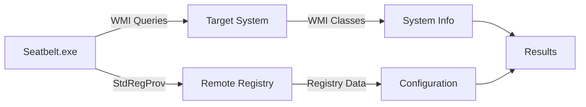

## What is Seatbelt?

Seatbelt is a **C# project that performs security-oriented host-survey "safety checks"** on Windows systems. It collects a comprehensive set of system information useful from both offensive and defensive security perspectives.

<Tip>
  Seatbelt was inspired by [@andrewchiles](https://twitter.com/andrewchiles)' [HostEnum.ps1](https://github.com/threatexpress/red-team-scripts/blob/master/HostEnum.ps1) and [@tifkin_](https://twitter.com/tifkin_)'s [Get-HostProfile.ps1](https://github.com/leechristensen/Random/blob/master/PowerShellScripts/Get-HostProfile.ps1).
</Tip>

## Key Features

<CardGroup cols={2}>
  <Card title="120+ Enumeration Commands" icon="magnifying-glass">
    Comprehensive host enumeration covering system, user, and security configurations
  </Card>
  <Card title="Command Groups" icon="layer-group">
    Organized command groups for targeted enumeration (system, user, misc, remote)
  </Card>
  <Card title="Remote Enumeration" icon="network-wired">
    Enumerate remote systems via WMI with alternate credentials
  </Card>
  <Card title="Flexible Output" icon="file-export">
    Text or JSON output formats with configurable verbosity
  </Card>
  <Card title="Modular Architecture" icon="puzzle-piece">
    Easily extensible with custom command modules
  </Card>
  <Card title="Privilege Context Aware" icon="user-shield">
    Automatically adjusts enumeration scope based on current privileges
  </Card>
</CardGroup>

## Command Groups

Seatbelt organizes its 120+ commands into logical groups for targeted enumeration:

### System Group

Runs checks that mine interesting data about the system itself.

<AccordionGroup>
  <Accordion title="System Commands (50+ checks)" icon="server">
    **OS & Environment:** OSInfo, DotNet, EnvironmentVariables, EnvironmentPath, LastShutdown

    **Security Configuration:** AppLocker, UAC, LAPS, CredGuard, SecureBoot, WindowsDefender

    **Authentication:** NTLM Settings, LSA Settings, Audit Policies, Token Privileges

    **Network:** ARP Table, TCP/UDP Connections, DNS Cache, Network Shares, Network Profiles, RDP Settings

    **Monitoring:** Sysmon, Windows Defender, Windows Event Forwarding, AMSI Providers

    **Local Objects:** Local Users, Local Groups, Services, Processes, Scheduled Tasks, Named Pipes

    **Enterprise:** SCCM, WSUS, Windows Firewall, Hotfixes
  </Accordion>
</AccordionGroup>

**Usage:** `Seatbelt.exe -group=system`

### User Group

Runs checks that enumerate user-specific data and credentials.

<AccordionGroup>
  <Accordion title="User Commands (30+ checks)" icon="user">
    **Credentials:** CredEnum, DPAPI Master Keys, Windows Vault, Security Package Credentials

    **Browser Data:** Chromium (Chrome/Edge/Brave/Opera), Firefox files and history

    **Cloud Credentials:** AWS, Google, Azure, Bluemix credential files

    **Recent Activity:** Explorer MRUs, Explorer Run Commands, Office MRUs, IE URLs

    **Saved Connections:** FileZilla, PuTTY, SuperPuTTY, RDC Manager, RDP Saved Connections

    **Certificates:** User and machine personal certificate files

    **Other:** Mapped Drives, Token Groups, KeePass, OneNote, PowerShell History, Slack files
  </Accordion>
</AccordionGroup>

**Usage:** `Seatbelt.exe -group=user`

<Info>
  User commands run for the **current user** if not elevated, and for **ALL users** if elevated.
</Info>

### Misc Group

Miscellaneous enumeration commands that take longer to run or serve specific purposes.

<AccordionGroup>
  <Accordion title="Misc Commands (20+ checks)" icon="ellipsis">
    **Event Logs:** Logon Events, Explicit Logon Events, Process Creation Events, PowerShell Events, Sysmon Events

    **Time-Intensive:** Interesting Files, LOLBAS, Search Index

    **Detailed Analysis:** File Info, Registry Query, Recycle Bin

    **System Details:** Installed Products, Microsoft Updates, Printers, RPC Endpoints, Scheduled Tasks
  </Accordion>
</AccordionGroup>

**Usage:** `Seatbelt.exe -group=misc`

### Browser Groups

Specialized groups for browser enumeration.

<Tabs>
  <Tab title="Chromium">
    Enumerates Chrome, Edge, Brave, and Opera artifacts:
    - ChromiumPresence
    - ChromiumBookmarks
    - ChromiumHistory

    **Usage:** `Seatbelt.exe -group=chromium`
  </Tab>
  <Tab title="Slack">
    Enumerates Slack artifacts:
    - SlackPresence
    - SlackDownloads
    - SlackWorkspaces

    **Usage:** `Seatbelt.exe -group=slack`
  </Tab>
</Tabs>

### Remote Group

Subset of commands that support remote enumeration via WMI (marked with + in help).

<AccordionGroup>
  <Accordion title="Remote-Capable Commands (40+ checks)" icon="satellite-dish">
    Commands that can be executed against remote systems include most system and user checks that rely on WMI and registry access.

    Examples: AMSIProviders, AntiVirus, DotNet, Hotfixes, LocalUsers, LogonEvents, PowerShell, WindowsDefender, and more.
  </Accordion>
</AccordionGroup>

**Usage:** `Seatbelt.exe -group=remote -computername=HOST [-username=DOMAIN\USER -password=PASSWORD]`

## Command Execution Options

### Running Individual Commands

```bash
# Single command
Seatbelt.exe OSInfo

# Multiple commands
Seatbelt.exe OSInfo LocalUsers AntiVirus

# Command with full output (no filtering)
Seatbelt.exe Processes -full
```

### Running Command Groups

```bash
# All system checks
Seatbelt.exe -group=system

# All checks with full output
Seatbelt.exe -group=all -full

# All checks except specific commands
Seatbelt.exe -group=all -AuditPolicies -Hotfixes
```

### Commands with Arguments

Some commands accept arguments (enclosed in quotes):

```bash
# Logon events for last 30 days
Seatbelt.exe "LogonEvents 30"

# Directory listing with depth and regex
Seatbelt.exe "dir C:\Users 3 .*password.* false"

# Registry query with depth and regex
Seatbelt.exe "reg \"HKLM\SOFTWARE\Microsoft\Windows Defender\" 3 .*defini.* true"
```

## Remote Enumeration

Commands marked with **+** in the help menu support remote execution via WMI.

<Steps>
  <Step title="Basic Remote Execution">
    Specify target computer with `-computername`:
    ```bash
    Seatbelt.exe OSInfo -computername=192.168.1.100
    ```
  </Step>

  <Step title="Authenticated Remote Execution">
    Provide alternate credentials:
    ```bash
    Seatbelt.exe -group=remote -computername=DC01.domain.com -username=DOMAIN\user -password="P@ssw0rd"
    ```
  </Step>

  <Step title="Remote Command Groups">
    Use the remote group for optimized remote enumeration:
    ```bash
    Seatbelt.exe -group=remote -computername=TARGET
    ```
  </Step>
</Steps>

### Remote Execution Architecture



<Warning>
  Remote enumeration requires:
  - Network access to target on WMI ports (135/TCP, dynamic RPC)
  - Appropriate permissions on target system
  - WMI and Remote Registry services running
</Warning>

## Output Options

### Text Output

Default output format to console or file:

```bash
# Console output
Seatbelt.exe -group=system

# Text file output
Seatbelt.exe -group=system -outputfile="C:\Temp\results.txt"
```

### JSON Output

Structured output for parsing and automation:

```bash
# JSON file output (file extension must be .json)
Seatbelt.exe -group=user -outputfile="C:\Temp\results.json"

# Quiet mode (no console output)
Seatbelt.exe -group=user -q -outputfile="C:\Temp\results.json"
```

### Output Verbosity

```bash
# Default (filtered output)
Seatbelt.exe Processes

# Full output (no filtering)
Seatbelt.exe Processes -full

# Quiet mode (no console messages)
Seatbelt.exe -group=user -q -outputfile="output.json"
```

## Privilege Context Behavior

Seatbelt automatically adjusts its behavior based on execution context:

<Tabs>
  <Tab title="Not Elevated">
    **User Commands:** Enumerate current user only

    **System Commands:** Limited to non-privileged enumeration

    **Typical Use:** Initial reconnaissance on compromised user account
  </Tab>

  <Tab title="Elevated (Admin)">
    **User Commands:** Enumerate ALL users on system

    **System Commands:** Full system enumeration including privileged information

    **Typical Use:** Post-privilege escalation enumeration
  </Tab>

  <Tab title="High Integrity">
    All checks run with maximum privileges and access to protected system resources.

    **Typical Use:** Post-exploitation situational awareness as SYSTEM or admin
  </Tab>
</Tabs>

## Modular Architecture

Seatbelt's structure is completely modular for easy extension:

<Steps>
  <Step title="Command Template">
    Use the template at `.\Seatbelt\Commands\Template.cs` as a starting point
  </Step>

  <Step title="Implement Command">
    Create your command class inheriting from `CommandBase`
  </Step>

  <Step title="Add to Project">
    Place in appropriate directory and include in Visual Studio solution
  </Step>

  <Step title="Compile">
    Rebuild project - new command automatically discovered and loaded
  </Step>
</Steps>

## Use Cases

<CardGroup cols={2}>
  <Card title="Red Team Operations" icon="user-secret">
    Post-compromise situational awareness and privilege escalation enumeration
  </Card>
  <Card title="Penetration Testing" icon="shield-check">
    Host-based enumeration during internal assessments
  </Card>
  <Card title="Incident Response" icon="siren">
    Rapid triage and forensic artifact collection
  </Card>
  <Card title="Security Auditing" icon="clipboard-check">
    Baseline security configuration assessment
  </Card>
  <Card title="Threat Hunting" icon="magnifying-glass">
    Anomaly detection and security posture evaluation
  </Card>
  <Card title="Blue Team Testing" icon="shield-halved">
    Validate detection capabilities and log visibility
  </Card>
</CardGroup>

## Detection Considerations

<Warning>
  Seatbelt generates significant detection opportunities for defenders.
</Warning>

### Detection Indicators

**Process Indicators:**
- Process name: Seatbelt.exe (or renamed executable)
- Unusual .NET assembly loading patterns
- Sequential enumeration of multiple system resources

**Behavioral Indicators:**
- Rapid WMI queries across multiple classes
- Extensive registry enumeration
- File system searches for specific patterns
- Event log queries for security events
- Network connection enumeration

**Network Indicators (Remote Mode):**
- WMI connections to remote systems (135/TCP, RPC)
- StdRegProv registry access patterns
- Authenticated connections with unusual source

### Defensive Measures

<Accordion title="Detection Strategies">
  - Monitor for processes making numerous WMI queries
  - Alert on registry enumeration of sensitive keys (LSA, credential locations)
  - Track event log access patterns (especially security log)
  - Monitor file access to credential-related files
  - Detect sequential execution of enumeration activities
  - Signature-based detection of Seatbelt binary
</Accordion>

<Accordion title="Prevention Strategies">
  - Implement least privilege to reduce enumeration effectiveness
  - Harden credential storage and remove cached credentials
  - Enable constrained PowerShell language mode
  - Implement application whitelisting (AppLocker, WDAC)
  - Restrict WMI access and remote registry
  - Enable enhanced logging for enumeration activities
</Accordion>

## Command Summary Statistics

<CardGroup cols={3}>
  <Card title="System Commands" icon="server">
    **50+ checks**

    OS, security, network, and system configuration
  </Card>
  <Card title="User Commands" icon="user">
    **30+ checks**

    User data, credentials, and activity
  </Card>
  <Card title="Misc Commands" icon="ellipsis">
    **20+ checks**

    Event logs, intensive searches, detailed analysis
  </Card>
  <Card title="Browser Commands" icon="globe">
    **6 checks**

    Chromium and Firefox artifacts
  </Card>
  <Card title="Remote-Capable" icon="satellite-dish">
    **40+ checks**

    Commands supporting WMI-based remote execution
  </Card>
  <Card title="Total Commands" icon="list">
    **120+ checks**

    Comprehensive Windows host enumeration
  </Card>
</CardGroup>

## Quick Start

<Steps>
  <Step title="Basic Enumeration">
    Run all checks:
    ```bash
    Seatbelt.exe -group=all
    ```
  </Step>

  <Step title="Targeted Enumeration">
    Run specific command group:
    ```bash
    Seatbelt.exe -group=system
    ```
  </Step>

  <Step title="Save Results">
    Output to file:
    ```bash
    Seatbelt.exe -group=all -outputfile="C:\Temp\results.json"
    ```
  </Step>

  <Step title="Remote Enumeration">
    Enumerate remote system:
    ```bash
    Seatbelt.exe -group=remote -computername=TARGET -username=DOMAIN\USER -password=PASS
    ```
  </Step>
</Steps>

## Example Output

```
                        %&&@@@&&
                        &&&&&&&%%%,                       #&&@@@@@@%%%%%%###############%
                        &%&   %&%%                        &////(((&%%%%%#%################//((((###%%%%%%%%%%%%%%%
%%%%%%%%%%%######%%%#%%####%  &%%**#                      @////(((&%%%%%%######################(((((((((((((((((((
#%#%%%%%%%#######%#%%#######  %&%,,,,,,,,,,,,,,,,         @////(((&%%%%%#%#####################(((((((((((((((((((
#%#%%%%%%#####%%#%#%%#######  %%%,,,,,,  ,,.   ,,         @////(((&%%%%%%%######################(#(((#(#((((((((((
#####%%%####################  &%%......  ...   ..         @////(((&%%%%%%%###############%######((#(#(####((((((((
#######%##########%#########  %%%......  ...   ..         @////(((&%%%%%#########################(#(#######((#####
###%##%%####################  &%%...............          @////(((&%%%%%%%%##############%#######(#########((#####
#####%######################  %%%..                       @////(((&%%%%%%%################
                        &%&   %%%%%      Seatbelt         %////(((&%%%%%%%%#############*
                        &%%&&&%%%%%        v1.2.1         ,(((&%%%%%%%%%%%%%%%%%,
                         #%%%%##,


Available commands (+ means remote usage is supported):
...

[*] Running System Checks...

=== OSInfo ===
  Hostname                :  WORKSTATION01
  Domain                  :  CORP.LOCAL
  OS Version              :  Microsoft Windows 10 Pro (10.0.19045)
  Architecture            :  x64
  Hotfixes Applied        :  KB5012345, KB5012346, KB5012347
```

## Additional Resources

<CardGroup cols={2}>
  <Card title="GitHub Repository" icon="github" href="https://github.com/GhostPack/Seatbelt">
    Official Seatbelt repository
  </Card>
  <Card title="Compilation Guide" icon="hammer" href="/ghostpack-docs/Seatbelt-mdx/compilation">
    Build Seatbelt from source
  </Card>
  <Card title="Usage Guide" icon="terminal" href="/ghostpack-docs/Seatbelt-mdx/usage">
    Detailed usage examples and scenarios
  </Card>
  <Card title="GhostPack Tools" icon="ghost" href="/ghostpack-docs/index">
    Other GhostPack security tools
  </Card>
</CardGroup>

## Authors

<Note>
  Seatbelt is developed by [@harmj0y](https://twitter.com/harmj0y) and [@tifkin_](https://twitter.com/tifkin_).
</Note>

## License

Seatbelt is licensed under the BSD 3-Clause license.
