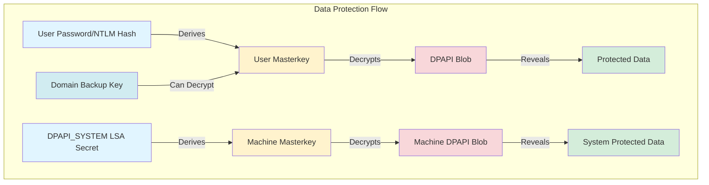

```
  __                 _   _       _ ___
 (_  |_   _. ._ ._  | \ |_) /\  |_) |
 __) | | (_| |  |_) |_/ |  /--\ |  _|_
                |
  v1.20.0
```

## What is SharpDPAPI?

SharpDPAPI is a **C# port of DPAPI functionality from Mimikatz** that enables the extraction and decryption of Windows Data Protection API (DPAPI) protected data. It operationalizes Benjamin Delpy's work to fit offensive security workflows, allowing practitioners to decrypt credentials, certificates, and other sensitive data protected by DPAPI.

<Tip>
  SharpDPAPI is a port of DPAPI functionality from [@gentilkiwi](https://twitter.com/gentilkiwi)'s [Mimikatz](https://github.com/gentilkiwi/mimikatz/) project. The original logic and implementation credit belongs to Benjamin Delpy.
</Tip>

## Understanding DPAPI

The Windows Data Protection API (DPAPI) is a cryptographic application programming interface that allows applications to protect sensitive data using encryption keys derived from user credentials or system secrets.

<CardGroup cols={2}>
  <Card title="User DPAPI" icon="user">
    Protects user-specific data using keys derived from user passwords
  </Card>
  <Card title="Machine DPAPI" icon="server">
    Protects system-level data using keys derived from machine secrets
  </Card>
  <Card title="Domain Backup Key" icon="building">
    Domain controllers maintain backup keys that can decrypt any domain user's masterkeys
  </Card>
  <Card title="Masterkeys" icon="key">
    Intermediate keys that protect actual data encryption keys
  </Card>
</CardGroup>

### DPAPI Architecture



## Key Capabilities

<Tabs>
  <Tab title="User Data Extraction">
    **Decrypt User DPAPI Protected Data:**
    - Credential Manager credentials
    - Windows Vault data (IE/Edge saved passwords)
    - RDP connection passwords (RDCMan.settings, .rdg files)
    - KeePass master keys
    - User certificates and private keys
    - PowerShell credential objects
  </Tab>

  <Tab title="Machine Data Extraction">
    **Decrypt System DPAPI Protected Data:**
    - Scheduled task credentials
    - Machine certificates and private keys
    - System Vault data
    - Machine-level credentials
  </Tab>

  <Tab title="Domain Operations">
    **Domain-Wide Capabilities:**
    - Retrieve domain DPAPI backup key
    - Decrypt any domain user's masterkeys
    - Remote system triage
    - SCCM Network Access Account credentials
  </Tab>

  <Tab title="Utilities">
    **Additional Functionality:**
    - Search for DPAPI blobs in registry and files
    - Decrypt arbitrary DPAPI blobs
    - Extract masterkey hashes for offline cracking
  </Tab>
</Tabs>

## Operational Usage

### Pre-Domain Compromise

Before obtaining domain administrator privileges, SharpDPAPI can leverage:

<AccordionGroup>
  <Accordion title="Mimikatz DPAPI Masterkeys" icon="key">
    Use Mimikatz `sekurlsa::dpapi` to extract {GUID}:SHA1 masterkey mappings from LSASS memory for currently logged-in users.

    ```bash
    # Extract masterkeys with Mimikatz
    mimikatz# sekurlsa::dpapi

    # Use with SharpDPAPI
    SharpDPAPI.exe credentials {GUID1}:SHA1 {GUID2}:SHA1
    ```
  </Accordion>

  <Accordion title="User Credentials" icon="user-lock">
    If you have a user's password, NTLM hash, or DPAPI prekey, use these directly:

    ```bash
    # Using plaintext password
    SharpDPAPI.exe credentials /password:Password123!

    # Using NTLM hash
    SharpDPAPI.exe credentials /ntlm:8846F7EAEE8FB117AD06BDD830B7586C

    # Using DPAPI prekey (from sekurlsa::msv)
    SharpDPAPI.exe credentials /credkey:abc123...
    ```
  </Accordion>

  <Accordion title="Local Elevation" icon="arrow-up">
    With local admin rights, use machine triage commands to decrypt system-level DPAPI data:

    ```bash
    # Triage all machine DPAPI data
    SharpDPAPI.exe machinetriage
    ```
  </Accordion>
</AccordionGroup>

### Post-Domain Compromise

After obtaining domain admin privileges:

<Steps>
  <Step title="Retrieve Domain Backup Key">
    ```bash
    SharpDPAPI.exe backupkey /server:dc.domain.com /file:key.pvk
    ```
    This key never changes and can decrypt masterkeys for any domain user.
  </Step>

  <Step title="Decrypt All User Masterkeys">
    ```bash
    SharpDPAPI.exe masterkeys /pvk:key.pvk
    ```
    Returns {GUID}:SHA1 mappings for all accessible masterkeys.
  </Step>

  <Step title="Triage All User Data">
    ```bash
    SharpDPAPI.exe triage /pvk:key.pvk
    ```
    Automatically decrypts credentials, vaults, RDG files, and certificates for all users.
  </Step>

  <Step title="Remote System Triage">
    ```bash
    SharpDPAPI.exe credentials /pvk:key.pvk /server:target.domain.com
    ```
    Triage DPAPI data on remote systems (requires admin access).
  </Step>
</Steps>

## Command Categories

### User Triage Commands

<CardGroup cols={2}>
  <Card title="masterkeys" icon="key" href="/ghostpack-docs/SharpDPAPI-mdx/commands/masterkeys">
    Decrypt and extract user masterkey files
  </Card>
  <Card title="credentials" icon="id-card" href="/ghostpack-docs/SharpDPAPI-mdx/commands/credentials">
    Decrypt Windows Credential Manager credentials
  </Card>
  <Card title="vaults" icon="vault" href="/ghostpack-docs/SharpDPAPI-mdx/commands/vaults">
    Decrypt Windows Vault data (browser passwords)
  </Card>
  <Card title="rdg" icon="server" href="/ghostpack-docs/SharpDPAPI-mdx/commands/rdg">
    Decrypt RDP connection passwords
  </Card>
  <Card title="keepass" icon="lock" href="/ghostpack-docs/SharpDPAPI-mdx/commands/keepass">
    Extract KeePass master key material
  </Card>
  <Card title="certificates" icon="certificate" href="/ghostpack-docs/SharpDPAPI-mdx/commands/certificates">
    Decrypt user certificate private keys
  </Card>
  <Card title="triage" icon="list-check" href="/ghostpack-docs/SharpDPAPI-mdx/commands/triage">
    Run all user DPAPI extraction commands
  </Card>
  <Card title="ps" icon="terminal" href="/ghostpack-docs/SharpDPAPI-mdx/commands/ps">
    Decrypt PowerShell credential XML files
  </Card>
</CardGroup>

### Machine Triage Commands

<CardGroup cols={2}>
  <Card title="machinemasterkeys" icon="key" href="/ghostpack-docs/SharpDPAPI-mdx/commands/machinemasterkeys">
    Decrypt machine masterkey files using DPAPI_SYSTEM
  </Card>
  <Card title="machinecredentials" icon="id-card" href="/ghostpack-docs/SharpDPAPI-mdx/commands/machinecredentials">
    Decrypt system Credential Manager credentials
  </Card>
  <Card title="machinevaults" icon="vault" href="/ghostpack-docs/SharpDPAPI-mdx/commands/machinevaults">
    Decrypt system Vault data
  </Card>
  <Card title="machinetriage" icon="list-check" href="/ghostpack-docs/SharpDPAPI-mdx/commands/machinetriage">
    Run all machine DPAPI extraction commands
  </Card>
</CardGroup>

### Utility Commands

<CardGroup cols={2}>
  <Card title="backupkey" icon="download" href="/ghostpack-docs/SharpDPAPI-mdx/commands/backupkey">
    Retrieve domain DPAPI backup key from DC
  </Card>
  <Card title="blob" icon="file-binary" href="/ghostpack-docs/SharpDPAPI-mdx/commands/blob">
    Decrypt arbitrary DPAPI blobs
  </Card>
  <Card title="search" icon="magnifying-glass" href="/ghostpack-docs/SharpDPAPI-mdx/commands/search">
    Search for DPAPI blobs in registry and files
  </Card>
  <Card title="sccm" icon="network-wired" href="/ghostpack-docs/SharpDPAPI-mdx/commands/sccm">
    Extract SCCM Network Access Account credentials
  </Card>
</CardGroup>

## Common Arguments

<Tabs>
  <Tab title="Decryption Methods">
    **Ways to Decrypt DPAPI Data:**

    | Argument | Description |
    |----------|-------------|
    | `/pvk:BASE64...` | Use base64-encoded domain backup key |
    | `/pvk:key.pvk` | Use domain backup key file |
    | `/password:X` | Decrypt using plaintext password |
    | `/ntlm:X` | Decrypt using NTLM hash |
    | `/credkey:X` | Use DPAPI credkey (SHA1 from Mimikatz) |
    | `/rpc` | Decrypt by asking domain controller |
    | `{GUID}:SHA1 ...` | Use explicit masterkey mappings |
    | `/mkfile:FILE` | Load masterkey mappings from file |
    | `/unprotect` | Use CryptUnprotectData() (current user context) |
  </Tab>

  <Tab title="Targeting">
    **Specify Targets:**

    | Argument | Description |
    |----------|-------------|
    | `/target:FILE` | Target specific file |
    | `/target:FOLDER` | Target specific folder |
    | `/server:SERVER` | Target remote server (requires pvk or password) |
  </Tab>

  <Tab title="Output Options">
    **Control Output:**

    | Argument | Description |
    |----------|-------------|
    | `/hashes` | Output masterkey hashes for cracking (masterkeys command) |
    | `/showall` | Show all decrypted private keys (certificates command) |
    | `/machine` | Use machine certificate store (certificates command) |
    | `/showErrors` | Display errors during enumeration (search command) |
  </Tab>
</Tabs>

## Typical Workflows

<Accordion title="Scenario 1: Domain Admin Compromise">
  ```bash
  # 1. Retrieve domain backup key
  SharpDPAPI.exe backupkey /server:dc.domain.com

  # 2. Triage all user DPAPI data on current system
  SharpDPAPI.exe triage /pvk:HvG1sAA...

  # 3. Triage remote systems
  SharpDPAPI.exe credentials /pvk:HvG1sAA... /server:fileserver.domain.com
  SharpDPAPI.exe vaults /pvk:HvG1sAA... /server:fileserver.domain.com
  ```
</Accordion>

<Accordion title="Scenario 2: Local Admin on Workstation">
  ```bash
  # 1. Use Mimikatz to extract user masterkeys
  mimikatz# sekurlsa::dpapi

  # 2. Triage user DPAPI data with masterkeys
  SharpDPAPI.exe triage {GUID1}:SHA1 {GUID2}:SHA1

  # 3. Triage machine DPAPI data
  SharpDPAPI.exe machinetriage
  ```
</Accordion>

<Accordion title="Scenario 3: Compromised User Account">
  ```bash
  # 1. Decrypt current user's RDG files (no elevation needed)
  SharpDPAPI.exe rdg /unprotect

  # 2. With user's password, decrypt their DPAPI data
  SharpDPAPI.exe credentials /password:Password123!
  SharpDPAPI.exe vaults /password:Password123!
  ```
</Accordion>

<Accordion title="Scenario 4: Offline Analysis">
  ```bash
  # 1. Copy user's masterkey folder and DPAPI data to analysis machine

  # 2. Decrypt masterkeys with known password
  SharpDPAPI.exe masterkeys /target:C:\Evidence\Protect\S-1-5-21-... /password:Password123!

  # 3. Decrypt credentials with masterkeys from offline folder
  SharpDPAPI.exe credentials /target:C:\Evidence\Credentials /pvk:key.pvk
  ```
</Accordion>

## Detection Considerations

<Warning>
  SharpDPAPI operations can be detected through multiple mechanisms. Use appropriate operational security measures.
</Warning>

<AccordionGroup>
  <Accordion title="Host-Based Detection" icon="computer">
    - Reading sensitive DPAPI masterkey files
    - Accessing LSASS for DPAPI_SYSTEM secret
    - Bulk reading of Credential Manager and Vault files
    - Token manipulation for SYSTEM elevation
  </Accordion>

  <Accordion title="Network Detection" icon="network-wired">
    - SMB enumeration of user profiles on remote systems
    - MS-BKRP protocol usage for backup key retrieval
    - Unusual DC RPC calls (LsaRetrievePrivateData)
  </Accordion>

  <Accordion title="Event Log Indicators" icon="list">
    - 4656/4663: Access to masterkey files
    - 4662: Domain backup key access on DC
    - 4624/4672: Privileged logon for remote triage
    - 4688: SharpDPAPI.exe process execution
  </Accordion>

  <Accordion title="Defensive Measures" icon="shield">
    - Monitor access to `%APPDATA%\Microsoft\Protect\` directories
    - Alert on MS-BKRP backup key retrieval
    - Restrict DPAPI_SYSTEM LSA secret access
    - Monitor for bulk Credential Manager file access
    - Implement conditional access and MFA where possible
  </Accordion>
</AccordionGroup>

## Prerequisites

<AccordionGroup>
  <Accordion title="Build Requirements">
    - Visual Studio 2019 Community Edition or later
    - .NET Framework 3.5 (default target)
    - Can be retargeted to .NET 4.0 or 4.5
  </Accordion>

  <Accordion title="Execution Requirements">
    - Windows operating system
    - .NET Framework installed on target
    - Appropriate access rights for target data
  </Accordion>

  <Accordion title="Privilege Requirements">
    **User Commands:**
    - Standard user: Can decrypt own data with /unprotect
    - Any user: With valid credentials or masterkeys

    **Machine Commands:**
    - Local Administrator: Required for DPAPI_SYSTEM access
    - SYSTEM context: For full machine triage

    **Domain Operations:**
    - Domain Admin: For backup key retrieval
    - Local Admin: For remote system triage
  </Accordion>
</AccordionGroup>

## Technical Background

<Accordion title="DPAPI Masterkey Hierarchy">
  DPAPI uses a multi-layer key derivation system:

  1. **User Credentials** → Derives **User Masterkey**
  2. **User Masterkey** → Decrypts **DPAPI Blob**
  3. **DPAPI Blob** → Contains **Protected Data**

  The domain backup key can decrypt any domain user's masterkeys, providing a domain-wide decryption capability.
</Accordion>

<Accordion title="CryptUnprotectData vs Manual Decryption">
  **CryptUnprotectData():**
  - Windows API that automatically handles decryption
  - Only works in the context of the user who encrypted the data
  - Doesn't require elevated privileges
  - Used with `/unprotect` flag

  **Manual Decryption:**
  - Requires masterkeys or backup keys
  - Works across user contexts
  - Can decrypt other users' data
  - Necessary for remote triage
</Accordion>

## Additional Resources

<CardGroup cols={2}>
  <Card title="DPAPI Attack Guidance" icon="book" href="https://blog.harmj0y.net/redteaming/operational-guidance-for-offensive-user-dpapi-abuse/">
    Operational Guidance for Offensive User DPAPI Abuse
  </Card>
  <Card title="Credential Manager Internals" icon="key" href="https://github.com/gentilkiwi/mimikatz/wiki/howto-~-credential-manager-saved-credentials">
    How Credential Manager and Vaults work with DPAPI
  </Card>
  <Card title="GitHub Repository" icon="github" href="https://github.com/GhostPack/SharpDPAPI">
    Official SharpDPAPI repository
  </Card>
  <Card title="Mimikatz Project" icon="hat-wizard" href="https://github.com/gentilkiwi/mimikatz/">
    Original DPAPI implementation source
  </Card>
</CardGroup>

## Next Steps

<CardGroup cols={2}>
  <Card title="Compilation Guide" icon="hammer" href="/ghostpack-docs/SharpDPAPI-mdx/compilation">
    Build SharpDPAPI from source
  </Card>
  <Card title="User Commands" icon="user" href="/ghostpack-docs/SharpDPAPI-mdx/commands/triage">
    Start with user DPAPI triage
  </Card>
  <Card title="Machine Commands" icon="server" href="/ghostpack-docs/SharpDPAPI-mdx/commands/machinetriage">
    Learn system-level DPAPI extraction
  </Card>
  <Card title="Domain Operations" icon="building" href="/ghostpack-docs/SharpDPAPI-mdx/commands/backupkey">
    Extract domain backup key
  </Card>
</CardGroup>

## License

SharpDPAPI is licensed under the BSD 3-Clause license.

<Note>
  SharpDPAPI is a port of Mimikatz DPAPI functionality. All credit for the original implementation goes to Benjamin Delpy ([@gentilkiwi](https://twitter.com/gentilkiwi)).
</Note>
