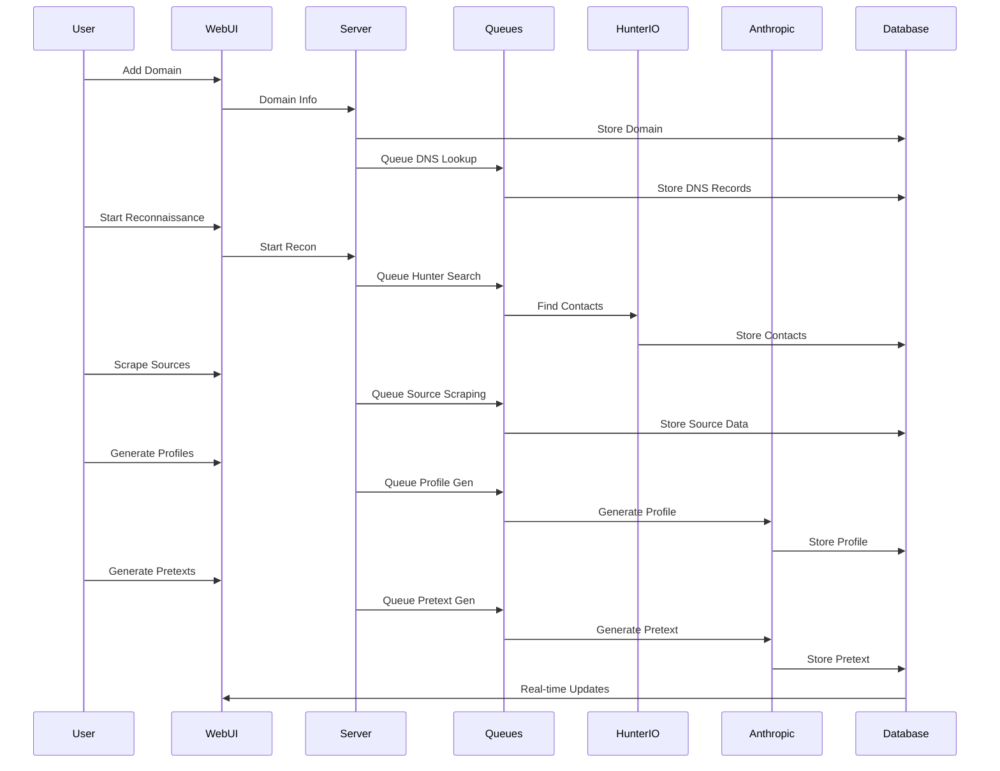

## What is Ghost Scout?

Ghost Scout is an **LLM-assisted OSINT and phishing email generation tool** that performs reconnaissance on target companies, finds their employees, and builds profiles for personalized emails based on public sources.

<Tip>
  Designed for red teamers to automate the reconnaissance and pretext generation phases of phishing campaigns
</Tip>

## Key Features

<CardGroup cols={2}>
  <Card title="Domain Discovery" icon="globe">
    Add target domains and find related ones through autodiscover techniques
  </Card>
  <Card title="Email Format Detection" icon="envelope">
    Identify company email patterns and DNS records
  </Card>
  <Card title="Contact Discovery" icon="users">
    Find potential contacts/employees using Hunter.io API
  </Card>
  <Card title="Source Scraping" icon="spider-web">
    Scrape discovered sources for enrichment information
  </Card>
  <Card title="Profile Generation" icon="user-circle">
    Generate detailed employee profiles using AI
  </Card>
  <Card title="Pretext Generation" icon="message">
    Create personalized phishing messages with AI
  </Card>
  <Card title="Real-time Updates" icon="bolt">
    Get live feedback as reconnaissance and processing happens
  </Card>
  <Card title="Source Conversion" icon="file-code">
    Convert HTML sources to Markdown for better LLM queries
  </Card>
</CardGroup>

## Technologies

Ghost Scout is built with modern web technologies and AI integration:

<Tabs>
  <Tab title="Backend">
    **Backend Stack:**
    - **Framework**: Node.js with Fastify
    - **Database**: SQLite for data storage
    - **Job Processing**: Bee-Queue with Redis for background tasks
    - **Real-time Updates**: Socket.io for live feedback
  </Tab>
  <Tab title="Frontend">
    **Frontend Stack:**
    - **Framework**: Alpine.js for reactive components
    - **Styling**: Tailwind CSS
    - **Communication**: Socket.io client for real-time updates
  </Tab>
  <Tab title="External Services">
    **External Integrations:**
    - **Hunter.io API**: Contact discovery
    - **Anthropic API**: AI profile and pretext generation
    - **MarkItDown-API**: HTML to Markdown conversion
  </Tab>
</Tabs>

## Architecture

### Application Structure

```bash
/
├── index.js                # Main application entry point
├── db/                     # SQLite database files
├── lib/                    # Library modules
│   ├── dnsQueue.js         # Queue for DNS lookups
│   ├── autodiscover.js     # Domain autodiscovery service
│   ├── hunterService.js    # Hunter.io API integration
│   ├── sourceQueue.js      # Queue for source scraping
│   ├── profileQueue.js     # Queue for profile generation
│   └── pretextQueue.js     # Queue for pretext generation
├── prompt_library/         # YAML templates for AI prompts
└── resources/              # Frontend resources
    ├── pages/              # HTML pages
    ├── js/                 # JavaScript files
    ├── css/                # CSS files
    └── images/             # Image assets
```

### System Components

<Mermaid chart={`
graph TD
    A[Web Interface] --> B[Fastify Server]
    B --> C[SQLite Database]
    B --> D[Job Queues]
    D --> E[DNS Queue]
    D --> F[Source Queue]
    D --> G[Profile Queue]
    D --> H[Pretext Queue]
    E --> I[Redis]
    F --> I
    G --> I
    H --> I
    F --> J[Hunter.io API]
    F --> K[MarkItDown-API]
    G --> L[Anthropic API]
    H --> L
    B --> M[Socket.io]
    M --> A
`} />

## Database Schema

Ghost Scout uses SQLite with the following tables:

<AccordionGroup>
  <Accordion title="Domain" icon="globe">
    Stores target company domains with DNS records

    **Purpose:** Track target organizations and their domain configurations
  </Accordion>

  <Accordion title="SourceDomain" icon="server">
    Tracks domains where source data is found

    **Purpose:** Organize discovered information sources by domain
  </Accordion>

  <Accordion title="Target" icon="user">
    Stores information about target individuals (prospects)

    **Purpose:** Track discovered employees and their information
  </Accordion>

  <Accordion title="SourceData" icon="link">
    Contains information about URLs where target data was found

    **Purpose:** Track the origin of scraped information for each target
  </Accordion>

  <Accordion title="TargetSourceMap" icon="diagram-project">
    Maps the many-to-many relationship between targets and sources

    **Purpose:** Associate multiple sources with each target and vice versa
  </Accordion>

  <Accordion title="Prompt" icon="code">
    Stores LLM prompts for pretext generation

    **Purpose:** Manage prompt templates for different phishing scenarios
  </Accordion>

  <Accordion title="Pretext" icon="envelope-open-text">
    Stores generated phishing messages

    **Purpose:** Save and manage AI-generated phishing emails
  </Accordion>
</AccordionGroup>

## Operational Workflow

### Typical Red Team Campaign

<Steps>
  <Step title="Add Target Domain">
    Enter the target company's domain into Ghost Scout to begin reconnaissance
  </Step>

  <Step title="Start Reconnaissance">
    Initiate automated discovery of employees and email formats through Hunter.io API
  </Step>

  <Step title="Scrape Sources">
    Ghost Scout scrapes discovered URLs to enrich contact information
  </Step>

  <Step title="Generate Profiles">
    AI generates detailed profiles for discovered contacts based on scraped data
  </Step>

  <Step title="Create Pretexts">
    AI creates personalized phishing emails tailored to each target's profile
  </Step>

  <Step title="Review & Export">
    Review, approve, and export pretexts for use in phishing campaigns
  </Step>
</Steps>

### Data Flow



## Use Cases

<AccordionGroup>
  <Accordion title="Red Team Reconnaissance" icon="user-secret">
    **Objective:** Automate OSINT gathering for phishing campaigns

    - Discover employee names and roles at target organizations
    - Identify email formats and patterns
    - Build comprehensive profiles from public sources
    - Generate personalized pretexts at scale
    - Reduce manual reconnaissance time
  </Accordion>

  <Accordion title="Spear Phishing Preparation" icon="crosshairs">
    **Objective:** Create highly targeted phishing campaigns

    - Research individual targets automatically
    - Leverage AI to create convincing pretexts
    - Personalize messages based on target profiles
    - Increase campaign success rates
    - Scale personalization across many targets
  </Accordion>

  <Accordion title="Social Engineering" icon="masks-theater">
    **Objective:** Gather intelligence for social engineering attacks

    - Identify organizational structure
    - Discover employee interests and roles
    - Find information for pretexting
    - Build rapport through personalization
    - Identify high-value targets
  </Accordion>
</AccordionGroup>

## Job Queue System

Ghost Scout uses Redis-backed job queues for asynchronous processing:

<Tabs>
  <Tab title="DNS Queue">
    **Purpose:** Process DNS lookups and autodiscovery

    - Queries DNS records for target domains
    - Performs autodiscovery for related domains
    - Stores DNS configuration data
  </Tab>

  <Tab title="Source Queue">
    **Purpose:** Scrape and convert web sources

    - Scrapes URLs discovered during reconnaissance
    - Converts HTML to Markdown via MarkItDown-API
    - Enriches contact profiles with additional data
  </Tab>

  <Tab title="Profile Queue">
    **Purpose:** Generate AI profiles for targets

    - Processes target data through Anthropic API
    - Generates detailed employee profiles
    - Uses prompt templates from prompt_library/
  </Tab>

  <Tab title="Pretext Queue">
    **Purpose:** Create personalized phishing emails

    - Generates custom pretexts for each target
    - Leverages profile data for personalization
    - Uses AI to create convincing narratives
  </Tab>
</Tabs>

## Real-time Features

<CardGroup cols={2}>
  <Card title="Live Progress" icon="spinner">
    Socket.io provides real-time updates as reconnaissance and processing tasks execute
  </Card>
  <Card title="Job Status" icon="list-check">
    Monitor queue processing status and job completion in real-time
  </Card>
  <Card title="Instant Feedback" icon="bolt">
    See results as they're discovered without page refreshes
  </Card>
  <Card title="Background Processing" icon="gears">
    Continue working while long-running tasks process in the background
  </Card>
</CardGroup>

## AI Integration

### Profile Generation

Ghost Scout uses Anthropic's Claude to generate detailed target profiles:

- Analyzes scraped source data
- Identifies key information about targets
- Creates structured profiles with relevant details
- Extracts professional information and interests
- Provides context for pretext generation

### Pretext Generation

AI-powered phishing email creation:

- Leverages target profiles for personalization
- Uses prompt templates from prompt_library/
- Generates convincing, contextual pretexts
- Adapts tone and content to target characteristics
- Creates multiple pretext variations

## Requirements

<Warning>
  Ghost Scout requires external API keys to function fully
</Warning>

**Required Services:**

<Tabs>
  <Tab title="Hunter.io">
    **Purpose:** Contact discovery and email format detection

    - API key required for contact searches
    - Used to find employees at target companies
    - Identifies company email patterns
  </Tab>

  <Tab title="Anthropic">
    **Purpose:** AI profile and pretext generation

    - API key required for Claude access
    - Generates employee profiles
    - Creates personalized phishing pretexts
  </Tab>

  <Tab title="Redis">
    **Purpose:** Job queue backend

    - Required for background task processing
    - Can run via Docker container
    - Handles all queue operations
  </Tab>

  <Tab title="MarkItDown-API">
    **Purpose:** HTML to Markdown conversion

    - Docker container required
    - Converts scraped HTML sources
    - Improves LLM processing of web content
  </Tab>
</Tabs>

## Detection Considerations

<Warning>
  Ghost Scout activities can be detected by security monitoring and rate limiting
</Warning>

### Detection Indicators

**API Activity:**
- Hunter.io API queries for target domain
- Patterns of email address enumeration
- Bulk contact lookups
- Rapid sequential API requests

**Network Activity:**
- Web scraping of public profiles
- Systematic URL enumeration
- Connections to MarkItDown-API service
- High volume of HTTP requests to target-related sites

**Hunter.io Alerts:**
- Hunter.io may notify organizations when their domain is searched
- Target companies may receive alerts about email searches
- API usage patterns may trigger rate limiting

### OPSEC Considerations

<AccordionGroup>
  <Accordion title="API Usage" icon="plug">
    - Use dedicated Hunter.io accounts for operations
    - Be aware that searches may alert target organizations
    - Consider rate limiting to avoid detection
    - Rotate API keys if performing multiple campaigns
  </Accordion>

  <Accordion title="Web Scraping" icon="spider-web">
    - Respect robots.txt and rate limits
    - Use appropriate user agents
    - Space out requests to avoid detection
    - Consider using proxies for source scraping
  </Accordion>

  <Accordion title="Data Storage" icon="database">
    - SQLite database contains all reconnaissance data
    - Secure database files appropriately
    - Consider encryption for sensitive campaign data
    - Regularly clean up old campaign data
  </Accordion>

  <Accordion title="Infrastructure" icon="server">
    - Redis contains job queue data
    - Secure Redis instance appropriately
    - Consider isolated infrastructure for campaigns
    - Use separate instances per client/campaign
  </Accordion>
</AccordionGroup>

## Defensive Recommendations

<Accordion title="Detection Strategies">
  **For Blue Teams:**

  - Monitor for Hunter.io searches of your domain (they provide alerts)
  - Watch for systematic enumeration of employee emails
  - Track unusual patterns of social media profile views
  - Alert on bulk scraping of public employee profiles
  - Monitor for AI-generated phishing patterns (unusual personalization)
</Accordion>

<Accordion title="Prevention Strategies">
  **For Organizations:**

  - Limit publicly available employee information
  - Train users to recognize personalized phishing attempts
  - Implement email authentication (SPF, DKIM, DMARC)
  - Use email security gateways with AI detection
  - Monitor for reconnaissance activities via Hunter.io
  - Educate employees about OSINT risks
  - Consider limiting public employee directories
</Accordion>

## Limitations

<Warning>
  Be aware of the following limitations when using Ghost Scout
</Warning>

- **API Dependencies**: Requires Hunter.io and Anthropic API keys
- **Rate Limits**: Subject to API rate limits from external services
- **Data Quality**: Profile quality depends on publicly available information
- **Detection Risk**: Hunter.io searches may alert target organizations
- **Manual Review**: Generated pretexts should be reviewed before use
- **Legal Compliance**: Must be used only for authorized red team engagements

## Project Status

**Current Features:**
- Domain discovery and DNS enumeration
- Contact discovery via Hunter.io
- Source scraping and HTML to Markdown conversion
- AI-powered profile generation
- AI-powered pretext generation
- Real-time updates via Socket.io
- SQLite data storage

**TODO (from project README):**
- Dockerize the application with Docker Compose
- Page to manage prompt library
- User/Target info on the pretexts page for manual validation
- Add more sources for scraping
- Add more LLM providers
- Add more pretext templates

## Disclaimer

<Note>
  This tool is designed for legitimate penetration testing and red teaming assessments. Always ensure compliance with privacy laws, email regulations, and terms of service of any integrated services. Use responsibly.
</Note>

**Legal and Ethical Use:**
- Only use for authorized red team engagements
- Obtain proper authorization before reconnaissance
- Respect privacy laws and regulations
- Follow terms of service for Hunter.io and Anthropic
- Do not use for unauthorized phishing campaigns
- This is for personal use only and should be used responsibly and ethically

## Additional Resources

<CardGroup cols={3}>
  <Card title="Installation" icon="download" href="/ghostscout-docs/installation">
    Setup and installation guide
  </Card>
  <Card title="Usage Guide" icon="terminal" href="/ghostscout-docs/usage">
    Practical usage and workflow examples
  </Card>
  <Card title="Hunter.io" icon="link" href="https://hunter.io">
    Hunter.io API documentation
  </Card>
</CardGroup>
