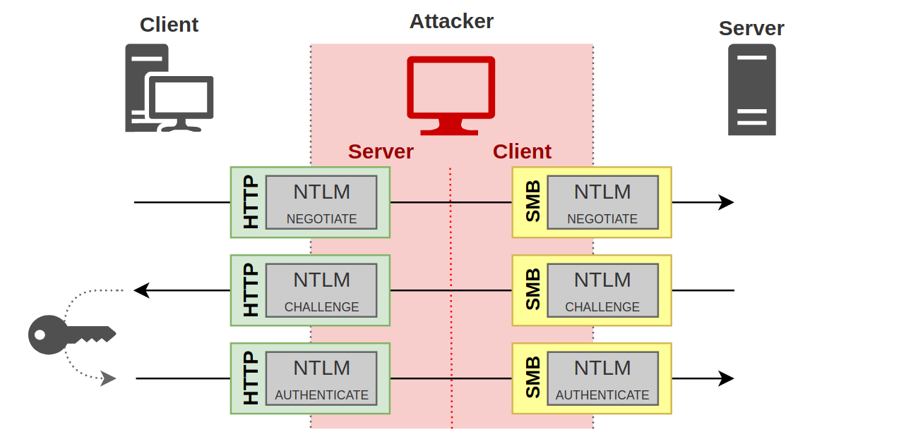
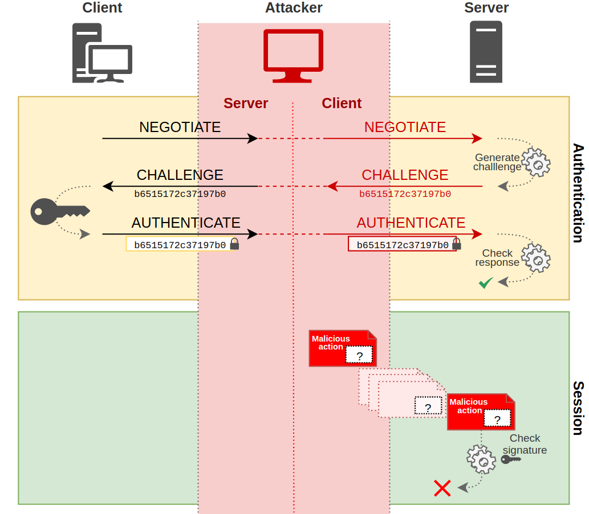
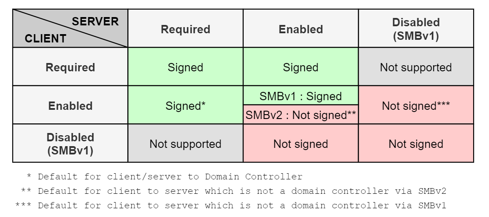

## Summary
This will prevent successful relay of NTLM authentication to SMB on the system where this setting is enabled, preventing several of the TAKEOVER attack techniques.

This configuration can be changed in the following group policy:

- "Microsoft network server: Digitally sign communications (always)" -> `Enabled`

This policy is located under `Computer Configuration > Policies > Windows Settings > Security Settings > Local Policies > Security Options` or in the registry at `HKLM\System\CurrentControlSet\Services\LanManServer\Parameters\RequireSecuritySignature`, which should be set to `1`.

Note that configuring the following setting on SMB clients in the environment (i.e., systems that could be coerced) will not prevent relay of authentication coerced from those clients to SMB servers because SMB negotiates signing in headers that can be stripped by an attacker in the middle of the connection.
- "Microsoft network client: Digitally sign communications (always)" -> `Enabled`

Client-side SMB signing also does not prevent NTLM relay from SMB to other protocols that do not support signing or that rely on TLS to provide signing and encryption (e.g., MSSQL and IIS). In such cases, channel binding should be configured to prevent NTLM relay attacks if it is supported (see [PREVENT-14](../PREVENT-14/prevent-14_description)).

The rest of this article discusses the SMB-specific mitigations that pertain to NTLM relay. To understand the specific SMB security configurations, it is important to discuss NTLM authentication and the underlying session (SMB).

### NTLM

**NOTE:** This is a very high level overview of the NTLM protocol for the context of this article. We highly recommend reviewing [Pixis](https://twitter.com/HackAndDo)'s articles on [NTLM](https://en.hackndo.com/pass-the-hash/#protocol-ntlm) and [NTLM relay](https://en.hackndo.com/ntlm-relay/) for further detail. This technique is heavily based on these great resources.

NTLM authentication is an authentication protocol used in Windows environments. The protocol uses a challenge and response design. When a client wants to access a server, the client sends a "Negotiate" message. The server responds with a "Challenge" message containing a 64-bit nonce challenge. Next, the client encrypts the challenge using its password as the key and sends the encrypted challenge back to the server with its domain and username. At this point, the server determines (with the help of the NetLogon service and a domain controller) if the challenge was encrypted with the correct password (NT hash) and makes an authentication decision.

There's an important distinction here. The aforementioned NTLM process represents an "authentication" layer, which is then encapsulated in a session layer using protocols such as HTTP, SMB, LDAP, MSSQL, etc (Figure 1). 

<Frame caption="Figure 1 - Authentication and session layers">
  
</Frame>

Since the NTLM challenge/response occurred at the authentication layer, it is transparent to the session protocol. This allows cross-protocol authentication relay where one protocol could be relayed to another by an attacker (Figure 2).

<Frame caption="Figure 2: NTLM Cross-protocol relay">
  
</Frame>

Session signing is a method of ensuring the integrity of a message between client and server. The sender digitally signs the message with its secret. If the server requires signing, the attacker will not be able to re-sign the message without the client's secret. Therefore, the server will reject the message because it's not signed, even if the client authenticated (Figure 3).

<Frame caption="Figure 3: Session signing failed">
  
</Frame>

### SMB Signing
Server Message Block (SMB) signing refers to session signing for the SMB protocol. There are two components that will determine if SMB messages are signed. First, at the authentication layer, the NTLM protocol will determine if signing is _supported_ based on the value of the `NEGOTIATE_SIGN` flag. When this flag is set to `1`, the client _supports_ signing. Next, depending on the version and options of the SMB protocol used, signing may be required, enabled, or disabled.

- Disabled: Signing is not managed
- Enabled: The client or server can sign and signing may occur based on settings
- Required: Messages must be signed

<Frame caption="Figure 4: SMB signing matrix">
  
</Frame>

## Linked Defensive IDs
- [PREVENT-13: Require LDAP channel binding and signing on DCs](../PREVENT-13/prevent-13_description)
- [PREVENT-14: Require EPA on AD CS and site databases](../PREVENT-14/prevent-14_description)
- [PREVENT-20: Block unnecessary connections to site systems](../PREVENT-20/prevent-20_description)

## Associated Offensive IDs
- [ELEVATE-1: NTLM relay site server to SMB on site systems](../../../attack-techniques/ELEVATE/ELEVATE-1/ELEVATE-1_description)
- [ELEVATE-2: NTLM relay via automatic client push installation](../../../attack-techniques/ELEVATE/ELEVATE-2/ELEVATE-2_description)
- [ELEVATE-3: NTLM relay via automatic client push installation and AD System Discovery](../../../attack-techniques/ELEVATE/ELEVATE-3/ELEVATE-3_description)
- [TAKEOVER-2: NTLM coercion and relay to SMB on remote site database](../../../attack-techniques/TAKEOVER/TAKEOVER-2/takeover-2_description)
- [TAKEOVER-4: NTLM coercion and relay from CAS to origin primary site server](../../../attack-techniques/TAKEOVER/TAKEOVER-4/takeover-4_description)
- [TAKEOVER-6: NTLM coercion and relay to SMB on remote SMS Provider](../../../attack-techniques/TAKEOVER/TAKEOVER-6/takeover-6_description)
- [TAKEOVER-7: NTLM coercion and relay to SMB between primary and passive site servers](../../../attack-techniques/TAKEOVER/TAKEOVER-7/takeover-7_description)

## References
- Pixis, [NTLM Relay](https://en.hackndo.com/ntlm-relay/)
- Pixis, [NTLM Protocol](https://en.hackndo.com/pass-the-hash/#protocol-ntlm)
- Microsoft, [Overview of Server Message Block Signing](https://learn.microsoft.com/en-us/troubleshoot/windows-server/networking/overview-server-message-block-signing)
- Microsoft, [The Basics of SMB Signing](https://learn.microsoft.com/fr-fr/archive/blogs/josebda/the-basics-of-smb-signing-covering-both-smb1-and-smb2)
- Ned Pyle, [Configure SMB Signing with Confidence](https://techcommunity.microsoft.com/t5/storage-at-microsoft/configure-smb-signing-with-confidence/ba-p/2418102)
