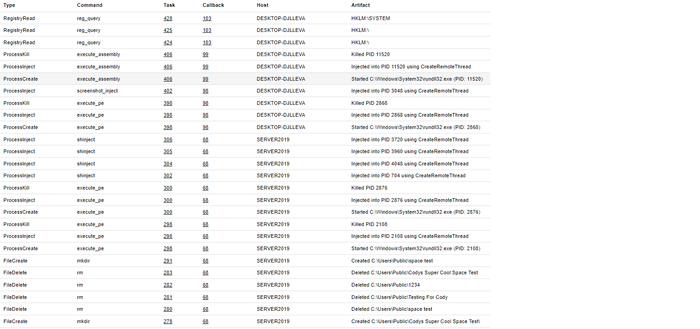

## Table of Contents

Below are considerations about Apollo's underlying behavior that may affect decisions during operation. Use this as a guide to ensure proper OPSEC and avoid detection when using Apollo. Additionally, all artifacts that are generated during task execution are logged by Apollo into Mythic under the Artifacts tab. Review the documentation of each command to determine what artifacts are generated before executing a command.

- [API Resolvers](apiresolvers)
- [Evasion](evasion)
- [Fork and Run Commands](forkandrun)
- [Injection](injection)

## Example Artifacts

