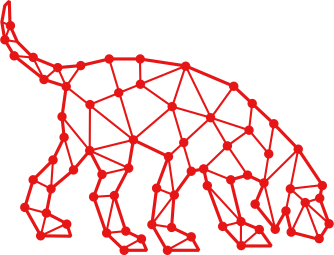

## Table of Contents

### Cypher
    * [cypher](./commands/cypher)
    * [cypher_create_saved](./commands/cypher_create_saved)
    * [cypher_delete_saved](./commands/cypher_delete_saved)
    * [cypher_list_saved](./commands/cypher_list_saved)
    * [cypher_predefined](./commands/cypher_predefined)
    * [cypher_saved](./commands/cypher_saved)
    * [shortest_path](./commands/shortest_path)
### Misc
    * [controllables](./commands/controllables)
    * [get_object](./commands/get_object)
### Domains
    * [get_domains](./commands/get_domains)
    * [get_domains_foreign_users](./commands/get_domains_foreign_users)
### Groups
    * [get_group](./commands/get_group)
    * [get_group_members](./commands/get_group_members)
    * [get_group_memberships](./commands/get_group_memberships)
### Owned
    * [get_owned](./commands/get_owned)
    * [mark_owned](./commands/mark_owned)
### Users
    * [get_user](./commands/get_user)
    * [get_user_memberships](./commands/get_user_memberships)
### Search
    * [graph_search](./commands/graph_search)
    * [search](./commands/search)
### Upload
    * [upload](./commands/upload)
    * [upload_status](./commands/upload_status)