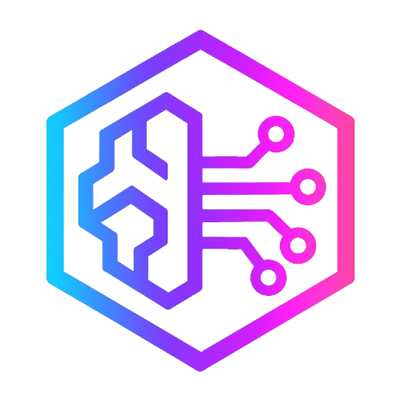

## Summary

Sage is a virtual Mythic agent that acts as an interface to AI and Large Language Model (LLM) services. Unlike traditional Mythic agents that run on compromised hosts, Sage operates entirely within the Mythic server itself, providing operators with AI-powered capabilities during operations.

This agent does not generate payloads for deployment but instead creates a "callback" within Mythic that allows you to interact with various AI model providers.

<Info>
You must obtain access permissions and API credentials for the AI model provider you plan to use. Sage supports multiple providers including Anthropic, AWS Bedrock, OpenAI, ollama, and OpenWebUI.
</Info>

### Highlighted Agent Features

- **Multiple AI Provider Support**: Connect to Anthropic, AWS Bedrock, OpenAI, ollama, and OpenWebUI
- **Interactive Chat Sessions**: Maintain conversational context across multiple messages
- **Single Query Mode**: Send one-off queries for quick responses
- **Tool Enhancement**: Enable tools to extend model capabilities
- **Model Context Protocol (MCP)**: Connect to Stdio MCP servers for additional functionality
- **Flexible Authentication**: Configure credentials at multiple levels (task, user, build, environment)
- **Model Discovery**: List available models from each provider

## Authors

- [@Ne0nd0g](https://twitter.com/Ne0nd0g)

## Supported Providers

### Anthropic
Direct access to Claude models via Anthropic's API. Requires an API key.

Example models:
- `claude-3-7-sonnet-latest`

### AWS Bedrock
Access Claude models through Amazon Bedrock. Requires AWS credentials with Bedrock permissions.

Example models:
- `us.anthropic.claude-3-5-sonnet-20241022-v2:0`

### OpenAI
Access to OpenAI models or any OpenAI-compatible API endpoint.

Example models:
- `gpt-4o-mini`

### ollama
Connect to local or remote ollama instances for running open-source models.

### OpenWebUI
Interface with OpenWebUI instances for additional model access.

## Authentication

Sage uses **CASE SENSITIVE** settings/keys for authentication. Credentials can be provided in four places (checked in this order):

1. **Task command parameters** - Highest priority, override all other settings
2. **User Secrets** - Per-operator credentials in Mythic UI
3. **Payload build parameters** - Shared credentials set during agent creation
4. **Container environment variables** - Lowest priority fallback

### Required Settings

- `provider` - The model provider (Anthropic, Bedrock, OpenAI, ollama, OpenWebUI)
- `model` - The model identifier string for the selected provider
- `API_ENDPOINT` - HTTP endpoint for the provider (not used for Bedrock)
- `API_KEY` - Authentication key for the provider

### AWS Bedrock Specific

- `AWS_ACCESS_KEY_ID`
- `AWS_SECRET_ACCESS_KEY`
- `AWS_SESSION_TOKEN`
- `AWS_DEFAULT_REGION`

<Warning>
Credentials provided at the task level override all other settings. Use this feature carefully to avoid unintended charges or API usage.
</Warning>

## Model Context Protocol (MCP)

Sage supports connecting to Stdio MCP servers using the `mcp-connect` command. This allows you to extend model capabilities with custom tools and functions.

<Info>
MCP servers must run in the same location as the Sage container. Ensure all required dependencies are installed in the container or run Sage locally on the Mythic host.
</Info>

## Getting Started

1. Clone the [Mythic](https://github.com/its-a-feature/Mythic/) repository
2. Install the Sage agent: `sudo ./mythic-cli install github https://github.com/MythicAgents/sage`
3. Start Mythic: `sudo ./mythic-cli start`
4. Navigate to the Payloads tab in Mythic
5. Generate a new Sage payload with your desired build parameters
6. A callback will be automatically created
7. Interact with AI models through the Active Callbacks tab
