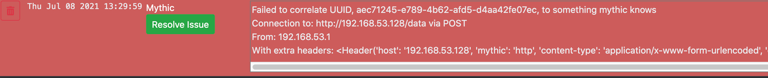

## Payload container, X, of version Y is not supported

<Frame>

</Frame>

All Payload containers leverage the `mythic_container` [PyPi package](https://github.com/MythicMeta/Mythic_PayloadType_Container) or the [Golang Package](https://github.com/MythicMeta/MythicContainer). These packages keeps track of a version that syncs up with Mythic when the container starts. As Mythic gains new functionality or changes how things are done, these containers might not be supported anymore. At any given time, Mythic could support only a single version or a range of versions.

### How do I fix this?

The agent in question needs to have its container updated or downgraded to be within the range specified by your version of Mythic. This likely means either updating the installed container or downgrading to a previously tagged version.

## Failed to correlate UUID, X, to something Mythic knows

<Frame>

</Frame>

Failed to correlate UUID

The "Failed to correlate UUID" message means that data came in through some C2 Profile, made its way to Mythic, Mythic base64 decoded the data successfully and looked at the first characters for a UUID. In Mythic messages, the only piece that's normally not encrypted is this random UUID4 string in the front that means something to Mythic, but is generally meaningless to everybody else. Mythic uses that UUID to look up the callback/payload/stage crypto keys and other related information for processing. In this case though, the UUID that Mythic sees isn't registered within Mythic's database. Normally people see this because they have old agents still connecting in, but they've since reset their database.

Looking at the rest of the message, we can see additional data. All C2 Profile docker containers add an additional header when forwarding messages to the Mythic server with `mythic: c2profile_name`. So, in this case we see `'mythic': 'http'` which means that the `http` profile is forwarding this message along to the Mythic server.

### How do I fix this?

First check if you have any agents that you forgot about from other engagements, tests, or deployments. The error message should tell you where they're connecting from. If the UUID that Mythic shows isn't actually a UUID format, then that means that some other data made its way to Mythic through a C2 profile. In that case, check your Firewall rules to see if there's something getting through that shouldn't be getting through. This kind of error does not impact the ability for your other agents to work (if they're working successfully), but does naturally take resources away from the Mythic server (especially if you're getting a lot of these).

## I installed an agent, but it's not showing up

If you use `mythic-cli` to install an agent, but you're not seeing it show up in the UI, it means that something is going wrong with booting up the agent and syncing to Mythic.

### How do I fix this?

Run `sudo ./mythic-cli logs [agent name]` to look at the output of the container. Usually you'll see some sort of error here about why things aren't working. This is typically the result of an agent/c2 profile being too far out of date from the rest of the Mythic instance that it can't properly sync up anymore.
