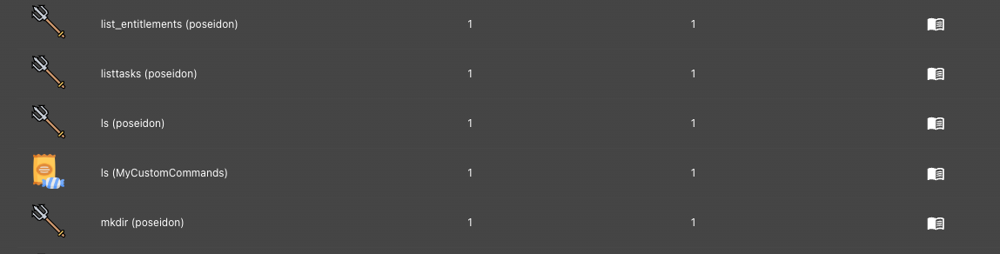
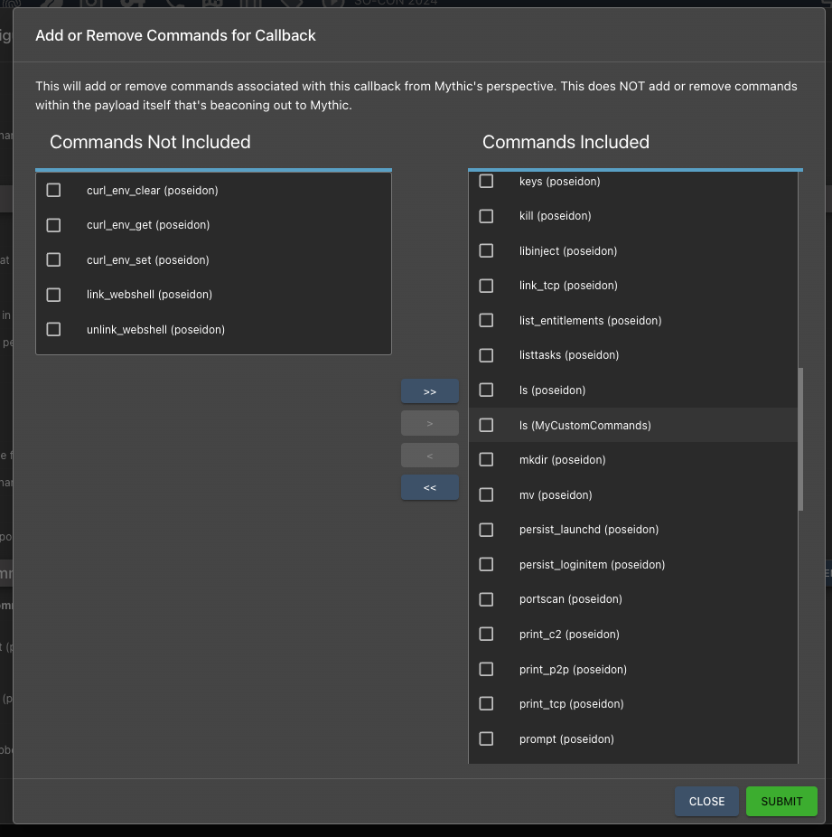

## What is this?

Sometimes you want to use public agents, but you *also* have some internal-specific commands you'd like to use with the agent as well. You might also have a set of commands you want to use across a variety of agents, but don't want to have to create/maintain it for each agent. This is where the new "command\_augment" container comes into play.

## What does this mean?

When creating a Payload type there's an option to specify an "AgentType". Normally this defaults to "agent" and you have a normal Payload Type. You could also change this to "wrapper" and have a wrapper payload type. There's also a "service" type you can set so that Mythic's UI doesn't expect you to have any C2 associated with the profile, but instead you to interact with 3rd party services. This is one more kind of "AgentType" called "command\_augment".

This works exactly the same as normal "agent" Payload Types *except* you don't actually build anything. Instead, the commands you register are "injected" into callbacks of other Payload Types. Naturally, these commands either need to be self contained (i.e. they set their completed status to true and never get sent down to the agent) or they need to eventually result in some other command getting executed (i.e. spawning subtasks or changing their CommandName in their create tasking function so that the agent executes a different function).

<CodeGroup>
    ```python Python
    class JXAAugment(PayloadType):
        name = "jxa_augment"
        file_extension = "js"
        author = "@its_a_feature_"
        supported_os = [SupportedOS.MacOS]
        agent_type = AgentType.CommandAugment
        wrapper = False
        wrapped_payloads = []
        note = """This payload uses JavaScript for Automation (JXA) for execution on macOS boxes."""
        supports_dynamic_loading = True
    ```
    ```go Go
    var payloadDefinition = agentstructs.PayloadType{
        Name:          "MyCustomCommands",
        Author:        "@its_a_feature_",
        SupportedOS:   []string{agentstructs.SUPPORTED_OS_LINUX, agentstructs.SUPPORTED_OS_MACOS},
        Description:   "Extra commands I want added to all agents",
        AgentType:     agentstructs.AgentTypeCommandAugment,
        MessageFormat: agentstructs.MessageFormatJSON,
    }

    func Initialize() {
        agentstructs.AllPayloadData.Get("MyCustomCommands").AddPayloadDefinition(payloadDefinition)
    }
    ```
</CodeGroup>

Notice all we do in this example is say which kinds of callback OS we want these commands to get injected into and we specify the AgentType to be CommandAugment. We don't actually specify any build function.

You can choose to have your commands injected by one or both of the following options:

* `SupportedOs` - the supported OS can be used as part of your command augment payload type definition to limit yourself to only certain operating systems

* `CommandAugmentSupportedAgents` - you can provide a list of agent names here and only have your commands injected into callbacks based on these agents

If you provide both, then both must be true (i.e. OS must match *and* payload type name must match).

For every Command associated with this CommandAugment container, only the ones that have CommandParameters with `builtin` or `suggested_command` set to `True` are loaded automatically into the callback (assuming the above criteria are met). If you want to allow others to be loaded or not, you need to include your own `load/unload` commands within the CommandAugment container. If you're not actually adding new commands that need to be sent down to the agent for loading, but instead just need to make Mythic aware of new commands that can be issued, then you can use the MythicRPCCallbackAddCommand functionality to just let Mythic know.

## What does this look like?

In the Callback metadata table, you can see these commands automatically injected:

<Frame>
    
</Frame>

You can also see them in the add/remove commands for callbacks:

<Frame>
    
</Frame>

You can see which specific backing container the command is associated with. There is currently no de-duplication of command names between what's part of the Payload Type itself and what you inject with CommandAugment containers. You can see above that there's two `ls` commands. When tab completing on the command line, you'll cycle through both of them, but there's currently no easy way to tell which is which. So, it's recommended that if you want to inject your own commands into a callback, that you do it in a way that makes it clear what your injected commands are for the operator.

## Command Wrapping

One common use case for a command augmentation container is to provide a wrapper, or meta command around an already existing command in an agent. For example, if a payload type has the ability to execute .net assemblies or BOF/COF files already, but you want to extend this capability with your own specific files and named parameters, then this is a perfect way to do it. You create your command augmentation container, and get your commands registered within the callback based on the above criteria.

So now let's say you have a command, `Rubeus`, that you want to expose from your `command_augment` container, but you want to ultimately have `apollo`'s `execute_assembly` function execute it. How do you do this?

In your `Rubeus`'s create\_tasking function, you'd set the `response.CommandName = "execute_assembly"` to make sure we're going to pass context to the right command (this also makes it so that when the callback picks up the task, it sees `execute_assembly` instead of `Rubeus`). The next piece is to make sure that `apollo`'s `execute_assembly` 's create\_tasking function gets a chance to process this data. To do that, we specify `response.ReprocessAtNewCommandPayloadType = "apollo"`. This tells Mythic that instead of going to process `Rubeus`'s opsec\_post function next, it should first pass execution to `apollo`'s container, specifically for the `execute_assembly` command.

Your next question is probably something along the lines of: "how do I know to pass execution to apollo or to its execute\_assembly vs some other payload type"? As part of your `create_go_tasking` function, you have access to `taskData`. There's a distinction in the data for this variable passed in:

```
taskData.PayloadType <-- the payload type associated with the callback that's running
taskData.CommandPayloadType <-- the payload type associated with the command that's executing
```

It's a small nuance, but important. The `taskData.PayloadType` always refers to the payload type that created the payload that resulted in the callback that's being tasked. `taskData.CommandPayloadType` refers to the payload type associated with the command that's executing. In most situations, these two would be the same. You're in a callback from an `apollo` payload type, you run a command from `apollo`, and so they match. When we start introducing `command_augmentation` containers though, you could be executing a command from a command augmentation container *from* a callback spawned by `apollo`, `merlin`, `apfell`, etc. So that answers the first question - how do you know which payload type you should be passing execution off to (if needed).

Identifying the specific command within that other payload type to execute is a *little* more complicated, but not by much. You have a few options.

1. You could have something hard-coded so that if you see `apollo`, you run `execute_assembly`, if you see `blah`, you run `custom_blah_blah`. That works, but doesn't make your command augmentation container really usable by any other base agents unless the operator modifies your source code. Not great.

2. You could have some sort of config file you use (that an operator is able to view/edit in the UI) where you keep a mapping of agent -> command. That makes it an easy lookup and is something that an operator can modify to make your command augmentation container support arbitrary other agents as well. Good, but still requires some operator config.

3. You can leverage `supported_ui_features`. These are used all throughout Mythic and browser scripts, but they're not limited to just that. The great thing is that these are also fully customizable. The down side is that the agent has to explicitly set these. So it doesn't work great for ad-hoc supporting new agents, but for known agents, it makes things pretty quick.

   1. All you'd do is say, for example, that your `command_augment` container X, `CA_X`, offers the ability to provide wrappers for BOFs. You identify how you want to find commands that support your command's output, for example, you could say that the command needs a supported\_ui\_feature of `CA_X:bof` (completely arbitrary value, just make it unique). Then, if `apollo` wanted to expose its `execute_coff` command, it would set in its `supported_ui_features = ["CA_X:bof"]`. Then, in the command augment container, you can do a `SendMythicRPCCallbackCommandSearch` and specifically search for any loaded commands in the callback with your ui feature (`CA_X:bof`). Once you find a matching command, you can set your `response.CommandName` to that command name.
