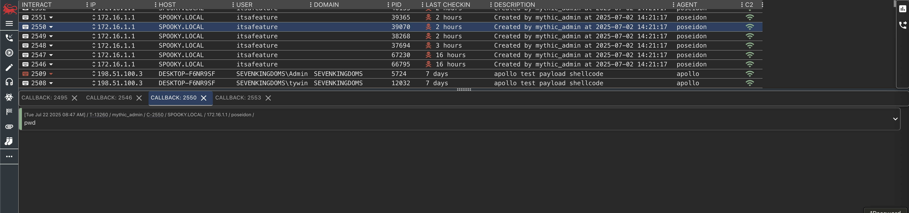
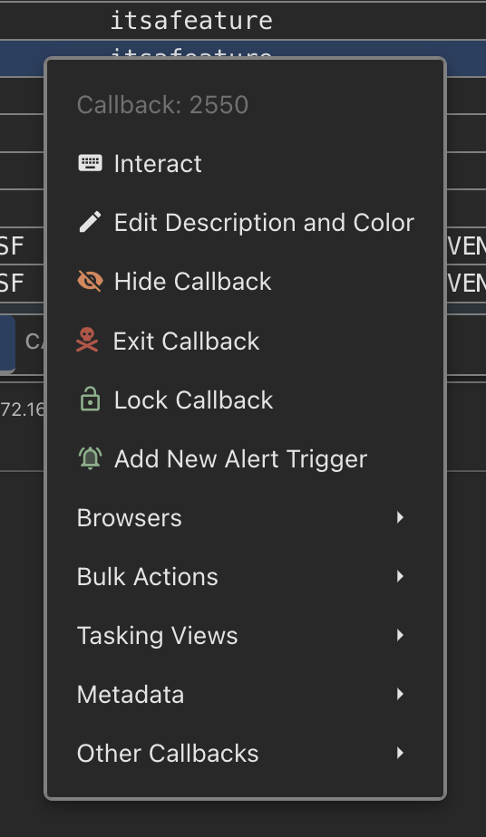
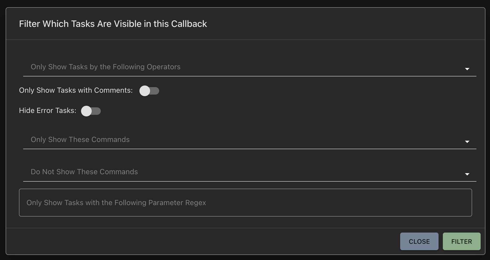

##  Where is it?

The main page to see and interactive with active callbacks can be found from the phone icon at the top of the screen.

### Top table

The top table has a list of current callbacks with a bunch of identifying information.
Many of the table headers can be clicked to sort the information in ascending or descending order or double clicked to auto-adjust the width based on the longest element in the column.

All rows have a context menu by right clicking anywhere in the callback row.

<Frame>
    
</Frame>

- Callback - The identifying callback number. The blue or red button will bring the bottom section into focus, load the previously issued tasks for that callback, and populate the bottom section with the appropriate information (discussed in the next section).
- If the `integrity_level` of the callback is `<=` 2, then the callback button will be blue. Otherwise it'll be red (indicating high integrity) and there will be an `*` next to the username. It's up to the agent to report back its own integrity level
- Host - The hostname for the machine the callback is from
- IP - The IPs associated with the host (first one in the array shown, but can always be adjusted by clicking this field)
- User - The current user context of the callback
- PID - The process ID for the callback
- OS (arch) - This is the OS and architecture information for the host
- Initial Checkin - The time when the callback first checked in. This date is stored in UTC in the database, but converted to the operator's local time zone on the page.
- Last Checkin - How long it's been since the last checkin in
- Description - The current description of the callback. The default value for this is specified by the `description` section when creating a payload. This can be changed via the callback's dropdown.

Next to the `Interact` button is a dropdown button that provides more accessible information (also accessible via right-click):

<Frame>
    
</Frame>
- Interact - Open up the default tasking area (this view can be changed from the default and other view options exist in the "Tasking Views" sub-menu)
- Edit Description and Color - This allows you to edit the description of a callback (as well as the color of the row in the table). To set this back to the default value set this to an empty string
- Hide Callback - This removes the callback from the current view and sets it to inactive. Additionally, from the Search page, you can make the callback `Active` again which will bring it back into view here.
- Exit Callback - This will automatically (after confirmation) issue the associated `exit` command to the callback.
- Lock Callback - If a callback is locked by a specific user, this will be indicated here (along with a changed user and lock icon instead of a keyboard on the interacting button).
- Browsers - Opens the optional File/Process browsers from this callback's context
- Bulk Actions - Bulk task or hide callbacks
- Tasking Views - open up tasking from different perspectives - the normal accordion view, a split view with more room for task output, and a console-like view
- Metadata - view metadata about the callback, associated payload, and export if necessary

## Bottom Area

The bottom area is where you'll find the tasks, process listings, file browsers, and comments related to specific callbacks. Clicking the keyboard icon on a callback will open or select the corresponding tab in this area.

### Auto Complete

When you start typing a command, you can press `Tab` to finish out and cycle through the matching commands. If you don't type anything and hit `Tab` then you'll cycle through all available commands. You can use the up and down arrow keys to cycle through the tasking history for that callback, and you can use `ctrl+r` to do a reverse grep search through your previous history as well.

Auto complete isn't just for the command names, but also applies to the command parameters and even for choices within a specific parameter. When in doubt, tab!

### Tasking

Submitting a command goes through a few phases that are also color coded to help visually see the state of your task:

1. Creating Task - This is when the command is submitted to Mythic, but execution is passed to the associated Payload Type's command file for processing. These capabilities are covered in more depth in the Payload Types section.
2. Submitted- The task has finished pre-processing and is ready for the agent to request it.
3. Processing - The agent has pulled down the task, but has not returned anything.
4. Processed - The agent has returned *at least one* response for the task, but hasn't explicitly marked the task as completed
5. Completed - The agent has reported the task done successfully
6. Error -The agent reported that there was an error with executing the task.

Once you've submitted tasking, there's a bit of information that'll be automatically displayed.

- The user that submitted the task
- The task number - You can click on this task number to view just that task and its output in a separate page. This makes it easy to share the output of a task between members of an operation.
- The command and any parameters supplied by the operator

#### Task filtering

The very bottom right hand of the screen has a little filter button that you can click to filter out what you see in your callbacks. The filtering only applies as long as you're on that callback page (i.e. it gets reset when you refresh the page).

<Frame>
    
</Frame>

<iframe
  className="w-full aspect-video rounded-xl"
  src="https://www.youtube.com/embed/FG3G3kDBXGQ?si=nVBFYybE7y0N22uZ"
  title="Mythic Operator Video Series — Callbacks"
  frameBorder="0"
  allow="accelerometer; autoplay; clipboard-write; encrypted-media; gyroscope; picture-in-picture"
  allowFullScreen
></iframe>