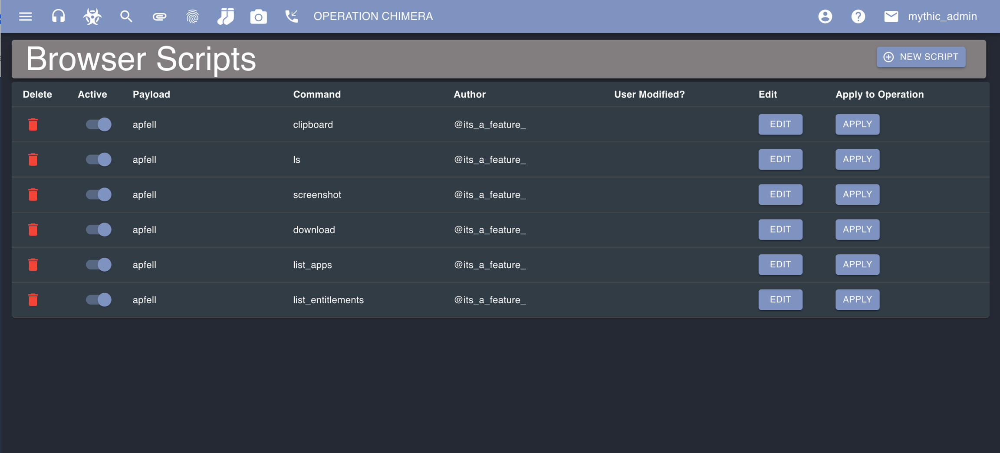

## What are they?

Browser Scripts allow users to script the output of agent commands. They are JavaScript functions that can return structured data to indicate for the React user interface to generate tables, buttons, and more.

### Where are they?

Browser Scripts are located in the hamburger icon in the top left -> "Operations" -> BrowserScripts.

Every user has the default browser scripts automatically imported upon user creation based on which agents are installed.

<Frame>
    
</Frame>

### How are they applied?

Anybody can create their own browser scripts and they'll be applied only to that operator. You can also deactivate your own script so that you don't have to delete it, but it will no longer be applied to your output. This deactivates it globally and takes affect when the task is toggled open/close. For individual tasking you can use the speed dial at the bottom of the task and select to "Toggle Browserscript".

### How are they created?

Click `Register New Script` to create a new one. This is for one-off scripts you create. If you want to make it permanent across databases and for other operators, then you need to add the script to the corresponding Payload Type's container. More information about that process can be found here: [What is Browser Scripting?](https://docs.mythic-c2.net/customizing/payload-type-development/browser-scripting#what-is-browser-scripting).

When you're creating a script, the function declaration will always be `function(task, responses)` where `task` is a JSON representation of the current task you're processing and `responses` is an array of the responses displayed to the user. This will always be a string. If you actually returned JSON data back, be sure to run `JSON.parse` on this to convert it back to a JSON dictionary. So, to access the first response value, you'd say `responses[0]`.

You should always return a value. It's recommended that you do proper error checking and handling. You can check the status of the task by looking at the `task` variable and checking the `status` and `completed` attributes.

### Toggling

Even if a browser script is pushed out for a command, its output can be toggled on and off individually.

<iframe
  className="w-full aspect-video rounded-xl"
  src="https://www.youtube.com/embed/zhiBWCEFR8E?si=ixG4Yh6M1eP2Y0mI"
  title="Mythic Operator Video Series — Browser Scripts"
  frameBorder="0"
  allow="accelerometer; autoplay; clipboard-write; encrypted-media; gyroscope; picture-in-picture"
  allowFullScreen
></iframe>