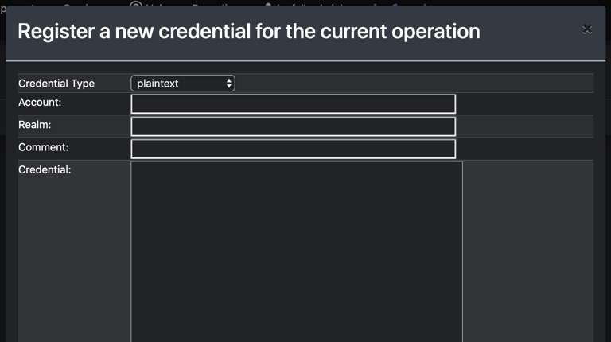
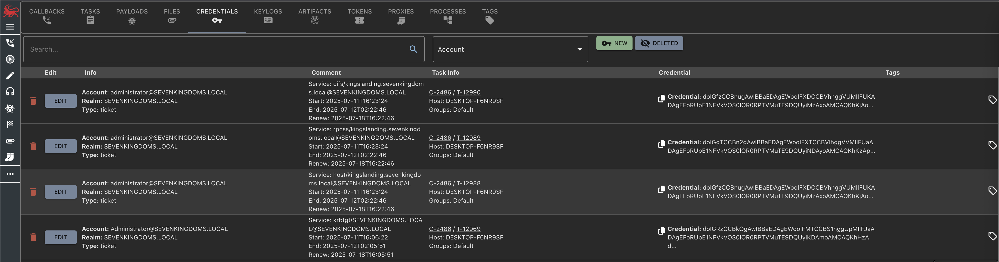

## Where is it?

Credentials can be found from the search page on the top navigation bar or by clicking the key icon at the top.

## How is it integrated?

As part of command output, credentials can be registered automatically if the agent parses out the material. Otherwise, users can also manually register credentials. There are a few pieces of information required:

<Frame >
  
</Frame>

- The type of credential - This is more for situational awareness right now, but in the future will help the flow of how to treat the credential before use.
- Account - the account this credential applies to
- Realm - the domain for the credential or a generic realm in case this is a credential for something else. If the account is a local account, the Domain is the name of the computer.
- Credential - the actual credential
- Comment - any comment you want to store about the credential

<Frame >
  
</Frame>

On this page you can also see the task that created credentials (which can be `Manual Entry` ), who added in the credential, and when it was added.

### Integration into issuing commands

Command parameters can hook into this by having a parameter type of `CredentialJson` - the tasking UI will get a dropdown for the various credentials to choose from and your `create_go_tasking` function will get a dictionary of all the credential's information.

Tasks can register credentials with the server in their responses by following [Credentials](https://docs.mythic-c2.net/customizing/hooking-features/credentials) format.

