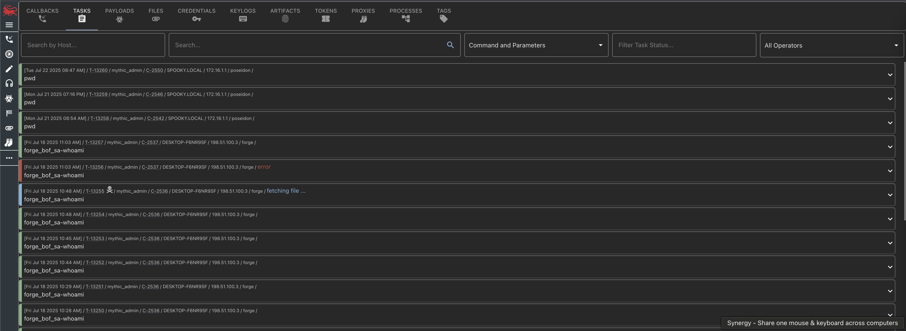

## Where is it?

The operational search feature can be found by clicking on any the search related shortcuts.
From here you can search across callbacks, tasks, files, screenshots, keylogs, tokens, artifacts, and more.

## How is it used?

The search bar checks for what you type as a case insensitive grep.

<Frame>
    
</Frame>

<iframe
  className="w-full aspect-video rounded-xl"
  src="https://www.youtube.com/embed/YO--fg1pN0I?si=QTgg5xdu1TKtFTtx"
  title="Mythic Operator Video Series — Searching"
  frameBorder="0"
  allow="accelerometer; autoplay; clipboard-write; encrypted-media; gyroscope; picture-in-picture"
  allowFullScreen
></iframe>