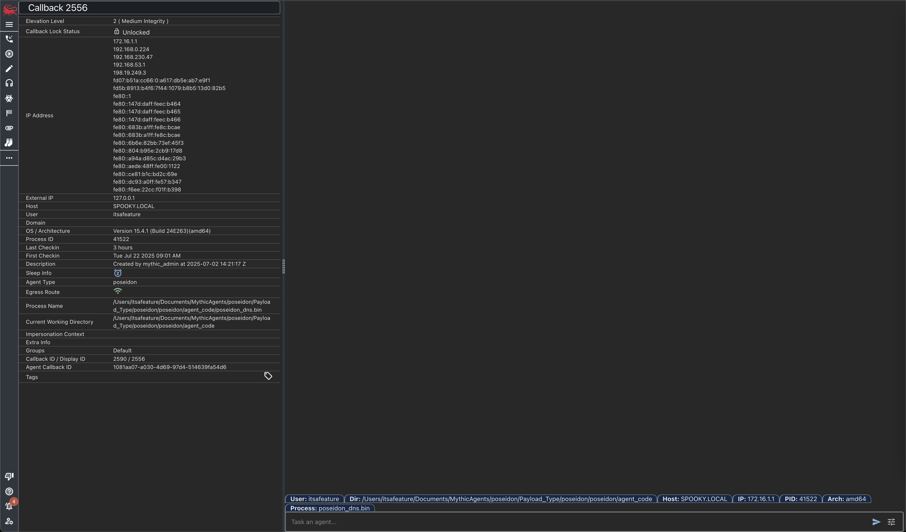

For any active callback, select the dropdown next to it and select "Expand Callback". This will open a new tab for that callback where you can actually view the tasking full screen with metadata on the side.

<Frame>
    
</Frame>
