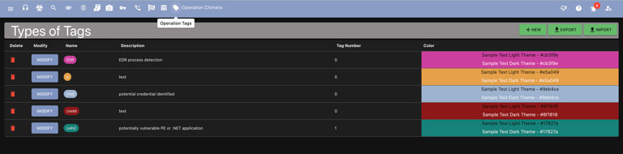
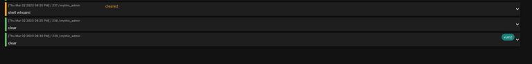

## What are tags?

Mythic allows you to track types of tags as well as instances of tags. A tag type would be something like "contains credential" or "objective 1" - these take a name, a description, and a color to be displayed to the user. An instance of a tag would then include more detailed information such as the source of the information, the actual credential contained or maybe why that thing is tagged as "objective 1", and can even include a link for more information.

### Why should I bother with this?

Tagging allows more logical grouping of various aspects of an operation. You can create a tag for "objective 1" then apply that tag to tasks, credentials, files, keylogs, etc. This information can then be used for easier deconflictions, attack path narratives, and even a way to signal information to other members of your assessment that something might be worth while to look at.

## Where are tags?

The tag icon at the top of the screen takes you to the tag management page where you can view/edit/create various types of tags and see how many times that tag is used in the current operation.

<Frame>
    
</Frame>

## Where can I see tags?

Tags are available throughout the various Mythic pages - anywhere you see the tag icon you can view/edit/add tags.

<Frame>
    
</Frame>

<iframe
  className="w-full aspect-video rounded-xl"
  src="https://www.youtube.com/embed/LtZ7VGeKL18?si=DP2BLdwb8y1Vyl7E"
  title="Mythic Operator Video Series — Tagging"
  frameBorder="0"
  allow="accelerometer; autoplay; clipboard-write; encrypted-media; gyroscope; picture-in-picture"
  allowFullScreen
></iframe>