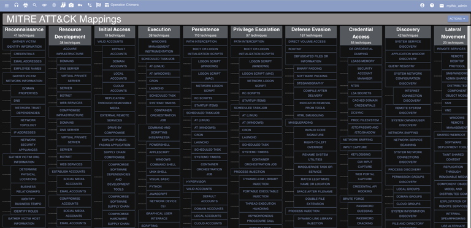
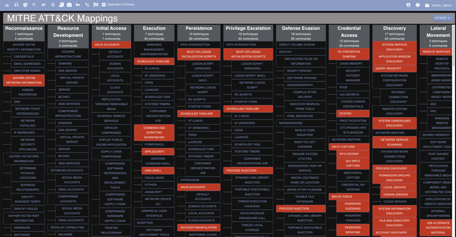
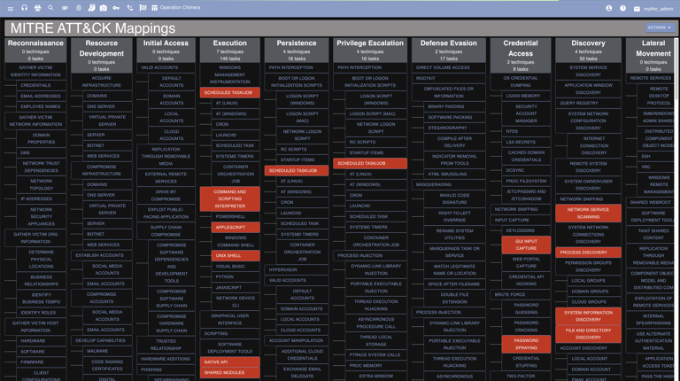
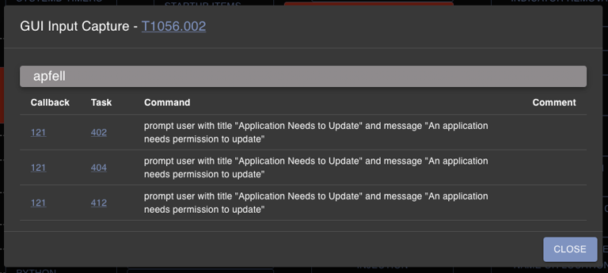

## What is it?

[MITRE ATT&CK](https://attack.mitre.org/) is a knowledge base of adversary tactics and techniques mapped out to various threat groups. It provides a common language between red teams and blue teams when discussing operations, TTPs, and threat hunting. For Mythic, this provides a great way to track all of the capabilities the agents provide and to track all of the capabilities so far exercised in an operation.

For more information on MITRE ATT&CK, check out the following:

- [https://attack.mitre.org](https://attack.mitre.org/)
- [https://twitter.com/mitreattack](https://twitter.com/mitreattack)
- [https://attackevals.mitre.org/](https://attackevals.mitre.org/)

## Where is it?

[MITRE ATT&CK](https://attack.mitre.org/) integrations can be found by clicking the chart icon from the top navigation bar.

<Frame>

</Frame>

## How to use it?

There are a few different ways to leverage this information.

### Commands by ATT&CK

Clicking the "Fetch All Commands Mapped to MITRE" action will highlight all of the matrix cells that have a command registered to that ATT&CK technique. Clicking on a specific cell will bring up more specific information on which payload type and which command is mapped to that technique. All of this information comes from the [MITRE ATT&CK](https://docs.mythic-c2.net/operational-pieces/understanding-commands/mitre-att-and-ck) portion of commands.

<Frame>

</Frame>

### Tasks by ATT&CK

This is a slightly different view. This button will highlight and show the cells that have been exercised in the current operation. A cell will only be highlighted if a command was executed in the current operation with that ATT&CK technique mapped to it.

<Frame>

</Frame>

The cell view will show the exact command that caused the cell to be highlighted with a link (via task number) back to the full display of the task:

<Frame>

</Frame>

mappings for the current operation in ATT&CK

If there is an issue with the mapping, clicking the red X button will remove the mapping.
