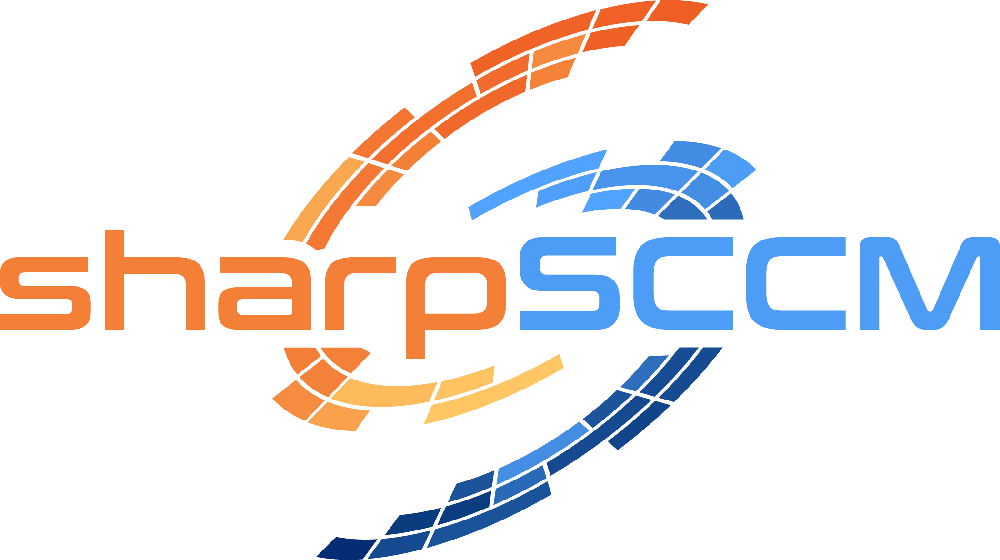

# SharpSCCM: SCCM Security Assessment Toolkit

SharpSCCM is a powerful post-exploitation tool designed to leverage Microsoft System Center Configuration Manager (SCCM) / Microsoft Endpoint Configuration Manager for credential gathering, lateral movement, and privilege escalation without requiring access to the SCCM administration console GUI.

<Warning>
  **For Authorized Use Only**: SharpSCCM is intended for authorized security testing, red team exercises, and defensive research. Always ensure you have proper authorization before using this tool.
</Warning>

## What is SharpSCCM?

SharpSCCM exploits common SCCM misconfigurations and inherent design weaknesses to demonstrate the security risks associated with poorly configured SCCM environments. The tool operates from any Windows machine running the SCCM client software and leverages Windows Management Instrumentation (WMI) and the ConfigMgr Client Messaging SDK to communicate with SCCM infrastructure.

<Info>
  **Research Foundation**: This tool is built upon extensive security research by [@_Mayyhem](https://twitter.com/_Mayyhem) and incorporates techniques developed by the security community, including work by Matt Nelson, Adam Chester, Duane Michael, and Garrett Foster.
</Info>

## Core Capabilities

<AccordionGroup>
  <Accordion title="Credential Harvesting" icon="key">
    Extract sensitive credentials from SCCM infrastructure:
    - **Network Access Accounts (NAAs)**: Retrieve domain credentials used for distribution point access
    - **Collection Variables**: Access credentials stored in collection-level variables
    - **Task Sequence Credentials**: Extract passwords from operating system deployment sequences
    - **Policy Secret Decryption**: Decrypt DPAPI-protected credential blobs
  </Accordion>

  <Accordion title="Lateral Movement" icon="arrows-alt">
    Move laterally through the environment using SCCM as a C2 framework:
    - **Application Deployment**: Execute commands on remote systems via application deployment
    - **Script Execution**: Run PowerShell scripts and binaries across collections
    - **User Impersonation**: Execute applications in specific user contexts
    - **Collection Targeting**: Target specific devices or users for operations
  </Accordion>

  <Accordion title="NTLM Coercion & Relay" icon="wifi">
    Force authentication for credential relay attacks:
    - **Client Push Installation**: Coerce NTLM authentication from site servers
    - **WebClient Exploitation**: Leverage WebClient for HTTP-based authentication
    - **SMB Relay**: Force connections to attacker-controlled SMB shares
    - **Domain Controller Targeting**: Relay authentication to domain controllers
  </Accordion>

  <Accordion title="Information Gathering" icon="search">
    Enumerate SCCM infrastructure and gather intelligence:
    - **Site Discovery**: Identify site servers and management points via LDAP
    - **Admin Enumeration**: List SCCM administrators and their roles
    - **Device & User Discovery**: Enumerate managed devices and users
    - **Configuration Analysis**: Analyze site settings and security configurations
  </Accordion>

  <Accordion title="AdminService API Abuse" icon="code">
    Leverage the SCCM AdminService REST API for advanced operations:
    - **CMPivot Queries**: Execute arbitrary CMPivot queries for data collection
    - **Real-time Intelligence**: Gather system information from managed endpoints
    - **Custom Queries**: Run tailored queries for specific intelligence requirements
    - **JSON Output**: Retrieve structured data for further analysis
  </Accordion>
</AccordionGroup>

## Attack Methodology

SharpSCCM follows a structured approach to SCCM exploitation:

<Steps>
  <Step title="Discovery & Reconnaissance">
    Identify SCCM infrastructure, site codes, management points, and site servers through LDAP queries and local client configuration analysis.
  </Step>

  <Step title="Credential Extraction">
    Extract stored credentials from policies, task sequences, and collection variables using DPAPI decryption techniques.
  </Step>

  <Step title="Privilege Escalation">
    Leverage extracted credentials or SCCM roles to gain higher privileges within the domain or SCCM hierarchy.
  </Step>

  <Step title="Lateral Movement">
    Use SCCM's application deployment and script execution capabilities to move laterally across the network.
  </Step>

  <Step title="Persistence & Control">
    Establish persistence through SCCM configurations and maintain control over managed endpoints.
  </Step>
</Steps>

## Key Features

<CardGroup cols={2}>
  <Card title="No Console Required" icon="ban" color="#6366f1">
    Operates without needing access to the SCCM administration console GUI
  </Card>

  <Card title="Client-Side Execution" icon="desktop" color="#8b5cf6">
    Runs from any Windows machine with the SCCM client installed
  </Card>

  <Card title="WMI Integration" icon="code" color="#06b6d4">
    Leverages WMI and ConfigMgr Client Messaging SDK for communication
  </Card>

  <Card title="Comprehensive Coverage" icon="shield-check" color="#10b981">
    Addresses multiple attack vectors and SCCM security weaknesses
  </Card>
</CardGroup>

## Prerequisites & Requirements

<Tabs>
  <Tab title="Environment">
    **Minimum Requirements:**
    - Windows machine with SCCM client installed
    - Domain-joined system (for most operations)
    - Network connectivity to SCCM management points
    - Local administrator privileges (for credential extraction)

    **Optimal Setup:**
    - SCCM administrative access for full functionality
    - Valid domain credentials
    - PKI certificates (if site requires them)
  </Tab>

  <Tab title="Permissions">
    **Required SCCM Roles (varies by operation):**
    - Read-only Analyst (minimum for discovery)
    - Application Administrator (for deployment operations)
    - Full Administrator (for site modification)
    - Custom roles with specific scope permissions

    **Domain Permissions:**
    - Domain user (minimum)
    - Local administrator on target systems
    - Service account permissions (for advanced techniques)
  </Tab>

  <Tab title="Network Access">
    **Required Connectivity:**
    - HTTP/HTTPS to management points (ports 80/443)
    - WMI access to SMS Provider (port 135 + dynamic RPC)
    - SMB access for file-based operations (port 445)
    - LDAP to domain controllers (port 389/636)
  </Tab>
</Tabs>

## Quick Start Guide

<CardGroup cols={2}>
  <Card title="Build SharpSCCM" icon="hammer" href="/sharpsccm-docs/resources/Build-Instructions">
    Compile the tool from source code with Visual Studio
  </Card>

  <Card title="Command Reference" icon="terminal" href="/sharpsccm-docs/resources/Command-Line-Usage">
    Learn the command-line syntax and common options
  </Card>

  <Card title="Credential Extraction" icon="key" href="/sharpsccm-docs/commands/get">
    Start with credential harvesting techniques
  </Card>

  <Card title="Lateral Movement" icon="arrows-alt" href="/sharpsccm-docs/commands/exec">
    Execute commands on remote systems via SCCM
  </Card>
</CardGroup>

## Command Categories

<AccordionGroup>
  <Accordion title="Information Gathering Commands" icon="search">
    **`get` Command Group** - Extract information from SCCM infrastructure:
    - `get site-info` - Discover site servers and management points
    - `get admins` - Enumerate SCCM administrators
    - `get devices` - List managed devices and users
    - `get collections` - Discover device and user collections
    - `get applications` - View available applications
  </Accordion>

  <Accordion title="Credential Harvesting Commands" icon="key">
    **`get secrets` / `local secrets`** - Extract stored credentials:
    - Network Access Account credentials
    - Collection variable passwords
    - Task sequence credentials
    - DPAPI-protected policy secrets
  </Accordion>

  <Accordion title="Lateral Movement Commands" icon="arrows-alt">
    **`exec` Command** - Execute code on remote systems:
    - Application deployment for command execution
    - Script execution across collections
    - NTLM coercion and relay operations
    - User impersonation techniques
  </Accordion>

  <Accordion title="Infrastructure Manipulation" icon="cogs">
    **`new` / `remove` Commands** - Modify SCCM infrastructure:
    - Create and delete applications
    - Manage collections and deployments
    - Add/remove collection members
    - Device registration operations
  </Accordion>

  <Accordion title="Advanced Operations" icon="code">
    **`invoke` Command Group** - Advanced SCCM operations:
    - CMPivot query execution via AdminService
    - Client push authentication coercion
    - Policy update enforcement
    - Custom WQL query execution
  </Accordion>
</AccordionGroup>

## Security Considerations

<Warning>
  **Important Security Notice**: This tool can cause significant impact to production SCCM environments. Always test in isolated lab environments first and ensure you have proper authorization before use.
</Warning>

### Responsible Use Guidelines

<Steps>
  <Step title="Authorization">
    Obtain explicit written authorization before testing against any SCCM infrastructure
  </Step>

  <Step title="Scope Limitation">
    Clearly define the scope of testing and avoid systems outside the authorized scope
  </Step>

  <Step title="Impact Assessment">
    Understand the potential impact of operations, especially application deployments
  </Step>

  <Step title="Documentation">
    Document all activities for compliance and remediation purposes
  </Step>

  <Step title="Cleanup">
    Remove any artifacts created during testing (applications, collections, etc.)
  </Step>
</Steps>

### Defensive Recommendations

For comprehensive defensive guidance, see our [Security Recommendations](/sharpsccm-docs/security/defensive-recommendations) page, which covers:

- SCCM hardening best practices
- Detection and monitoring strategies
- Incident response procedures
- Security configuration checklists

## Development & Lab Setup

<Tip>
  **Quick Lab Deployment**: Microsoft's [Windows and Office 365 deployment lab kit](https://docs.microsoft.com/en-us/microsoft-365/enterprise/modern-desktop-deployment-and-management-lab?view=o365-worldwide) can deploy a fully operational SCCM lab in Hyper-V in less than an hour.
</Tip>

**Minimum Lab Components:**
- **CM1**: Configuration Manager Primary Site Server, Management Point, and Site Database Server
- **GW1**: Configuration Manager Client
- **DC1**: Domain Controller

**Alternative Lab Options:**
- [Azure QuickStart Templates](https://learn.microsoft.com/en-us/samples/azure/azure-quickstart-templates/sccm-technicalpreview/)
- [AutomatedLab](https://automatedlab.org/en/latest/)
- [Snaplabs](https://twitter.com/an0n_r0/status/1687230842601451522) 

## Research & Publications

**Primary Research by [@_Mayyhem](https://twitter.com/_Mayyhem):**
  - [Coercing NTLM Authentication from SCCM](https://posts.specterops.io/coercing-ntlm-authentication-from-sccm-e6e23ea8260a)
  - [Relaying NTLM Authentication from SCCM Clients](https://posts.specterops.io/relaying-ntlm-authentication-from-sccm-clients-7dccb8f92867)
  - [SCCM Site Takeover via Automatic Client Push Installation](https://posts.specterops.io/sccm-site-takeover-via-automatic-client-push-installation-f567ec80d5b1)
  - [SCCM Hierarchy Takeover](https://posts.specterops.io/sccm-hierarchy-takeover-41929c61e087)

**Black Hat USA Arsenal Presentations:**
<iframe
  className="w-full aspect-video rounded-xl"
  src="https://www.youtube.com/embed/19F_Io1Tykg?si=_ZSc53-eVNzhzGTB"
  title="2022: SharpSCCM"
  frameBorder="0"
  allow="accelerometer; autoplay; clipboard-write; encrypted-media; gyroscope; picture-in-picture"
  allowFullScreen
></iframe>

<iframe
  className="w-full aspect-video rounded-xl"
  src="https://www.youtube.com/embed/uyI5rgR0D-s?si=HXChQMsn-m38LecB"
  title="2023: Abusing Microsoft's C2 Framework"
  frameBorder="0"
  allow="accelerometer; autoplay; clipboard-write; encrypted-media; gyroscope; picture-in-picture"
  allowFullScreen
></iframe>

<iframe
  className="w-full aspect-video rounded-xl"
  src="https://www.youtube.com/embed/Q8mEMFKscnk?si=sXZQDCogBNNnOjPh"
  title="2023: SpecterOps Booth Demo"
  frameBorder="0"
  allow="accelerometer; autoplay; clipboard-write; encrypted-media; gyroscope; picture-in-picture"
  allowFullScreen
></iframe>

### Community Research & Tools

<Accordion title="Related Research & Tools">
  The SCCM security community has produced excellent research and tooling:

  **Key Research Papers:**
  - [The Phantom Credentials of SCCM](https://posts.specterops.io/the-phantom-credentials-of-sccm-why-the-naa-wont-die-332ac7aa1ab9) by Duane Michael
  - [Unobfuscating Network Access Accounts](https://blog.xpnsec.com/unobfuscating-network-access-accounts/) by Adam Chester
  - [Looting Microsoft Configuration Manager](https://labs.withsecure.com/publications/looting-microsoft-configuration-manager) by Tomas Rzepka
  - [Site Takeover via AdminService API](https://posts.specterops.io/site-takeover-via-sccms-adminservice-api-d932e22b2bf) by Garrett Foster

  **Related Tools:**
  - [SCCMHunter](/sccmhunter-docs/overview) - Python-based SCCM reconnaissance and exploitation toolkit ([GitHub](https://github.com/garrettfoster13/sccmhunter))
  - [PowerSCCM](https://github.com/PowerShellMafia/PowerSCCM) by PowerShell Mafia
  - [CMLoot](https://github.com/1njected/CMLoot) by Tomas Rzepka
  - [PXEThief](https://github.com/MWR-CyberSec/PXEThief) by Christopher Panayi
  - [MalSCCM](https://github.com/nettitude/MalSCCM) by Phil Keeble

  **Defensive Resources:**
  - [CISA Red Team Report on SCCM](https://www.cisa.gov/sites/default/files/2023-03/aa23-059a-cisa_red_team_shares_key_findings_to_improve_monitoring_and_hardening_of_networks_1.pdf)
  - [SCCM/MECM Hacker Recipes](https://www.thehacker.recipes/a-d/movement/sccm-mecm) by Charlie Bromberg
</Accordion>

## Project Support & Contributors

<Info>
  **Sponsorship**: This project is supported by [SpecterOps](https://www.specterops.io/) as part of their commitment to transparency and open-source security research.
</Info>

### Core Contributors

<CardGroup cols={3}>
  <Card title="Duane Michael" icon="x-twitter" href="https://twitter.com/subat0mik">
    @subat0mik
    - NAA credential gathering techniques
    - DPAPI implementation contributions
  </Card>
  <Card title="Evan McBroom" icon="x-twitter" href="https://twitter.com/mcbroom_evan">
    @EvanMcBroom
    - Credential recovery enhancements
    - Core functionality improvements
  </Card>
  <Card title="Diego Lomellini" icon="x-twitter" href="https://twitter.com/DiLomSec1">
      @DiLomSec1
    - CMPivot AdminService integration
    - API enhancement contributions
  </Card>
  <Card title="Carsten Sandker" icon="x-twitter" href="https://twitter.com/0xcsandker">
      @0xcsandker
    - PXE media certificate support
    - Security enhancement features
  </Card>
  <Card title="Adam Chester" icon="x-twitter" href="https://twitter.com/_xpn_">
      @_xpn_
    - NAA deobfuscation research
    - Cryptographic implementation guidance
  </Card>
  <Card title="Matt Nelson" icon="x-twitter" href="https://twitter.com/enigma0x3">
      @enigma0x3
    - PowerSCCM foundation work
    - Original offensive SCCM research
  </Card>
</CardGroup>

## Community & Support

<CardGroup cols={2}>
  <Card title="GitHub Repository" icon="github" href="https://github.com/Mayyhem/SharpSCCM">
    Source code, issues, and contributions
  </Card>

  <Card title="BloodHound Slack" icon="slack" href="http://ghst.ly/BHSlack">
    Community discussion and support
  </Card>

  <Card title="Twitter" icon="x-twitter" href="https://twitter.com/_Mayyhem">
    Updates and announcements
  </Card>

  <Card title="SpecterOps Blog" icon="blog" href="https://posts.specterops.io/">
    Latest research and insights
  </Card>
</CardGroup>

